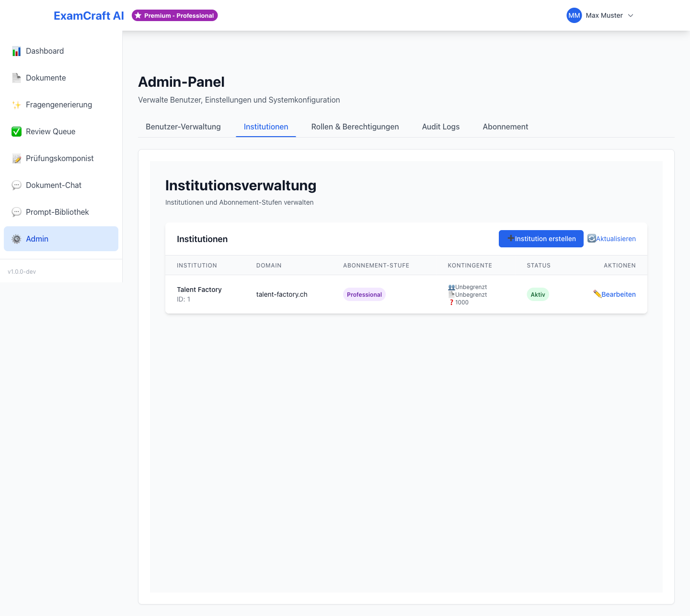

# Institutionen

Institutionen organisieren Benutzer in Gruppen — zum Beispiel eine Schule, eine Hochschule oder eine Abteilung. Jeder Benutzer gehört zu genau einer Institution.

Navigieren Sie zu `/admin` und wählen Sie den Tab **Institutionen**.

## Institution erstellen

1. Klicken Sie auf **Neue Institution**
2. Geben Sie folgende Informationen ein:

| Feld | Beschreibung | Pflichtfeld |
|------|-------------|:-----------:|
| Name | Bezeichnung der Institution (z.B. „Kantonsschule Zürich") | ✓ |
| Beschreibung | Optionale Zusatzinformation | — |

3. Klicken Sie auf **Institution erstellen**

Die neue Institution erscheint sofort in der Liste und steht bei der Benutzerverwaltung zur Auswahl.

## Benutzer einer Institution zuweisen

Sie können Benutzer einer Institution auf zwei Wegen zuweisen:

**Beim Erstellen eines neuen Benutzers**: Wählen Sie die Institution direkt im Erstellungsformular aus. Siehe [Benutzerverwaltung](user-mgmt.md).

**Über die Institutionsdetails**:

1. Klicken Sie auf die Institution
2. Wechseln Sie zum Tab **Benutzer**
3. Klicken Sie auf **Benutzer hinzufügen**
4. Wählen Sie den Benutzer aus der Liste

## Institution bearbeiten

1. Klicken Sie in der Institutionsliste auf den Namen
2. Passen Sie Name oder Beschreibung an
3. Klicken Sie auf **Änderungen speichern**

## Institutionsspezifische Einstellungen

Je nach Konfiguration Ihrer ExamCraft-Installation können Sie folgende institutionsspezifische Einstellungen vornehmen:

- **Standard-Abonnement**: Welcher Plan neuen Benutzern dieser Institution standardmässig zugewiesen wird
- **Erlaubte Anmeldemethoden**: E-Mail/Passwort und/oder Google OAuth

!!! note "Einstellungen abhängig von Ihrer Installation"
    Die verfügbaren Einstellungen können je nach Ihrer ExamCraft-Version variieren.
    Wenden Sie sich bei Fragen an Ihren IT-Administrator.

## Institution löschen

!!! warning "Achtung: Nicht rückgängig machbar"
    Das Löschen einer Institution entfernt die Institution und alle Zuordnungen.
    Die Benutzer der Institution werden nicht gelöscht, verlieren aber ihre Institutionszuweisung.
    Überlegen Sie gut, ob Löschen wirklich die richtige Massnahme ist — oft reicht es, die Institution umzubenennen.

1. Klicken Sie auf die Institution
2. Klicken Sie auf **Institution löschen**
3. Bestätigen Sie die Aktion durch Eingabe des Institutionsnamens

## Nächste Schritte

- [:octicons-arrow-right-24: Benutzer verwalten](user-mgmt.md)
- [:octicons-arrow-right-24: Nutzungsübersicht](monitoring.md)
