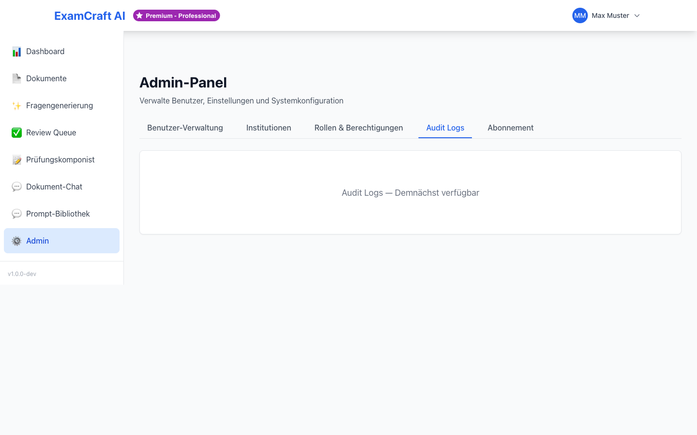

# Audit Logs

Die Nutzungsübersicht im Admin-Panel gibt Ihnen einen Überblick über die Aktivitäten und den Ressourcenverbrauch Ihrer Institution.

Navigieren Sie zu `/admin` und wählen Sie den Tab **Nutzung**.

## Verfügbare Kennzahlen

| Metrik | Beschreibung |
|--------|-------------|
| Aktive Benutzer | Anzahl Benutzer mit mindestens einer Aktivität im gewählten Zeitraum |
| Generierte Fragen | Gesamtanzahl der von KI erzeugten Fragen |
| Validierte Fragen | Anzahl in der Review Queue genehmigter Fragen |
| Hochgeladene Dokumente | Anzahl und Gesamtgrösse der verarbeiteten Dokumente |
| API-Aufrufe | Anzahl der Claude-API-Anfragen (relevant für Kostenkontrolle) |

## Zeitraum auswählen

Filtern Sie die Darstellung nach Zeitraum:

- **Heute** — Aktivitäten des aktuellen Tages
- **Diese Woche** — Laufende Woche (Montag bis heute)
- **Dieser Monat** — Laufender Kalendermonat
- **Benutzerdefiniert** — Eigenen Zeitraum über den Datumspicker wählen

## Nutzung pro Benutzer

In der Detailansicht sehen Sie die Aufschlüsselung nach Benutzern:

| Spalte | Beschreibung |
|--------|-------------|
| Benutzer | Name und E-Mail |
| Generierte Fragen | Anzahl im gewählten Zeitraum |
| Dokumente | Anzahl hochgeladener Dokumente |
| Letzte Aktivität | Datum der letzten Aktion |

Klicken Sie auf eine Tabellenzeile, um die Details eines einzelnen Benutzers einzusehen.

## Abonnementkontingente überwachen

Achten Sie besonders auf die Kontingentauslastung:

!!! warning "Kontingentgrenzen beachten"
    Beim Free- und Starter-Abonnement gelten monatliche Limits für Fragen und Dokumente.
    Wenn Benutzer die Limits regelmässig erreichen, sollten Sie über ein Upgrade nachdenken.
    Siehe [Abonnement](../user-guide/subscription.md).

## Hinweis: Technisches Infrastruktur-Monitoring

Die Nutzungsübersicht im Admin-Panel zeigt **Anwendungsmetriken** (wer nutzt was). Für **technisches Infrastruktur-Monitoring** (Serverauslastung, Logs, Fehlerrate) wenden Sie sich an Ihren IT-Administrator oder DevOps-Verantwortlichen — diese Informationen sind nicht Bestandteil des Admin-Panels.

## Häufige Fragen zur Nutzungsübersicht

**Wie oft werden die Zahlen aktualisiert?**

Die Kennzahlen werden in Echtzeit aktualisiert. Nach jeder Aktion (Fragengenerierung, Dokumentupload, Review) werden die Metriken innerhalb weniger Sekunden aktualisiert.

**Kann ich die Daten exportieren?**

Derzeit ist kein direkter Datenexport aus dem Admin-Panel möglich. Sie können jedoch die Nutzungsübersicht im Browser abfotografieren oder die Zahlen manuell dokumentieren. Ein CSV/PDF-Export ist für zukünftige Releases geplant.

**Was bedeutet „API-Aufrufe"?**

Jede KI-Fragengenerierung zählt als ein oder mehrere API-Aufrufe an die Claude API. Wenn Sie z.B. 10 Fragen generieren, können es 1–3 API-Aufrufe sein (je nach Batch-Grösse). Diese Information ist relevant für die Kostenkontrolle bei Professional- und Enterprise-Plänen, da Sie Ihr API-Budget verwalten müssen.

**Unterscheiden sich API-Aufrufe zwischen KI- und RAG-Prüfungen?**

RAG-Prüfungen benötigen möglicherweise mehr API-Aufrufe, da die KI erst die semantische Suche durchführt und dann die Fragen generiert. KI-Prüfungen sind meist schneller. Der genaue Unterschied wird in der API-Aufruf-Metrik gemessen.

**Kann ich Benutzer mit hohem Verbrauch sehen?**

Ja! In der Detailansicht „Nutzung pro Benutzer" können Sie sehen, welche Benutzer wie viele Fragen generiert haben und wie viele Dokumente sie nutzen. Dies hilft bei der Identifikation von Power-Usern und der Planung von Ressourcen.

## Nächste Schritte

- [:octicons-arrow-right-24: Benutzer verwalten](user-mgmt.md)
- [:octicons-arrow-right-24: Institutionen verwalten](institutions.md)
