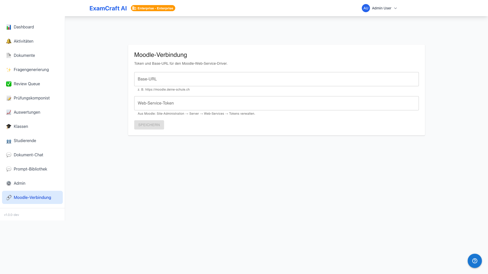

# Moodle-Connection einrichten

!!! warning "Pflicht-Konfiguration für Produktivbetrieb"
    Der Moodle-Zugriffs-Token wird mit Fernet verschlüsselt gespeichert. Für den Produktivbetrieb **muss** die Umgebungsvariable `MOODLE_TOKEN_ENCRYPTION_KEY` mit einem 44-Zeichen-Fernet-Key gesetzt sein. Fehlt sie, fällt die Anwendung auf einen Default-Mechanismus zurück, der für die Produktion ungeeignet ist.

Die Moodle-Connection erlaubt Lehrpersonen den direkten API-Import von Prüfungsresultaten ohne manuellen CSV-Export. Diese Einrichtung erfolgt einmalig pro Institution durch einen Administrator.

## Voraussetzungen in Moodle

1. **Website-Administration → Plugins → Web Services → Überblick**: Web Services aktivieren
2. REST-Protokoll aktivieren
3. Einen externen Dienst anlegen und folgende Funktionen zuweisen:
   - `mod_quiz_get_quizzes_by_courses`
   - `mod_quiz_get_user_attempts`
   - `mod_quiz_get_attempt_review`
   - `core_webservice_get_site_info` (für den Test-Button)
4. Token für einen Systembenutzer mit den nötigen Berechtigungen generieren

## Encryption-Key generieren

Führen Sie folgenden Befehl auf dem Server aus und tragen Sie den Output als `MOODLE_TOKEN_ENCRYPTION_KEY` in die `.env`-Datei ein:

```bash
python -c "from cryptography.fernet import Fernet; print(Fernet.generate_key().decode())"
```

Der Key hat exakt 44 Zeichen und muss geheim gehalten werden. Bei Verlust müssen alle gespeicherten Tokens neu eingetragen werden.

## Connection einrichten



1. Navigieren Sie als Admin zu `/admin/integrations/moodle`
2. Klicken Sie auf **Neue Verbindung**
3. Füllen Sie die Felder aus:

| Feld | Beispiel | Hinweis |
|------|---------|---------|
| Name | „Moodle Hochschule Bern" | Anzeigename für Lehrpersonen |
| Base-URL | `https://moodle.example.ch` | Ohne abschliessendes `/` |
| Token | `abc123...` | Aus Moodle kopiert |

4. Klicken Sie auf **Verbindung testen** — ExamCraft ruft `core_webservice_get_site_info` auf. Bei Erfolg erscheint der Moodle-Sitename als Bestätigung.
5. **Speichern**

## Wie der API-Import intern funktioniert

Beim Import läuft folgende Abfragesequenz:

1. `mod_quiz_get_quizzes_by_courses` — alle Quizze im Kurs auflisten
2. `mod_quiz_get_user_attempts` — alle Versuche pro Studierenden holen
3. `mod_quiz_get_attempt_review` — Detailantworten pro Versuch abrufen

Die Fragen-Zuordnung erfolgt anhand der Moodle-Fragen-IDs, die Lehrpersonen einmalig im [Question-ID-Round-Trip](../user-guide/moodle-integration.md) hinterlegen.

## Multi-Tenant-Isolation

Jede Institution verwaltet ihre eigenen Connections. Tokens und Verbindungsdaten sind institutionsübergreifend nicht zugänglich.

## Nächste Schritte

- [:octicons-arrow-right-24: Lehrpersonen-Anleitung Moodle](../user-guide/moodle-integration.md)
- [:octicons-arrow-right-24: Notenschemata](grading-schemes.md)
- [:octicons-arrow-right-24: Rollen und Berechtigungen](roles.md)
