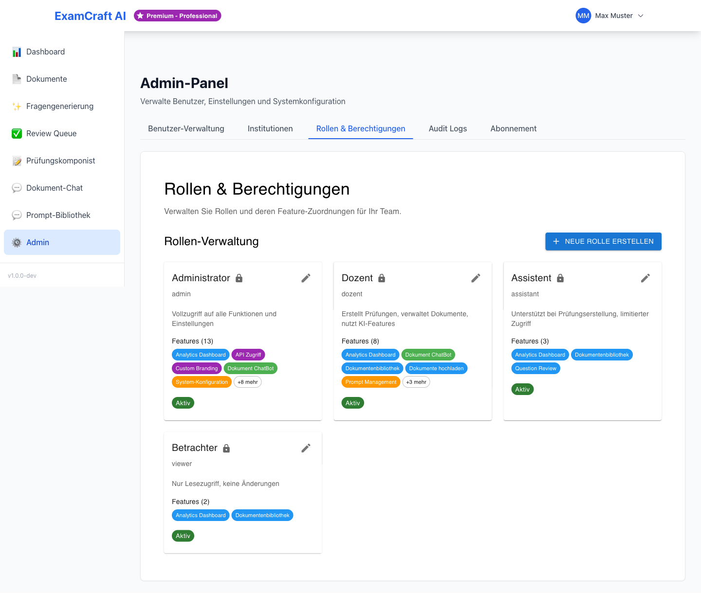

# Rollen und Berechtigungen

ExamCraft AI verwendet ein rollenbasiertes Berechtigungssystem (RBAC). Jeder Benutzer erhält eine Rolle, die bestimmt, welche Funktionen er nutzen darf.

Navigieren Sie zu `/admin` und wählen Sie den Tab **Rollen**, um die Rollenzuweisungen Ihrer Institution einzusehen.

## Verfügbare Rollen

ExamCraft AI kennt zwei Rollen:

| Rolle | Beschreibung |
|-------|-------------|
| **DOZENT** | Standardrolle für Lehrkräfte — Zugang zu allen Lernfunktionen |
| **ADMIN** | Erweiterte Rolle für Institutionsadministratoren — zusätzlicher Zugang zum Admin-Panel |

## Berechtigungsübersicht

| Funktion | DOZENT | ADMIN |
|----------|:------:|:-----:|
| Dokumente hochladen und verwalten | ✓ | ✓ |
| KI-Prüfungen generieren | ✓ | ✓ |
| RAG-Prüfungen generieren | ✓ | ✓ |
| Review Queue nutzen | ✓ | ✓ |
| Prüfungskomponist nutzen | ✓ | ✓ |
| Prompt-Bibliothek nutzen | ✓ | ✓ |
| Eigenes Profil bearbeiten | ✓ | ✓ |
| **Benutzerverwaltung** | — | ✓ |
| **Institutionen verwalten** | — | ✓ |
| **Nutzungsübersicht einsehen** | — | ✓ |
| **Rollen zuweisen** | — | ✓ |
| **Abonnement und Quotas verwalten** | — | ✓ |

## Rolle zuweisen oder ändern

Die Rollenzuweisung erfolgt in der [Benutzerverwaltung](user-mgmt.md):

1. Navigieren Sie zu `/admin` → Tab **Benutzer**
2. Öffnen Sie den gewünschten Benutzer
3. Wählen Sie im Feld **Rolle** den neuen Wert (`DOZENT` oder `ADMIN`)
4. Klicken Sie auf **Änderungen speichern**

Die neue Rolle ist sofort wirksam — der Benutzer sieht beim nächsten Seitenaufruf die angepasste Oberfläche.

!!! warning "ADMIN-Rolle sparsam vergeben"
    Vergeben Sie die ADMIN-Rolle nur an Personen, die tatsächlich Benutzer und
    Institutionseinstellungen verwalten müssen. Zu viele Administratoren erhöhen
    das Risiko unbeabsichtigter Konfigurationsänderungen.

## Subscription-Tiers und Berechtigungen

Die Rolle (DOZENT / ADMIN) steuert, **wer** auf welche Funktionen zugreifen darf. Das [Abonnement-Tier](subscription.md) (Free, Starter, Professional, Enterprise) steuert zusätzlich, **wie viel** ein Benutzer nutzen darf — etwa die Anzahl der Dokumente oder generierbaren Fragen pro Monat.

Beide Mechanismen greifen unabhängig voneinander: Ein ADMIN mit Free-Tier hat Zugang zum Admin-Panel, aber dieselben Nutzungslimits wie ein DOZENT mit Free-Tier.

## Nächste Schritte

- [:octicons-arrow-right-24: Benutzer verwalten](user-mgmt.md)
- [:octicons-arrow-right-24: Abonnement und Quotas](subscription.md)
- [:octicons-arrow-right-24: Institutionen verwalten](institutions.md)
