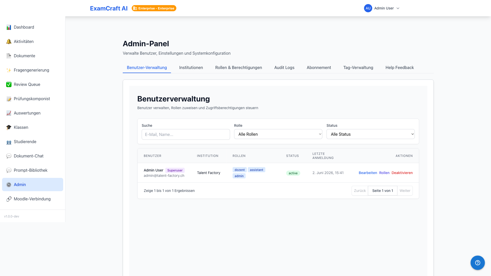

# Rollen und Berechtigungen

ExamCraft AI verwendet ein rollenbasiertes Berechtigungssystem (RBAC). Jeder Benutzer erhält eine Rolle, die bestimmt, welche Funktionen er nutzen darf.

Navigieren Sie zu `/admin` und wählen Sie den Tab **Rollen**, um die Rollenzuweisungen Ihrer Institution einzusehen.

## Verfügbare Rollen

ExamCraft AI kennt zwei Rollen:

| Rolle | Beschreibung |
|-------|-------------|
| **DOZENT** | Standardrolle für Lehrkräfte — Zugang zu allen Lernfunktionen |
| **ADMIN** | Erweiterte Rolle für Institutionsadministratoren — zusätzlicher Zugang zum Admin-Panel |

## Berechtigungsübersicht

| Funktion | DOZENT | ADMIN |
|----------|:------:|:-----:|
| Dokumente hochladen und verwalten | ✓ | ✓ |
| KI-Prüfungen generieren | ✓ | ✓ |
| RAG-Prüfungen generieren | ✓ | ✓ |
| Review Queue nutzen | ✓ | ✓ |
| Prüfungskomponist nutzen | ✓ | ✓ |
| Prompt-Bibliothek nutzen | ✓ | ✓ |
| Eigenes Profil bearbeiten | ✓ | ✓ |
| **Benutzerverwaltung** | — | ✓ |
| **Institutionen verwalten** | — | ✓ |
| **Nutzungsübersicht einsehen** | — | ✓ |
| **Rollen zuweisen** | — | ✓ |
| **Abonnement und Quotas verwalten** | — | ✓ |
| Auswertungen einsehen (`submissions:read`) | ✓ | ✓ |
| Submissions importieren (`submissions:import`) | ✓ | ✓ |
| Submissions bewerten (`submissions:grade`) | ✓ | ✓ |
| Studierende verwalten (`students:manage`) | — | ✓ |
| Moodle-Connection konfigurieren (`moodle:configure`) | — | ✓ |
| Notenschemata verwalten (`grading_schemes:manage`) | — | ✓ (Enterprise) |
| Organisationseinheiten verwalten (`manage_org_units`) | — | ✓ |

## Rolle zuweisen oder ändern

Die Rollenzuweisung erfolgt in der [Benutzerverwaltung](user-mgmt.md):

1. Navigieren Sie zu `/admin` → Tab **Benutzer**
2. Öffnen Sie den gewünschten Benutzer
3. Wählen Sie im Feld **Rolle** den neuen Wert (`DOZENT` oder `ADMIN`)
4. Klicken Sie auf **Änderungen speichern**

Die neue Rolle ist sofort wirksam — der Benutzer sieht beim nächsten Seitenaufruf die angepasste Oberfläche.

!!! warning "ADMIN-Rolle sparsam vergeben"
    Vergeben Sie die ADMIN-Rolle nur an Personen, die tatsächlich Benutzer und
    Institutionseinstellungen verwalten müssen. Zu viele Administratoren erhöhen
    das Risiko unbeabsichtigter Konfigurationsänderungen.

## Subscription-Tiers und Berechtigungen

Die Rolle (DOZENT / ADMIN) steuert, **wer** auf welche Funktionen zugreifen darf. Das [Abonnement-Tier](subscription.md) (Free, Starter, Professional, Enterprise) steuert zusätzlich, **wie viel** ein Benutzer nutzen darf — etwa die Anzahl der Dokumente oder generierbaren Fragen pro Monat.

Beide Mechanismen greifen unabhängig voneinander: Ein ADMIN mit Free-Tier hat Zugang zum Admin-Panel, aber dieselben Nutzungslimits wie ein DOZENT mit Free-Tier.

## Update-Hinweis v1.4 — Neue Permissions

!!! warning "Automatische Zuweisung an Reviewer-Rolle"
    Mit dem v1.4-Update erhält die Reviewer-Rolle automatisch die Permission `submissions:grade`. Wer das Bewerten (Grading) von der reinen Review-Tätigkeit trennen möchte, sollte **vor dem Update** eine eigene Rolle ohne diese Permission definieren.

    Die Permission `grading_schemes:manage` wird **nicht** automatisch vergeben — sie ist ausschliesslich Admin- und Institution-Owner-Rollen im Enterprise-Tier vorbehalten.

### Default-Rollen-Mapping (ab v1.4)

| Rolle | Neue Permissions |
|-------|-----------------|
| DOZENT | `submissions:read`, `submissions:import`, `submissions:grade` |
| ADMIN | Alle obigen + `students:manage`, `moodle:configure` |
| Institution Owner | Zusätzlich `grading_schemes:manage` (Enterprise) |

## Update-Hinweis v1.8 — Neue Permission

!!! info "Organisationseinheiten"
    Mit v1.8 wurde die Permission `manage_org_units` eingeführt. Sie ist standardmässig der ADMIN-Systemrolle zugewiesen und steuert das Anlegen, Verschieben, Löschen und das Einsehen der vollständigen Liste von Organisationseinheiten (Abteilungen/Teams) im Admin-Panel. Ohne die Permission bleibt der Tab unsichtbar; jeder Benutzer sieht weiterhin seine eigenen Zugehörigkeiten.

    Eine Organisationseinheit kann zusätzlich ihren direkten Mitgliedern automatisch eine Rolle verleihen und für Ressourcen mit Team-Sichtbarkeit steuern, wer sie sehen darf. Details siehe [Organisationseinheiten](org-units.md).

### Default-Rollen-Mapping (ab v1.8)

| Rolle | Neue Permissions |
|-------|-------------------|
| ADMIN | `manage_org_units` |
| DOZENT | — |

## Nächste Schritte

- [:octicons-arrow-right-24: Benutzer verwalten](user-mgmt.md)
- [:octicons-arrow-right-24: Organisationseinheiten verwalten](org-units.md)
- [:octicons-arrow-right-24: Abonnement und Quotas](subscription.md)
- [:octicons-arrow-right-24: Institutionen verwalten](institutions.md)
