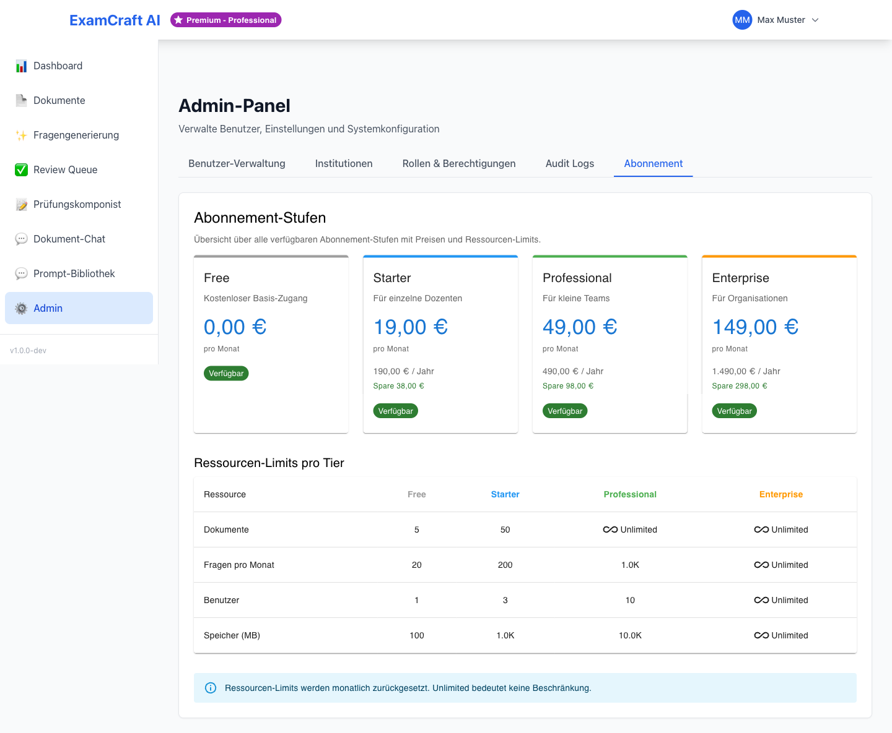

# Abonnement

ExamCraft AI bietet vier Subscription-Tiers mit unterschiedlichen Funktionen und Kontingenten:

| Tier | Dokumente | Generierte Fragen/Monat | RAG | KI-Modelle | Support |
|---|-----|----------|------|---------|---------|
| **Free** | 5 | 20 | Nein | GPT-4 Mini | Community |
| **Starter** | 50 | 100 | Ja (limitiert) | GPT-4 Mini | Email |
| **Professional** | Unbegrenzt | Unbegrenzt | Ja | GPT-4 + Claude 3 | Email + Priority |
| **Enterprise** | Unbegrenzt | Unbegrenzt | Ja | Alle Modelle | Dedicated Support |

## Tier-Unterschiede im Detail

### Free Tier

**Ideal für**: Einzelne Lehrkräfte und kleine Tests

- **Dokumentenverwaltung**: Maximal 5 Dokumente gleichzeitig
- **Fragengenerierung**: Bis zu 20 Fragen pro Monat
- **Fragetypen**: Multiple Choice und Offene Fragen
- **Funktionen**:
  - KI-Prüfungen (einfache Prompts)
  - Review Queue (manuelle Überprüfung)
  - Grundlegende Benutzerprofile
- **Keine RAG**: Fragen werden nur zu eingegebenem Thema generiert, nicht aus Dokumenten
- **Support**: Community-Forum

### Starter Tier

**Ideal für**: Kurse mit regelmässigen Prüfungen

- **Dokumentenverwaltung**: Maximal 50 Dokumente gleichzeitig
- **Fragengenerierung**: Bis zu 100 Fragen pro Monat
- **RAG-Prüfungen**: Mit Dokumenten erstellen (bis zu 5 pro Anfrage)
- **Funktionen**:
  - KI-Prüfungen mit erweiterten Prompt-Templates
  - RAG-basierte Prüfungen mit Quellenangaben
  - Confidence Scores für Qualitätskontrolle
  - Review Queue mit erweiterten Filteroptionen
- **Prompt-Vorlagen**: 10 vordefinierte Prompt-Templates
- **Support**: Email-Support (48h Antwortzeit)

### Professional Tier

**Ideal für**: Institutionen mit mehreren Kursen

- **Dokumentenverwaltung**: Unbegrenzte Anzahl und Grösse
- **Fragengenerierung**: Unbegrenzte Fragenanzahl pro Monat
- **RAG-Prüfungen**: Mit bis zu 50 Dokumenten pro Anfrage
- **Funktionen**:
  - Alle Starter-Features
  - Erweiterte Prompt-Vorlagen (50+)
  - Benutzerdefinierte Prompt-Erstellung
  - Admin-Dashboard mit detaillierter Nutzungsanalyse
  - Mehrere Administratoren pro Institution
  - Benutzerrolle-Management (Lehrkraft, Admin)
- **API-Zugriff**: Begrenzt (100 Anfragen/Tag)
- **Support**: Email + Priority Queue (24h Antwortzeit)
- **Backup & Sicherheit**: Automatische tägliche Backups

### Enterprise Tier

**Ideal für**: Grosse Organisationen und Unternehmen

- **Alle Professional-Features** plus:
- **Dokumentenverwaltung**: Unbegrenzte Anzahl, Grösse und gleichzeitige Verarbeitung
- **Fragengenerierung**: Unbegrenzte Fragenanzahl und Anfragen pro Monat
- **RAG-Prüfungen**: Unbegrenzte Dokumenten pro Anfrage, erweiterte Indexierung
- **Funktionen**:
  - Custom KI-Modelle und Fine-Tuning
  - Erweiterte Sicherheitskonfiguration (SSO, LDAP)
  - White-Label-Optionen
  - Bulk-Import und -Export von Dokumenten
  - API-Zugang ohne Limit
  - Audit-Logs für Compliance
- **Support**: Dedicated Account Manager, 24/7 Hotline
- **Infrastruktur**: Optional selbstgehostete Lösung, eigene Qdrant-Instanz
- **SLA**: 99,9% Verfügbarkeit garantiert
- **Training**: Kostenlose Onboarding-Session und Schulungen

## Quotas und Limits

Folgende Tabelle zeigt technische Limits pro Tier:

| Limit | Free | Starter | Professional | Enterprise |
|-------|------|---------|-------------|-----------|
| Parallele Uploads | 1 | 5 | 10 | Unbegrenzt |
| Max. Dokumentgrösse | 10 MB | 50 MB | 100 MB | Unbegrenzt |
| Batch-Fragengenerierung | 1 | 3 | 10 | Unbegrenzt |
| API-Aufrufe/Monat | 50 | 500 | 5000 | Unbegrenzt |
| Retention Period (Daten) | 3 Monate | 6 Monate | 12 Monate | Custom |

## Upgrade und Downgrade

- **Upgrades**: Sofort wirksam, proportionale Abrechnung
- **Downgrades**: Am Ende des laufenden Abrechnungszeitraums
- **Kundensperre**: Bei Überschreitung von Kontingenten werden Anfragen blockiert

## Nächste Schritte

- [:octicons-arrow-right-24: Benutzer und ihre Tiers verwalten](user-mgmt.md)
- [:octicons-arrow-right-24: Nutzungsstatistiken anschauen](monitoring.md)
