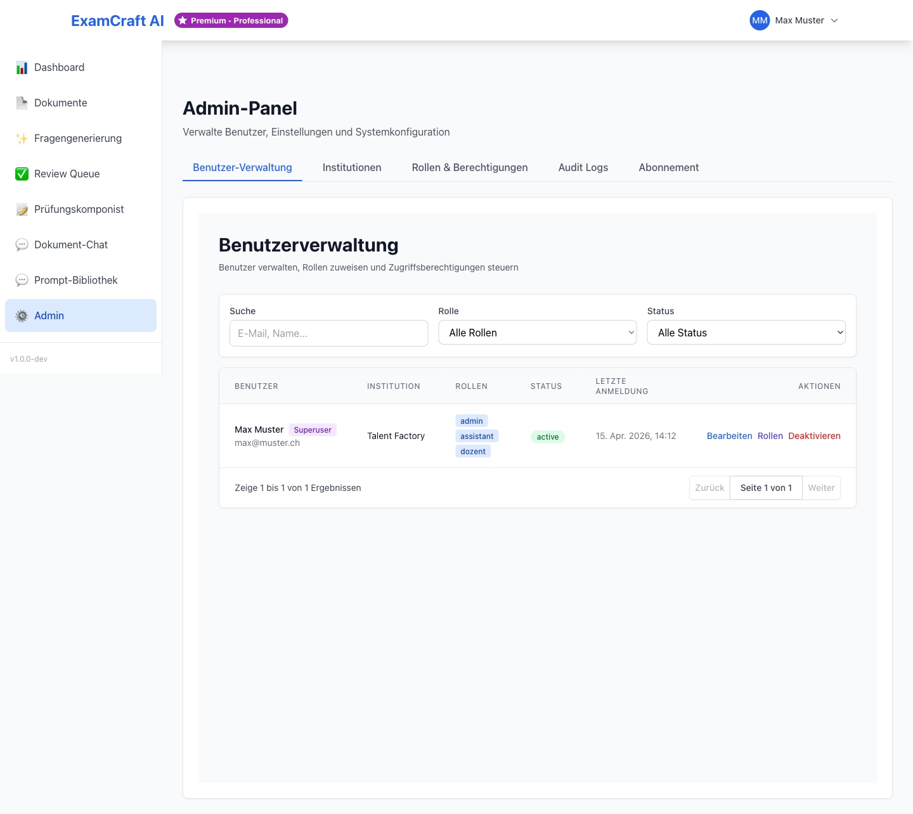

# Benutzer-Verwaltung

Als Administrator verwalten Sie alle Benutzer Ihrer Institution über das Admin-Panel. Navigieren Sie zu `/admin` und wählen Sie den Tab **Benutzer**.

## Benutzer anlegen

1. Klicken Sie auf **Neuer Benutzer**
2. Füllen Sie das Formular aus:

| Feld | Beschreibung | Pflichtfeld |
|------|-------------|:-----------:|
| Vorname und Nachname | Vollständiger Name der Person | ✓ |
| E-Mail-Adresse | Wird als Login-Name verwendet | ✓ |
| Rolle | ADMIN oder DOZENT (siehe unten) | ✓ |
| Institution | Zuweisung zur Institution | ✓ |
| Temporäres Passwort | Erstes Passwort (Benutzer kann es ändern) | ✓ |

3. Klicken Sie auf **Benutzer erstellen**
4. Der neue Benutzer erhält eine Willkommens-E-Mail mit Anmeldeinformationen

!!! tip "Google OAuth empfehlen"
    Empfehlen Sie neuen Benutzern, beim ersten Login auf Google OAuth umzusteigen.
    Das vereinfacht die Passwortverwaltung und erhöht die Sicherheit.

## Benutzerrollen

ExamCraft AI kennt zwei Rollen:

| Rolle | Berechtigungen |
|-------|---------------|
| **DOZENT** | Dokumente hochladen, Fragen generieren, Review Queue, Prüfungskomponist, Prompt-Bibliothek |
| **ADMIN** | Alle DOZENT-Berechtigungen + Benutzerverwaltung, Institutionen, Admin-Panel |

Vergeben Sie die ADMIN-Rolle nur an Personen, die tatsächlich Benutzer verwalten sollen.

## Benutzer bearbeiten

1. Klicken Sie in der Benutzerliste auf den Namen der Person
2. Passen Sie die gewünschten Felder an (Name, E-Mail, Rolle, Institution)
3. Klicken Sie auf **Änderungen speichern**

## Passwort zurücksetzen (als Admin)

1. Öffnen Sie den Benutzer in der Verwaltung
2. Klicken Sie auf **Passwort zurücksetzen**
3. Ein neues temporäres Passwort wird generiert und per E-Mail an den Benutzer gesendet
4. Der Benutzer wird beim nächsten Login aufgefordert, das Passwort zu ändern

## Benutzer deaktivieren

Wenn ein Benutzer die Institution verlässt oder keinen Zugriff mehr benötigen soll:

1. Öffnen Sie den Benutzer
2. Klicken Sie auf **Benutzer deaktivieren**
3. Bestätigen Sie die Aktion

!!! warning "Deaktivieren statt Löschen"
    Deaktivieren Sie Benutzer anstatt sie zu löschen. So bleiben alle erstellten
    Fragen und Prüfungen erhalten und zuordenbar. Ein deaktivierter Benutzer kann
    sich nicht mehr anmelden, seine Daten bleiben aber bestehen.

## Benutzer einer Institution zuweisen

Sie können die Institutionszuweisung jederzeit ändern:

1. Öffnen Sie den Benutzer
2. Wählen Sie im Feld **Institution** die neue Institution
3. Speichern Sie die Änderung

Weitere Informationen zu Institutionen: [Institutionen verwalten](institutions.md)

## Nächste Schritte

- [:octicons-arrow-right-24: Institutionen verwalten](institutions.md)
- [:octicons-arrow-right-24: Nutzungsübersicht](monitoring.md)
