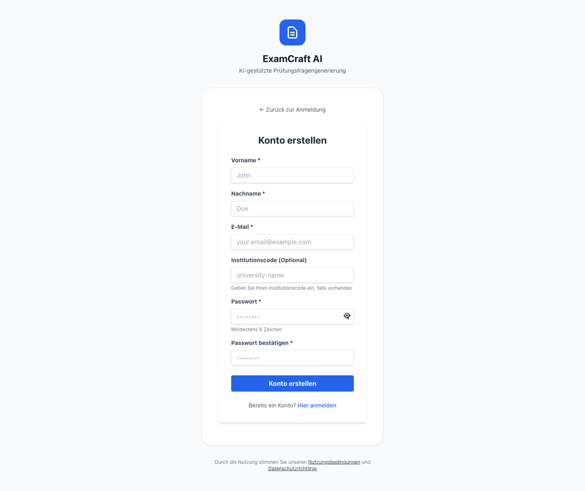

# Konto erstellen

Um ExamCraft AI nutzen zu können, benötigen Sie ein persönliches Benutzerkonto. Die Registrierung ist kostenlos und dauert weniger als zwei Minuten.

!!! warning "Kein Selbst-Signup in manchen Institutionen"
    In einigen Bildungsinstitutionen ist die Selbstregistrierung deaktiviert. In diesem Fall erhalten Sie eine Einladungs-E-Mail von Ihrer Institution. Folgen Sie dem Link in dieser E-Mail, um Ihr Konto einzurichten. Wenden Sie sich an Ihre IT-Administration oder Ihren Institutionsadministrator, falls Sie keine Einladung erhalten haben.

## Registrierungsmethoden

ExamCraft AI unterstützt zwei Anmeldeverfahren. Sie können sich jederzeit für eine der folgenden Methoden entscheiden:

### Google OAuth (empfohlen)

Die Anmeldung über Google OAuth ist die schnellste und sicherste Methode. Sie benötigen kein zusätzliches Passwort — Ihre bestehende Google-Identität wird zur Authentifizierung verwendet.

!!! tip "Tipp: Google OAuth bevorzugen"
    Google OAuth ist sicherer als ein eigenständiges Passwort, da Google moderne Sicherheitsmechanismen wie Zwei-Faktor-Authentifizierung und Anomalieerkennung übernimmt. Falls Sie bereits ein Google-Konto verwenden, empfehlen wir diese Methode.

**Schritt-für-Schritt-Anleitung:**

1. Öffnen Sie ExamCraft AI in Ihrem Browser und navigieren Sie zur Anmeldeseite.
2. Klicken Sie auf die Schaltfläche **Mit Google anmelden**.
3. Es öffnet sich ein Google-Anmeldefenster (Popup oder neue Seite). Wählen Sie das gewünschte Google-Konto aus oder geben Sie Ihre Google-E-Mail-Adresse ein.
4. Bestätigen Sie den Zugriff, wenn Google Sie dazu auffordert. ExamCraft AI erhält lediglich Ihren Namen und Ihre E-Mail-Adresse — keine Inhalte aus Ihrem Google-Konto.
5. Sie werden automatisch zu ExamCraft AI zurückgeleitet und sind sofort angemeldet.
6. Beim ersten Login wird Ihr Profil automatisch angelegt. Sie sehen anschliessend das Dashboard mit Ihrem Free-Abonnement.

### E-Mail und Passwort

Falls Sie kein Google-Konto verwenden möchten oder können, registrieren Sie sich mit Ihrer E-Mail-Adresse und einem selbst gewählten Passwort.

**Schritt-für-Schritt-Anleitung:**

1. Öffnen Sie ExamCraft AI in Ihrem Browser und navigieren Sie zur Anmeldeseite.
2. Klicken Sie auf **Registrieren** (oder **Konto erstellen**).
3. Geben Sie Ihre **E-Mail-Adresse** ein. Verwenden Sie eine E-Mail-Adresse, auf die Sie regelmässig Zugriff haben — sie wird für die Kontobestätigung und Passwort-Zurücksetzen benötigt.
4. Wählen Sie ein **Passwort**. Das Passwort muss folgende Anforderungen erfüllen:
    - Mindestens 8 Zeichen
    - Mindestens ein Grossbuchstabe
    - Mindestens eine Zahl oder ein Sonderzeichen
5. Wiederholen Sie das Passwort im Feld **Passwort bestätigen**.
6. Klicken Sie auf **Registrieren**.
7. Sie erhalten eine **Bestätigungs-E-Mail** an die angegebene Adresse. Öffnen Sie diese E-Mail und klicken Sie auf den Bestätigungslink, um Ihr Konto zu aktivieren. Der Link ist 24 Stunden gültig.
8. Nach der Bestätigung können Sie sich mit Ihrer E-Mail-Adresse und Ihrem Passwort anmelden.

!!! note "Bestätigungs-E-Mail nicht erhalten?"
    Prüfen Sie zunächst Ihren Spam- oder Junk-Ordner. Falls die E-Mail dort nicht erscheint, können Sie auf der Anmeldeseite unter **Bestätigungsmail erneut senden** eine neue Bestätigung anfordern.

## Erste Anmeldung

Nach der erfolgreichen Registrierung und dem ersten Login werden Sie automatisch auf das **Dashboard** weitergeleitet. Das Dashboard ist der zentrale Ausgangspunkt für alle Aktivitäten in ExamCraft AI.

Folgendes erwartet Sie beim ersten Login:

- Ihr Konto wird automatisch mit dem kostenlosen **Free-Abonnement** ausgestattet. Damit können Sie eine begrenzte Anzahl von Dokumenten hochladen und Prüfungsfragen generieren.
- Ihr Profil ist bereits mit Ihrem Namen und Ihrer E-Mail-Adresse befüllt (bei Google OAuth werden diese Daten direkt von Google übernommen).
- Sie können sofort loslegen: Laden Sie ein Dokument hoch oder generieren Sie direkt eine erste Prüfung.

Eine Übersicht aller Dashboard-Funktionen finden Sie unter [Dashboard verstehen](../user-guide/dashboard.md).

## Passwort vergessen

Falls Sie Ihr Passwort vergessen haben, können Sie es über die Anmeldeseite zurücksetzen. Dieser Vorgang ist nur für Konten mit E-Mail/Passwort-Anmeldung möglich — Google-OAuth-Konten werden über Ihr Google-Konto verwaltet.

1. Öffnen Sie die Anmeldeseite von ExamCraft AI.
2. Klicken Sie unterhalb des Anmeldeformulars auf den Link **Passwort vergessen?**.
3. Geben Sie die E-Mail-Adresse ein, mit der Sie sich registriert haben.
4. Klicken Sie auf **Zurücksetzen-Link senden**.
5. Sie erhalten eine E-Mail mit einem Link zum Zurücksetzen Ihres Passworts. Der Link ist 1 Stunde gültig.
6. Klicken Sie auf den Link in der E-Mail und geben Sie Ihr neues Passwort ein (mindestens 8 Zeichen, mit Grossbuchstabe und Zahl/Sonderzeichen).
7. Bestätigen Sie das neue Passwort und klicken Sie auf **Passwort speichern**.
8. Sie werden zur Anmeldeseite weitergeleitet und können sich sofort mit dem neuen Passwort einloggen.

## Konto deaktiviert oder gesperrt

Falls Sie beim Anmelden die Meldung erhalten, dass Ihr Konto deaktiviert oder gesperrt wurde, können Sie sich nicht selbstständig wieder anmelden. Wenden Sie sich in diesem Fall direkt an den Administrator Ihrer Institution oder an den ExamCraft-AI-Support.

Mögliche Gründe für eine Kontosperrung:

- Zu viele fehlgeschlagene Anmeldeversuche (temporäre Sperre, wird nach einer Wartezeit automatisch aufgehoben)
- Manuelle Deaktivierung durch einen Institutionsadministrator
- Abgelaufenes oder storniertes Abonnement auf Institutionsebene

Teilen Sie dem Administrator Ihre registrierte E-Mail-Adresse mit, damit er Ihr Konto prüfen und bei Bedarf reaktivieren kann.
