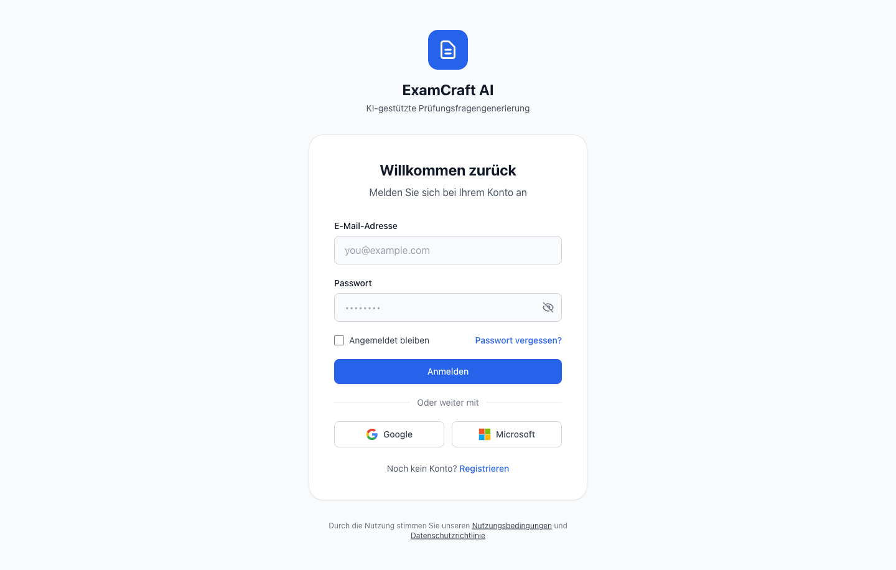

---
hide:
  - navigation
---

# Willkommen bei ExamCraft AI

ExamCraft AI ist eine KI-gesteuerte Plattform zur automatischen Generierung von Prüfungsaufgaben aus Ihren Kursmaterialien.

## Für wen ist diese Dokumentation?

- :material-school: **Dozenten und Lehrkräfte**

    ---

    Lernen Sie, wie Sie mit ExamCraft AI hochwertige Prüfungsfragen aus Ihren eigenen Materialien erstellen.

    [:octicons-arrow-right-24: Benutzerhandbuch](user-guide/documents.md)

- :material-shield-account: **IT-Administratoren**

    ---

    Einrichtung, Benutzerverwaltung, Prompt Management und Monitoring.

    [:octicons-arrow-right-24: Admin-Guide](admin-guide/deployment.md)

## Schnellstart

Erstellen Sie Ihre erste KI-Prüfung in 5 Minuten:

1. **Dokument hochladen** – Laden Sie ein PDF oder Word-Dokument hoch
2. **Prüfung konfigurieren** – Wählen Sie Fragetyp, Schwierigkeitsgrad und Anzahl
3. **Generieren** – Die KI erstellt Fragen basierend auf Ihren Materialien
4. **Reviewen und Exportieren** – Prüfen und exportieren Sie die Ergebnisse

[:octicons-arrow-right-24: Zur Schnellstart-Anleitung](getting-started/quickstart.md)
