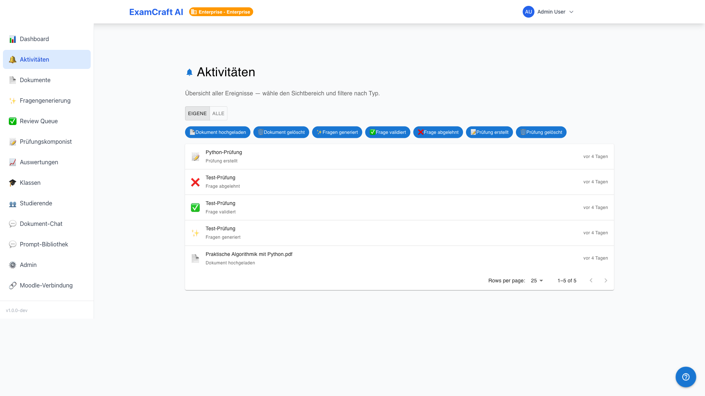
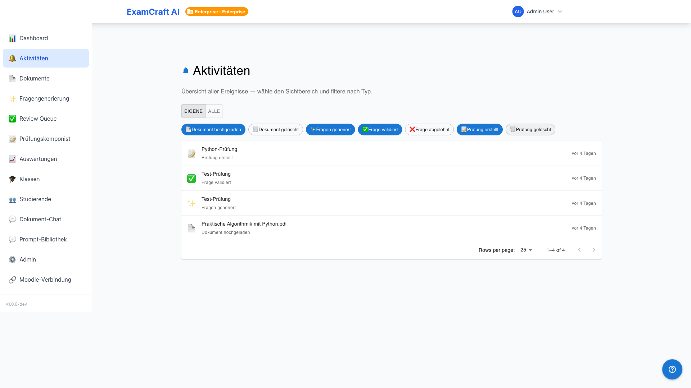

# Aktivitäten

!!! note "Alle Aktivitäten auf einen Blick"
    Die Aktivitäten-Seite zeigt alle Ereignisse aus Ihrer Institution in chronologischer Reihenfolge — mit Pagination, Filter-Chips und einem Toggle zwischen eigenen und allen Aktivitäten.

Route: `/aktivitaeten`

## Aktivitäten-Übersicht

Die Seite listet alle Aktivitäten mit Zeitstempel, Typ, Beschreibung und ausführendem Benutzer. Standardmässig sind nur eigene Aktivitäten sichtbar.

### Toggle: Eigene / Alle

Mit dem Schalter **Eigene / Alle** oben rechts wechseln Sie zwischen:

| Modus | Sichtbare Aktivitäten |
|-------|-----------------------|
| **Eigene** | Nur Ihre eigenen Aktionen (Standard) |
| **Alle** | Alle Aktivitäten der Institution (erfordert entsprechende Berechtigung) |

Das Dashboard-Widget zeigt immer nur eigene Aktivitäten — die Aktivitäten-Seite ist der einzige Ort für die institutionsweite Sicht.

## Filter-Chips

Sieben Filter-Chips grenzen die Ansicht nach Aktivitätstyp ein:

| Filter | Enthaltene Ereignisse |
|--------|-----------------------|
| **Dokumente** | Upload, Verarbeitung, Löschung von Dokumenten |
| **Prüfungen** | Erstellen, Bearbeiten, Archivieren von Prüfungen |
| **Fragen** | Generierung, Review, Änderungen an Fragen |
| **Auswertungen** | CSV-Import, LLM-Bewertung, Review-Abschluss |
| **Export** | Notenexport (CSV, Moodle-CSV, PDF) |
| **Klassen** | Klassen anlegen, Mitglieder zuweisen |
| **Benutzer** | Login, Logout, Profil-Änderungen |

Mehrere Filter sind gleichzeitig aktiv möglich. Ein Klick auf einen aktiven Chip deaktiviert ihn.

## Pagination

Die Aktivitäten-Liste wird in Seiten aufgeteilt. Wählen Sie die Seitengrösse über das Dropdown unten rechts:

- **25** Einträge pro Seite (Standard)
- **50** Einträge pro Seite
- **100** Einträge pro Seite

Mit den Vor-/Zurück-Pfeilen navigieren Sie zwischen den Seiten.

## Empty-State

Wenn keine Aktivitäten den aktiven Filtern entsprechen, erscheint ein Empty-State mit einem Hinweis auf die aktiven Filter und einem **Filter zurücksetzen**-Button.

## Was zählt als Aktivität?

Aktivitäten werden serverseitig protokolliert — jede Aktion, die Daten verändert oder eine wichtige Ressource konsumiert, erzeugt einen Eintrag. Reine Leseoperationen (z. B. Dokument öffnen, Prüfung ansehen) erscheinen nicht in der Liste.

## Datenschutz-Hinweis

Im Modus **Eigene** sehen Sie ausschliesslich Ihre eigenen Aktivitäten. Der Modus **Alle** zeigt Namen und Aktionen aller Benutzer der Institution — nutzen Sie diese Ansicht verantwortungsvoll.

## Nächste Schritte

- [:octicons-arrow-right-24: Dashboard](dashboard.md)
- [:octicons-arrow-right-24: Auswertungen](auswertungen.md)
- [:octicons-arrow-right-24: Subscription-Quotas](subscription.md)
