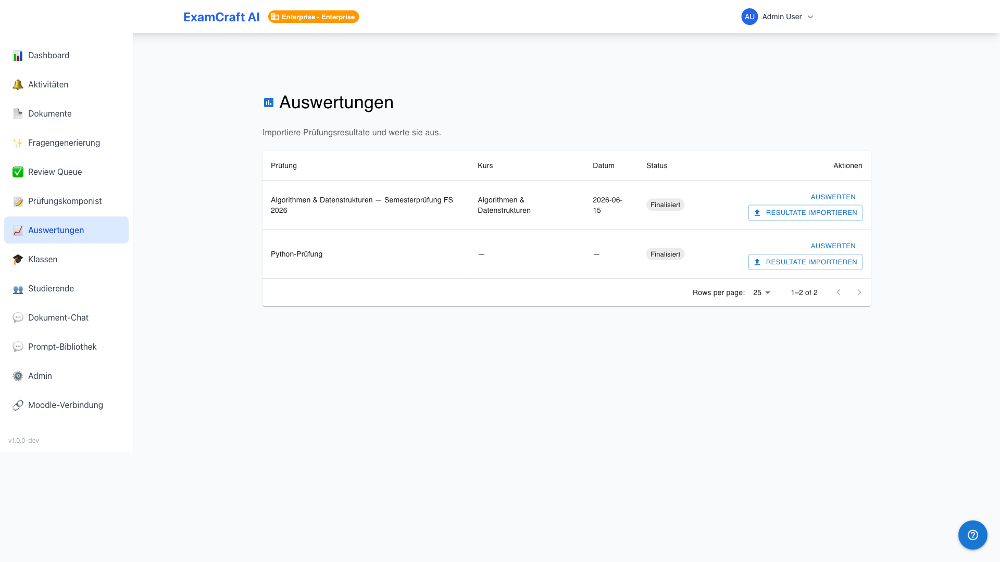
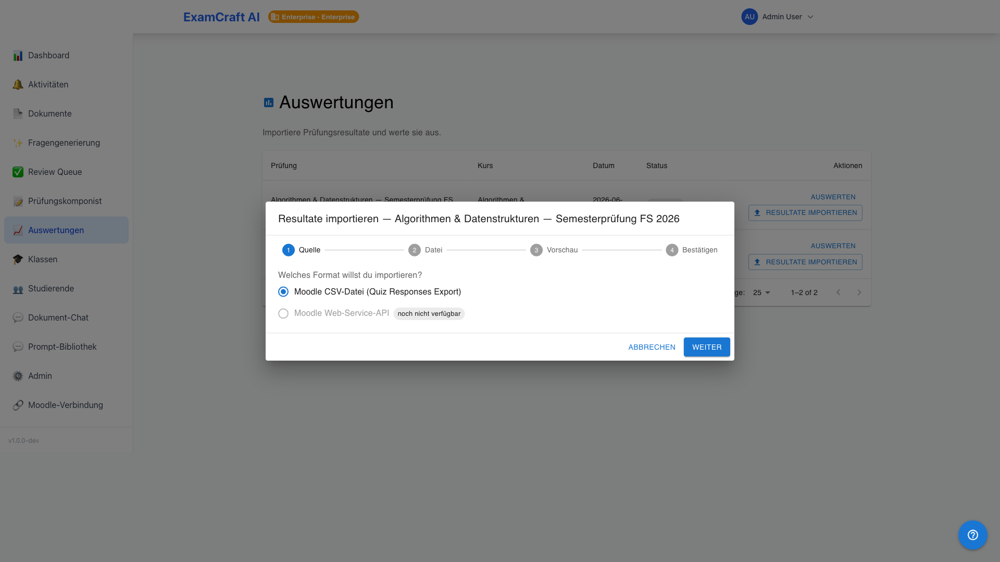
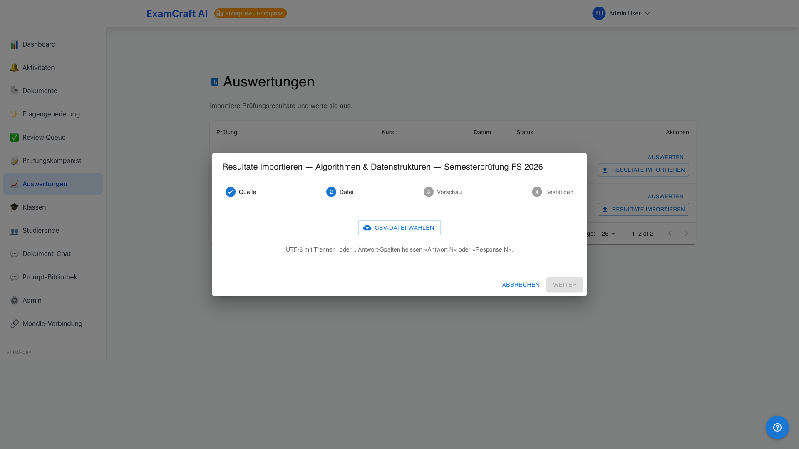
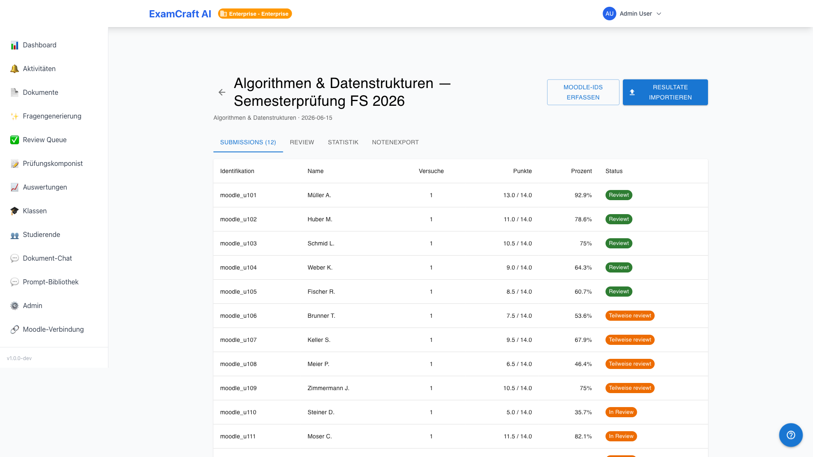
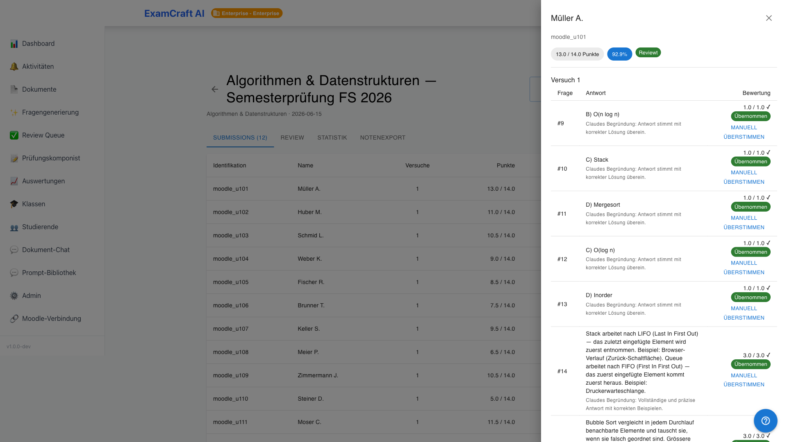

# Valutazioni

!!! note "Prerequisito"
    Per valutare i risultati di un esame, è necessario disporre di un esame completato nel [Compositore d'esame](exam-composer.md). I risultati vengono esportati come file CSV dalla propria piattaforma di apprendimento (ad es. Moodle) e importati qui.

La pipeline di valutazione conduce dall'invio alla lista dei voti in cinque passaggi: **Importazione → Valutazione automatica → Review delle domande aperte → Statistiche → Esportazione voti**. Route: `/auswertungen`.

## Avviare la pipeline di valutazione

Navigare a **Valutazioni** nella navigazione principale. La tabella elenca tutti i propri esami. Fare clic su **Importa risultati** per l'esame desiderato.

## Importare i risultati dell'esame

La finestra di dialogo di importazione guida il processo di importazione CSV in due passaggi.

### Passaggio 1: Caricare il file CSV

Selezionare **File CSV** come fonte e caricare il file di esportazione della propria piattaforma di apprendimento. Le esportazioni di Moodle (locale DE e EN) vengono riconosciute automaticamente. Per l'importazione diretta via API da Moodle, consultare la sezione [Integrazione Moodle](moodle-integration.md).

### Passaggio 2: Verificare la mappatura delle colonne

Il sistema assegna automaticamente le colonne CSV alle domande dell'esame. Verificare la mappatura:

| Colonna | Significato |
|---------|-------------|
| Studenti | Nome o e-mail del candidato |
| Colonne domande | Risposta per domanda — assegnazione tramite ID domanda Moodle o posizione della colonna |
| Punti totali | Calcolato a partire dalle valutazioni individuali, non prelevato dalla colonna CSV |

Vengono visualizzati avvisi se una domanda non può essere assegnata. È comunque possibile completare l'importazione — le domande non assegnate verranno ignorate.

!!! note "Importazione idempotente"
    Una seconda importazione dello stesso file CSV non genera duplicati. Le submission già importate vengono aggiornate, quelle mancanti vengono create ex novo.

Fare clic su **Importa** per completare l'operazione.

## Panoramica delle submission

Dopo l'importazione, tutte le submission compaiono nella scheda **Submission**. L'elenco mostra:

| Colonna | Descrizione |
|---------|-------------|
| Studenti | Nome e e-mail |
| Punti | Punti ottenuti / massimi |
| Percentuale | Quota percentuale |
| Stato | Stato di valutazione (vedere sotto) |

### Badge di stato

| Badge | Significato |
|-------|-------------|
| `pending_review` | Le domande aperte sono ancora in attesa di review |
| `partially_reviewed` | Alcune domande aperte sono state revisionate, altre non ancora |
| `fully_reviewed` | Tutte le domande aperte valutate — esportazione voti possibile |

## Dettaglio submission

Fare clic su una riga per aprire il drawer di dettaglio. Mostra tutte le risposte con testo della domanda, tipo di risposta (MC, Vero/Falso, Aperta), risposta fornita, stato di valutazione e punti ottenuti. Per le domande aperte: proposta dell'IA con badge di confidenza.

## Passi successivi

- [:octicons-arrow-right-24: Revisione delle domande aperte](review-grading.md)
- [:octicons-arrow-right-24: Visualizza statistiche](statistik.md)
- [:octicons-arrow-right-24: Esporta voti](notenexport.md)
- [:octicons-arrow-right-24: Integrazione Moodle](moodle-integration.md)
- [:octicons-arrow-right-24: Quote di abbonamento](subscription.md)
