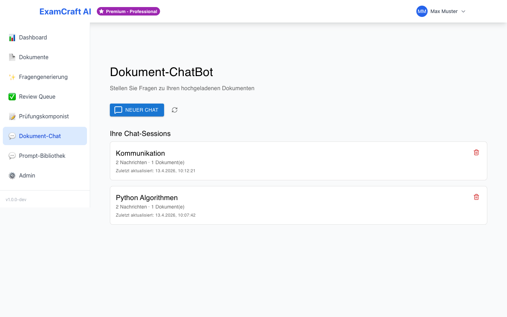
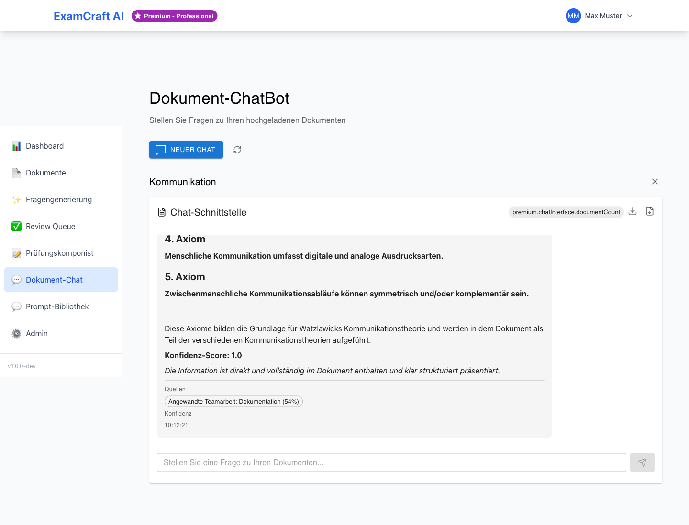

# Dokument ChatBot

Der ChatBot ermöglicht interaktive Gespräche mit Ihren hochgeladenen Dokumenten.

!!! warning "Premium-Feature"
    Der Dokument-Chat ist ab dem **Starter-Abonnement** verfügbar und erfordert
    die Berechtigung `document_chatbot`. Beim Free-Abonnement ist diese Funktion
    nicht zugänglich. Siehe [Abonnement](subscription.md).

## Dokument auswählen

1. Klicken Sie auf **Dokument ChatBot** in der Navigation
2. Wählen Sie ein Dokument aus dem Dropdown-Menü
3. Der ChatBot lädt den Kontext (2–5 Sekunden)

## Chat starten

Stellen Sie Fragen zu Ihrem Dokument:

- "Erkläre mir den Heapsort Algorithmus"
- "Was sind die Unterschiede zwischen Quicksort und Mergesort?"
- "Fasse Kapitel 3 zusammen"

!!! tip "Tipps für gute Fragen"
    - Spezifisch und klar formuliert
    - Bezug auf Dokumentinhalt
    - Folge-Fragen nutzen für tieferes Verständnis

## Antworten verstehen

Jede Antwort enthält:

- **Haupttext** – KI-generierte Antwort
- **Quellen** – Relevante Textabschnitte aus dem Dokument
- **Confidence** – Zuverlässigkeit (0–1)

| Confidence | Bedeutung |
|------|------|
| > 0.8 | Sehr zuverlässig |
| 0.6–0.8 | Zuverlässig |
| < 0.6 | Mit Vorsicht verwenden |

## Chat-Historie

- Alle Nachrichten werden innerhalb der Session gespeichert
- Kontext bleibt erhalten (Multi-Turn)
- Wählen Sie ein anderes Dokument, um eine neue Konversation zu starten

## Limitierungen

- **Nur hochgeladene Dokumente** als Wissensquelle — kein Internetzugang
- **Kein Zugriff** auf Inhalte, die nicht als Dokument hochgeladen wurden
- **Sitzungsgebunden** — der Gesprächsverlauf wird nicht zwischen Sitzungen gespeichert
- Starten Sie eine neue Konversation, indem Sie ein anderes Dokument auswählen

## Beispiel-Prompts

Formulieren Sie Ihre Fragen präzise, um bessere Antworten zu erhalten:

| Statt... | Besser... |
|----------|-----------|
| „Erkläre das Dokument" | „Fasse Kapitel 3 über Sortieralgorithmen in drei Punkten zusammen" |
| „Was steht drin?" | „Was sind laut diesem Dokument die Unterschiede zwischen Quicksort und Mergesort?" |
| „Wie geht das?" | „Erkläre den Heapsort-Algorithmus Schritt für Schritt anhand des Dokuments" |

!!! tip "Folge-Fragen nutzen"
    Der Chat versteht den Gesprächskontext. Nutzen Sie Folge-Fragen wie
    „Erkläre das genauer" oder „Gib mir ein Beispiel dafür".

## Nächste Schritte

- [:octicons-arrow-right-24: Dokumente verwalten](documents.md)
- [:octicons-arrow-right-24: Fragen aus Dokumenten generieren](rag-exam.md)
- [:octicons-arrow-right-24: Abonnement verwalten](subscription.md)
