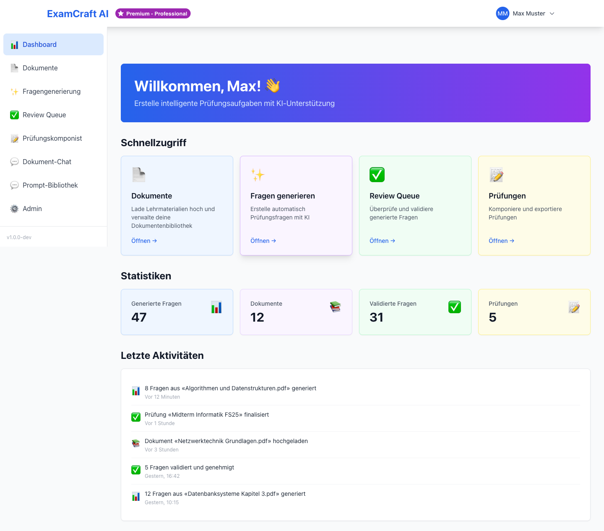
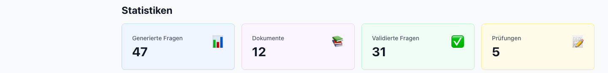
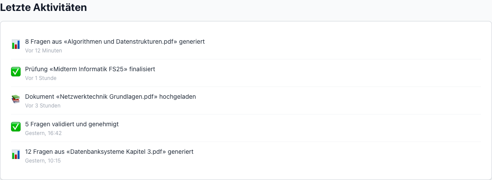

# Dashboard

Das Dashboard ist die Startseite von ExamCraft AI nach der Anmeldung. Es bietet
einen schnellen Überblick über Ihre Aktivitäten und direkten Zugang zu allen
Hauptfunktionen der Plattform.

## Statistiken

Im oberen Bereich des Dashboards sehen Sie vier Kennzahlen auf einen Blick:

| Statistik | Beschreibung |
|-----------|-------------|
| Generierte Fragen | Gesamtanzahl der bisher von KI erzeugten Fragen |
| Dokumente | Anzahl der erfolgreich hochgeladenen und verarbeiteten Dokumente |
| Validierte Fragen | Anzahl der in der Review Queue genehmigten Fragen |
| Prüfungen | Anzahl der im Prüfungskomponisten erstellten Prüfungen |

Diese Zahlen aktualisieren sich in Echtzeit und helfen Ihnen, den Überblick über
Ihre Arbeit zu behalten.

## Schnellzugriff-Kacheln

Die Schnellzugriff-Kacheln ermöglichen den direkten Zugang zu den wichtigsten
Bereichen der Plattform:

| Kachel | Ziel | Beschreibung |
|--------|------|-------------|
| Dokumente hochladen | [Dokumente](documents.md) | Neue Lernunterlagen hochladen und verarbeiten |
| Prüfung erstellen | [Prüfung erstellen](exam-create.md) | KI-Fragen ohne Quelldokument generieren |
| RAG-Prüfung erstellen | [RAG-Prüfung](rag-exam.md) | Fragen aus Ihren Dokumenten generieren |
| Fragen reviewen | [Review Queue](review-queue.md) | Generierte Fragen prüfen und genehmigen |
| Prüfung zusammenstellen | [Prüfungskomponist](exam-composer.md) | Genehmigte Fragen zu Prüfungen zusammenstellen |
| Prompt-Bibliothek | [Prompt-Bibliothek](prompt-library.md) | Wiederverwendbare KI-Prompts verwalten |

Klicken Sie auf eine Kachel, um direkt zum gewünschten Bereich zu gelangen.

## Letzte Aktivitäten

Der Bereich „Letzte Aktivitäten" zeigt Ihnen die zuletzt generierten Fragen und
zuletzt hochgeladenen Dokumente. So können Sie schnell an unterbrochene Aufgaben
anknüpfen.

- **Zuletzt generierte Fragen**: Klicken Sie auf eine Frage, um sie in der Review Queue zu öffnen
- **Zuletzt hochgeladene Dokumente**: Klicken Sie auf ein Dokument, um es in der Dokumentenbibliothek zu öffnen

## Abonnement-Badge

Oben links im Dashboard sehen Sie ein farbiges Badge mit Ihrem aktuellen Abonnement,
zum Beispiel „Free", „Starter" oder „Professional". Dieses Badge zeigt Ihnen jederzeit,
welche Features Ihnen zur Verfügung stehen.

Klicken Sie auf das Badge, um zur [Abonnement-Seite](subscription.md) zu gelangen und
Ihren Plan einzusehen oder zu upgraden.

!!! tip "Tipp: Dashboard als Ausgangspunkt"
    Das Dashboard gibt Ihnen einen schnellen Überblick. Für einen effizienten Arbeitsablauf
    empfehlen wir: Zuerst Dokumente hochladen, dann Fragen generieren, die Review Queue
    abarbeiten und schliesslich die Prüfung im Prüfungskomponisten zusammenstellen.

## Nächste Schritte

- [:octicons-arrow-right-24: Dokument hochladen](documents.md)
- [:octicons-arrow-right-24: Erste Prüfung erstellen](exam-create.md)
- [:octicons-arrow-right-24: Abonnement verwalten](subscription.md)
