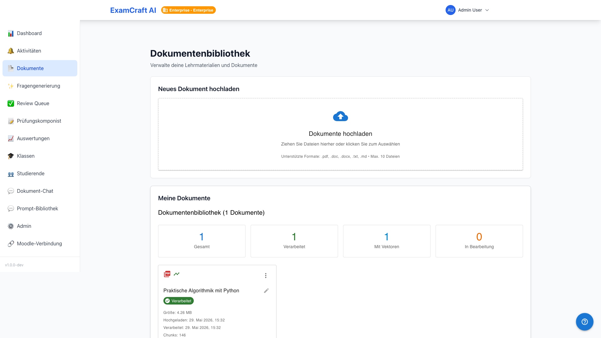
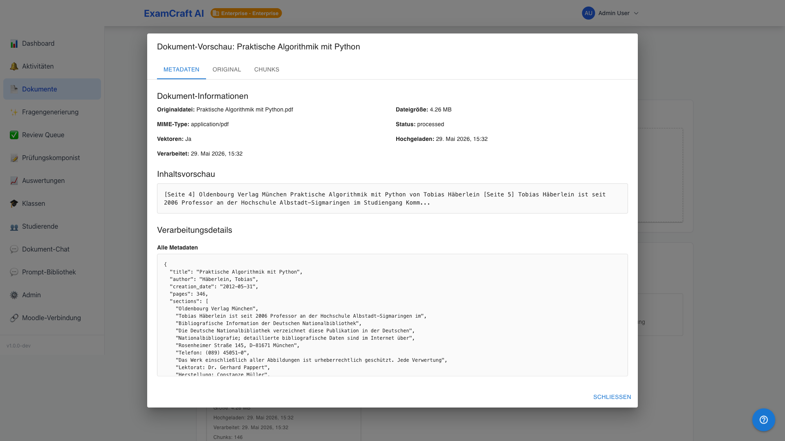
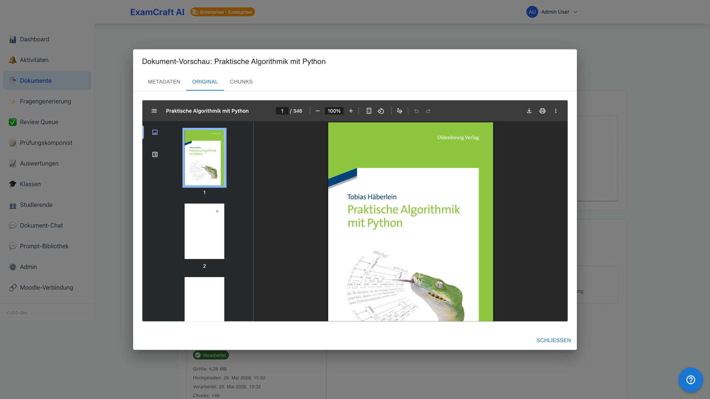
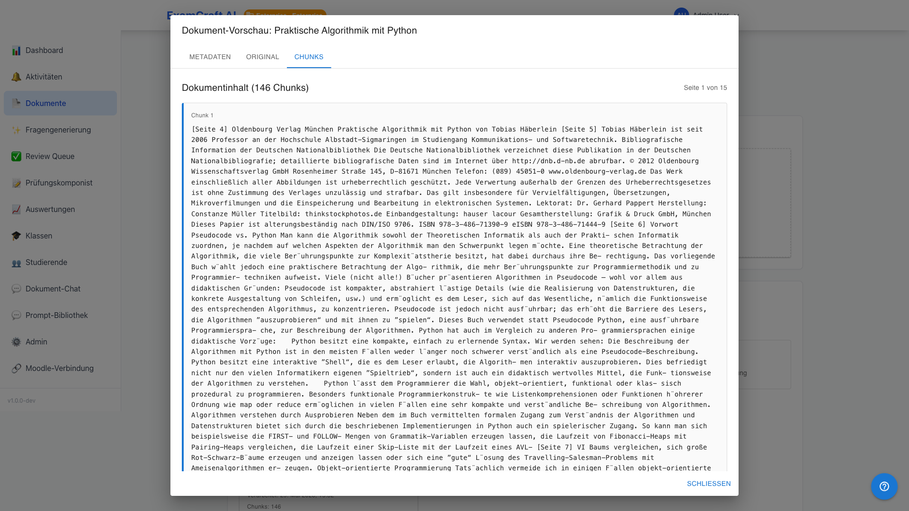

# Télécharger et gérer les documents

## Formats de fichiers supportés

| Format | Extension | Taille max. | Particularités |
|----|-------|------|--------|
| PDF | `.pdf` | 50 MB | Tableaux, formules, images |
| Word | `.doc`, `.docx` | 25 MB | Formatage conservé |
| Markdown | `.md` | 10 MB | Blocs de code, LaTeX |
| Texte | `.txt` | 5 MB | Texte brut |

## Télécharger des documents

### 1. Ouvrir l'onglet «Télécharger des documents»

Cliquez sur l'onglet **Télécharger des documents** dans la navigation.

### 2. Sélectionner les fichiers

Vous avez deux options:

- **Glisser-déposer**: Déposez les fichiers dans la zone de téléchargement
- **Sélecteur de fichiers**: Cliquez sur **Sélectionner des fichiers**

### 3. Surveiller la progression du téléchargement

Pendant le téléchargement, vous voyez:

- Nom du fichier et taille
- Barre de progression (0–100%)
- Statut: «Traitement en cours...» puis «Traité»

### 4. Attendre le traitement

Après le téléchargement, les documents sont automatiquement:

1. Texte extrait
2. Divisés en chunks sémantiques
3. Indexés dans la base de données vecteurs
4. Préparés pour la recherche RAG

| Type de document | Temps de traitement typique |
|------|--------------|
| PDF (10 pages) | ~30 secondes |
| Word (20 pages) | ~45 secondes |
| Markdown (5 pages) | ~15 secondes |

!!! tip "Meilleures pratiques pour les téléchargements"
    - Utilisez des noms de fichiers clairs (par ex. `Algorithmes_Chapitre_3.pdf`)
    - Les documents structurés avec des titres donnent de meilleurs résultats
    - Téléchargez les documents connexes par lots

!!! warning "À éviter"
    - PDFs numérisés sans OCR
    - Fichiers protégés par mot de passe
    - Fichiers plus grands que 50 MB
    - Doublons

## Bibliothèque de documents

La bibliothèque de documents montre tous les documents téléchargés dans une liste claire avec le nom du fichier, la date de téléchargement, la taille du fichier, le nombre de pages et le statut du traitement.

### Rechercher des documents

Entrez les termes de recherche dans le champ de recherche. Les résultats sont filtrés en temps réel (nom de fichier, étiquettes, contenu).

**Filtres:**

- Tous les formats
- PDF uniquement
- Word uniquement
- Markdown uniquement

### Sélectionner des documents pour les examens

1. Activez les cases à cocher à côté des documents souhaités
2. Cliquez sur **Créer un examen à partir de la sélection**
3. Vous êtes redirigé vers le créateur d'examen RAG

### Supprimer des documents

1. Cliquez sur l'icône de suppression
2. Confirmez la demande de sécurité
3. Le document est supprimé de la bibliothèque et de la base de données vecteurs

!!! warning "Attention"
    Les documents supprimés ne peuvent pas être récupérés.

## Aperçu du document

Cliquez sur le nom d'un document dans la bibliothèque pour ouvrir la boîte de dialogue de prévisualisation. Elle se compose de trois onglets:

| Onglet | Contenu |
|--------|---------|
| **Métadonnées** | Nom du fichier, date de téléchargement, taille du fichier, statut de traitement, étiquettes |
| **Original** (par défaut) | Le document original selon son type: PDF directement dans le navigateur, Markdown et exports de chat en texte formaté, texte brut en monospace |
| **Fragments** | Fragments de traitement internes pour diagnostic technique |

### États d'erreur

| Erreur | Cause | Solution |
|--------|-------|----------|
| Erreur réseau | Interruption de connexion | Recharger la page |
| 403 Forbidden | Pas d'accès à ce document | Contacter l'administrateur |
| 404 Not Found | Le document a été supprimé | Retirer de la bibliothèque |
| 429 Too Many Requests | Limite de taux atteinte | Attendre un moment et réessayer |
| 500 Server Error | Erreur interne | Contacter l'administrateur |

## Étapes suivantes

Après le téléchargement, vous pouvez commencer directement la génération de questions:

- **[Générer des questions à partir de documents (RAG)](rag-exam.md)**: Utilisez vos documents
  comme source de connaissances pour les questions d'examen basées sur l'IA.
- **[Réviser les questions (Review Queue)](review-queue.md)**: Vérifiez et approuvez les
  questions générées avant de les utiliser pour les examens.
- **[Chat sur les documents](chatbot.md)**: Posez des questions directes à vos documents
  (Fonctionnalité Premium).
