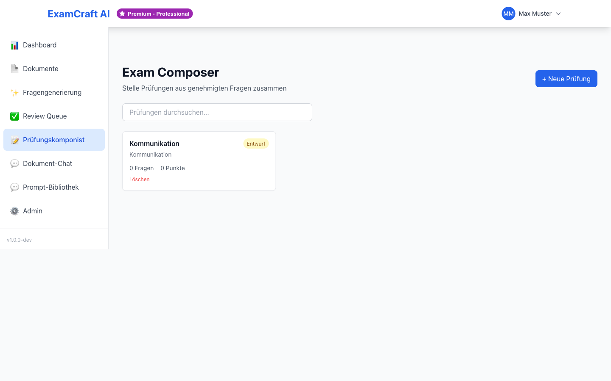
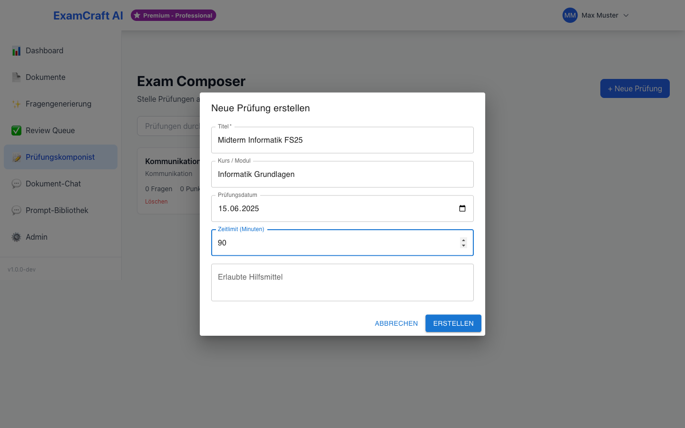
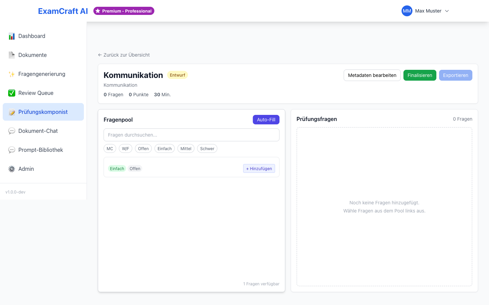
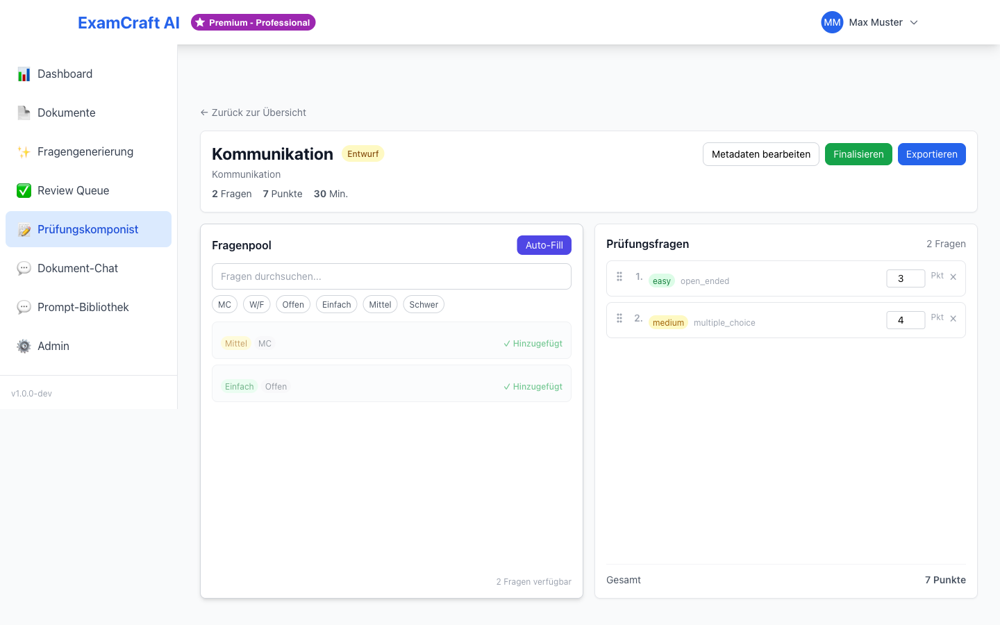
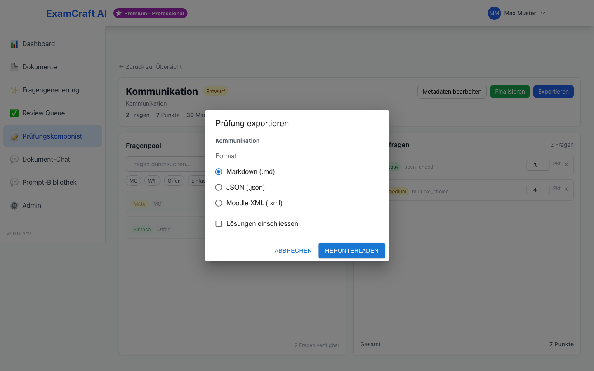

# Prüfungskomponist

Der Prüfungskomponist ermöglicht es, genehmigte Fragen zu einer vollständigen Prüfung zusammenzustellen und in verschiedenen Formaten zu exportieren.

!!! note "Voraussetzung"
    Im Prüfungskomponisten stehen nur Fragen zur Verfügung, die in der [Review Queue](review-queue.md) genehmigt wurden. Generieren Sie zuerst Fragen und reviewen Sie diese, bevor Sie eine Prüfung zusammenstellen.

## Neue Prüfung erstellen

### Schritt 1: Prüfungskomponist öffnen

Klicken Sie in der Navigation auf **Prüfungskomponist** oder wählen Sie die entsprechende Kachel auf dem [Dashboard](dashboard.md). Route: `/exams/compose`.

### Schritt 2: Neue Prüfung starten

Klicken Sie auf **Neue Prüfung erstellen** und füllen Sie die folgenden Felder aus:

| Feld | Beschreibung |
|------|-------------|
| Titel | Bezeichnung der Prüfung (z.B. „Algorithmen — Semesterprüfung 2026") |
| Beschreibung | Optionale Zusatzinformationen zur Prüfung |
| Datum | Geplantes Prüfungsdatum |

Der Titel ist das Schlüsselelement, das Ihre Prüfung eindeutig identifiziert. Wählen Sie eine aussagekräftige Bezeichnung, die Fach, Kurs und zeitliche Einordnung deutlich macht. Die Beschreibung bietet zusätzlichen Kontext für Sie und Ihre Kolleginnen und Kollegen — etwa Informationen zum Schwierigkeitsgrad, der Zielgruppe oder speziellen Schwerpunkten.

### Schritt 3: Fragen auswählen

Wählen Sie Fragen aus der Liste der genehmigten Fragen:

- Klicken Sie auf **+ Hinzufügen** neben jeder gewünschten Frage
- Nutzen Sie die Filter um gezielt Fragen nach **Fragetyp**, **Schwierigkeit** oder **Quelldokument** zu finden
- Die Gesamtanzahl der ausgewählten Fragen wird oben angezeigt

!!! tip "Ausgewogene Prüfung zusammenstellen"
    Achten Sie auf eine ausgewogene Mischung: verschiedene Fragetypen (Multiple Choice und offene Fragen), unterschiedliche Schwierigkeitsgrade und wenn möglich verschiedene Themengebiete. Eine ausgewogene Prüfung fördert gerechte Leistungsbewertung und authentisches Verständnis der Inhalte.

Die Filterfunktionen helfen Ihnen, effizient die passenden Fragen zu finden. Nutzen Sie die Filteroptionen systematisch: Beginnen Sie mit dem gewünschten Fragetyp (z.B. nur Multiple-Choice-Fragen für Schnelltests oder ein Mix aus MC und offenen Fragen für umfassendere Prüfungen). Anschliessend filtern Sie nach Schwierigkeit, um eine ausgewogene Verteilung zu erreichen. Zuletzt können Sie gezielt nach Quelldokumenten filtern, wenn Sie bestimmte Kapitel oder Themenbereiche schwerpunktmässig prüfen möchten.

### Schritt 4: Reihenfolge festlegen

Ordnen Sie die ausgewählten Fragen per Drag & Drop in die gewünschte Reihenfolge. Die Fragen werden automatisch nummeriert. Überlegen Sie sich, ob Sie mit einfacheren Fragen beginnen, um Prüflinge in das Thema einzuführen, oder ob Sie bewusst schwierigere Fragen voranstellen möchten. Die Reihenfolge kann auch thematisch sinnvoll sein — gruppieren Sie zusammenhängende Fragen, um Prüflingen das Verständnis von Zusammenhängen zu ermöglichen.

### Schritt 5: Prüfung exportieren

Klicken Sie auf **Exportieren** und wählen Sie das gewünschte Format:

| Format | Beschreibung |
|--------|-------------|
| Markdown (.md) | Textbasiertes Format, ideal für die weitere Bearbeitung oder Veröffentlichung. Optional können die Lösungen eingeschlossen werden. |
| JSON (.json) | Maschinenlesbares Format für die weitere Verarbeitung, Integration mit externen Systemen oder Datenanalyse |
| Moodle XML (.xml) | Direkt importierbares Format für das Lernmanagementsystem Moodle |

!!! tip "Lösungen einschliessen"
    Beim Export im Markdown-Format können Sie optional die Lösungen einschliessen. Aktivieren Sie dazu die Checkbox **Lösungen einschliessen** im Export-Dialog — praktisch für die Erstellung von Lösungsblättern oder zur internen Überprüfung.

Das Markdown-Format eignet sich für die weitere Bearbeitung oder Integration in Dokumentationssysteme. Das JSON-Format ist ideal für technische Integration — etwa wenn Sie Prüfungsdaten in ein eigenes System importieren oder automatisierte Auswertungen durchführen möchten. Das Moodle-XML-Format ermöglicht den direkten Import in Moodle, ohne manuelle Nachbearbeitung.

## Bestehende Prüfungen verwalten

Alle erstellten Prüfungen erscheinen in der Übersichtsliste. Dort können Sie:

- **Öffnen**: Prüfung bearbeiten und ergänzen
- **Duplizieren**: Als Grundlage für eine neue, ähnliche Prüfung verwenden
- **Exportieren**: Erneut in einem beliebigen Format exportieren
- **Löschen**: Prüfung entfernen (nicht rückgängig machbar)

Die Übersichtsliste zeigt wichtige Metadaten wie Erstellungsdatum, Anzahl der Fragen und letzter Änderungszeitstempel. Nutzen Sie die Duplikatfunktion, um schnell ähnliche Prüfungen zu erstellen — z.B. für verschiedene Klassen desselben Jahrgangs oder für eine Nachholprüfung. Diese Funktion spart Zeit bei der Zusammenstellung ähnlicher Prüfungen und minimiert Fehler.

!!! warning "Gelöschte Prüfungen"
    Das Löschen einer Prüfung entfernt nur die Prüfungszusammenstellung, nicht die einzelnen Fragen. Die Fragen bleiben in der Review Queue erhalten und können für zukünftige Prüfungen wiederverwendet werden.

## Nächste Schritte

- [:octicons-arrow-right-24: Mehr Fragen generieren](exam-create.md)
- [:octicons-arrow-right-24: RAG-Prüfung aus Dokumenten](rag-exam.md)
- [:octicons-arrow-right-24: Review Queue — Fragen prüfen](review-queue.md)
- [:octicons-arrow-right-24: Best Practices](best-practices.md)
