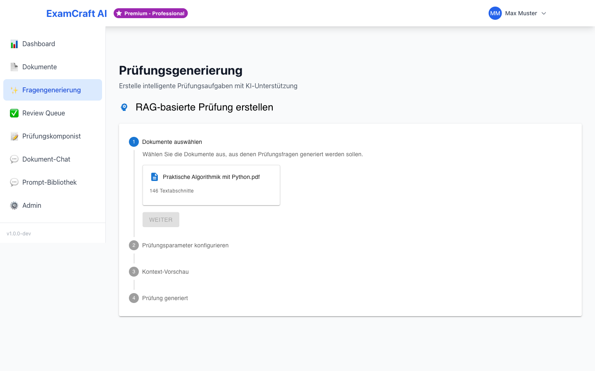

# KI-Prüfungen erstellen

Generieren Sie Prüfungsfragen zu einem beliebigen Thema – ohne hochgeladene Dokumente.

## Konfiguration

### 1. Prüfungsthema eingeben

Geben Sie ein spezifisches Thema ein:

!!! tip "Gute Themenformulierung"
    - "Python Programmierung – Listen und Dictionaries"
    - "Datenstrukturen – Heapsort Algorithmus"

!!! warning "Vermeiden"
    - "Informatik" (zu allgemein)
    - "Programmieren" (zu breit)

### 2. Schwierigkeitsgrad wählen

| Stufe | Beschreibung | Bloom-Taxonomie |
|----|-------|---------|
| Einfach | Grundlegendes Verständnis | Remember, Understand |
| Mittel | Anwendung und Analyse | Apply, Analyze |
| Schwer | Evaluation und Kreation | Evaluate, Create |

### 3. Anzahl Fragen festlegen

- Minimum: 1 Frage
- Maximum: 20 Fragen
- Empfohlen: 5–10 Fragen pro Durchlauf

### 4. Fragetypen auswählen

- **Multiple Choice** – 4 Antwortoptionen, 1 korrekt
- **Offene Fragen** – Freitext-Antworten

### 5. Sprache wählen

- **Deutsch** – Fragen und Antworten auf Deutsch
- **English** – Questions and answers in English

## Generierung starten

1. Klicken Sie auf **Prüfung generieren**
2. Warten Sie 10–30 Sekunden
3. Fortschrittsanzeige: "Generiere Prüfung..."

## Ergebnis

Jede generierte Frage enthält:

- Fragenummer und Fragetext
- Antwortoptionen (bei Multiple Choice)
- Korrekte Antwort (gruen markiert)
- Erklärung/Begründung
- Bloom-Level
- Schwierigkeitsgrad (1–5)

## Nach der Generierung

Die generierten Fragen erscheinen automatisch in der **[Review Queue](review-queue.md)**.

Dort können Sie:
- Jede Frage einzeln prüfen
- Fragen genehmigen (werden für den Prüfungskomponisten freigegeben) oder ablehnen
- Nach der Überprüfung eine vollständige Prüfung im **[Prüfungskomponisten](exam-composer.md)** zusammenstellen

!!! tip "Tipp: Erst reviewen, dann komponieren"
    Nehmen Sie sich Zeit für die Review Queue. Gut geprüfte Fragen machen den
    Prüfungskomponisten effizienter.

## Häufige Fragen zu KI-Prüfungen

**Wie unterscheiden sich KI-Prüfungen von RAG-basierten Prüfungen?**

KI-Prüfungen werden zu einem beliebigen Thema generiert, ohne dass Dokumente hochgeladen sein müssen. RAG-Prüfungen verwenden Ihre hochgeladenen Kursmaterialien als Quelle. Wählen Sie KI-Prüfungen für allgemeine Themenschwerpunkte, RAG-Prüfungen für Inhalte, die direkt in Ihren Dokumenten enthalten sind.

**Welcher Schwierigkeitsgrad ist optimal?**

Das hängt vom Niveau Ihrer Lerngruppe ab. Für Anfänger: Einfach. Für Fortgeschrittene: Mittel bis Schwer. Eine Mischung ist auch möglich – generieren Sie mehrere Sets mit unterschiedlichen Schwierigkeitsgraden und kombinieren Sie sie später im Prüfungskomponisten.

**Kann ich die generierten Fragen nachträglich bearbeiten?**

Ja! In der Review Queue können Sie jede Frage prüfen. Bevor Sie sie genehmigen, können Sie den Fragentext oder die Antwortoptionen anpassen. Die Bearbeitung erfolgt direkt in der Queue.

**Wie lange dauert die Generierung?**

Typischerweise 10–30 Sekunden für 5–10 Fragen, abhängig von Thema, Schwierigkeitsgrad und Serverauslastung. Die Fortschrittsanzeige informiert Sie in Echtzeit.

**Kann ich mehr als 20 Fragen generieren?**

Die maximale Anzahl pro Durchlauf ist 20 Fragen. Für mehr Fragen: Führen Sie mehrere Generierungen hintereinander durch. Die neuen Fragen werden der bestehenden Review Queue hinzugefügt.

## Tipps für bessere Ergebnisse

- **Spezifische Themen**: Je spezifischer die Formulierung, desto besser die Qualität. "Python Listen und Dictionaries" ist besser als nur "Python".
- **Angemessene Schwierigkeitsgrade**: Wählen Sie Schwierigkeitsgrade, die dem Lernstand Ihrer Lernenden entsprechen.
- **Regelmässiges Reviewen**: Überprüfen Sie Fragen zeitnah, um die Qualität zu sichern. Je schneller Sie feedback geben, desto besser passt sich die KI an.
- **Vielfalt erzielen**: Generieren Sie mehrere Durchläufe mit unterschiedlichen Schwierigkeitsgraden und Fragetypen.
