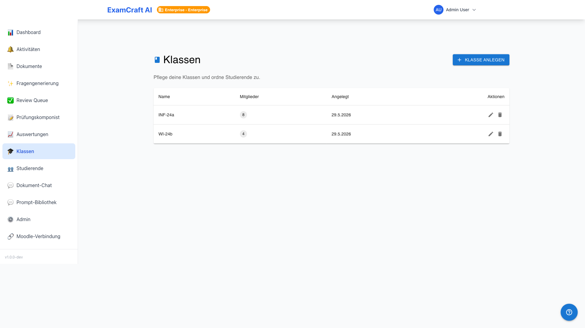
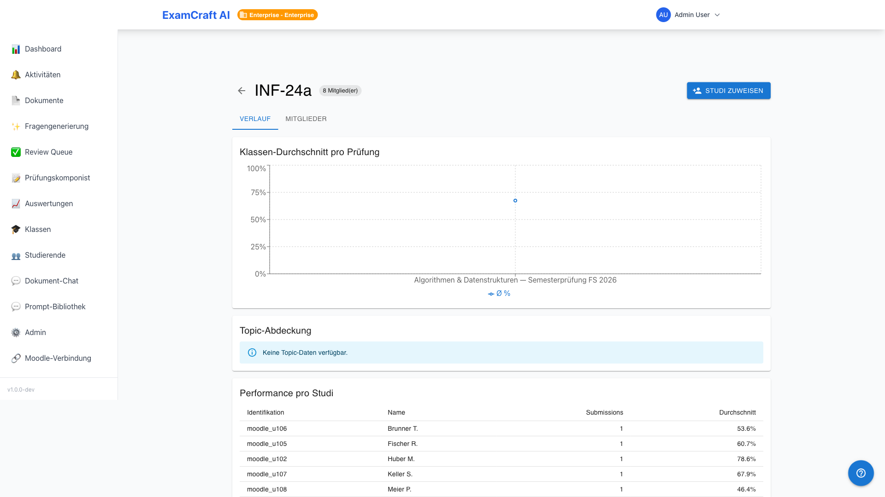
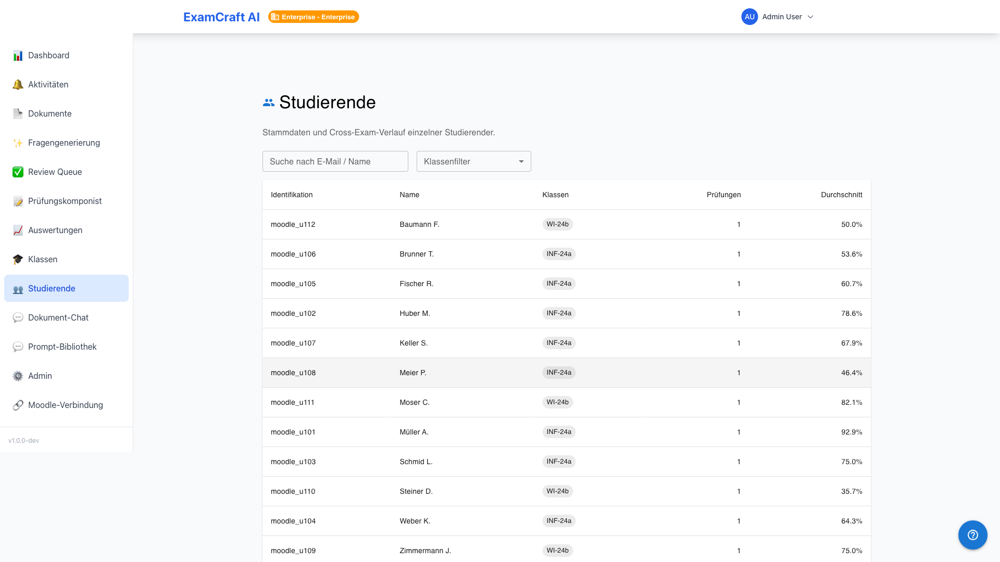
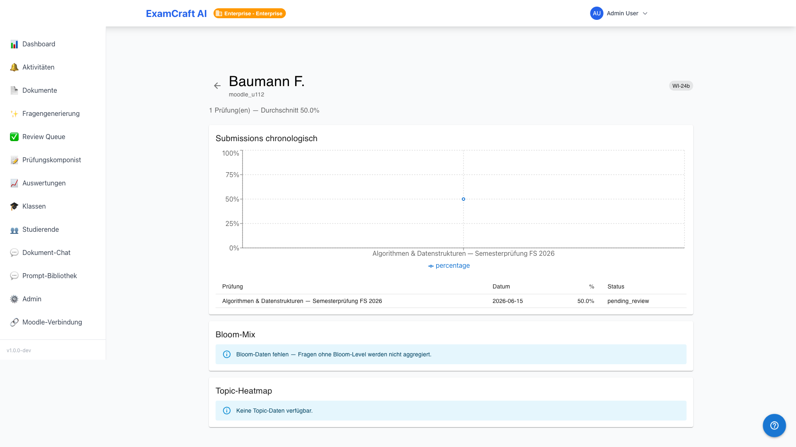

# Classi e studenti

!!! note "Nota sul tier"
    Le classi, le statistiche di andamento degli studenti e le valutazioni trasversali agli esami sono funzionalità Enterprise. Gli studenti vengono tuttavia creati automaticamente in tutti i tier durante l'importazione CSV e possono essere consultati.

Con le classi è possibile raggruppare gli studenti e ottenere una panoramica dello sviluppo delle loro prestazioni attraverso più esami. Route: `/auswertungen/klassen`, `/auswertungen/klassen/:classId`, `/auswertungen/studierende`, `/auswertungen/studierende/:studentId`.

## Creare una classe

1. Navigare a **Valutazioni → Classi**
2. Fare clic su **Crea classe**
3. Assegnare un nome (ad es. "Informatica B 2026")
4. Facoltativo: inserire descrizione e anno scolastico
5. **Salva** — la classe è ora vuota

## Assegnare studenti

Selezionare la classe nell'elenco e fare clic su **Assegna studenti**. Nella finestra di dialogo è possibile aggiungere singoli studenti tramite ricerca oppure importare tutti i candidati di un esame importato.

!!! tip "Assegnazione automatica durante l'importazione CSV"
    Se il CSV di importazione contiene una colonna `class_hint`, gli studenti vengono assegnati automaticamente alla classe corrispondente — senza passaggio manuale. Le classi che non esistono ancora vengono create automaticamente.

## Dettaglio della classe e andamento

Nel dettaglio della classe sono visibili tutti gli esami sostenuti finora:

| Vista | Contenuto |
|-------|-----------|
| Grafico di andamento | Valore medio per esame in ordine cronologico |
| Elenco esami | Tutti gli esami con data, media e tasso di superamento |
| Elenco membri | Tutti gli studenti con il loro ultimo risultato |

## Panoramica studenti

Navigare a **Valutazioni → Studenti** per una panoramica istituzionale di tutti i candidati con nome, e-mail, classe/i e data dell'ultimo esame.

## Dettaglio studente

Il dettaglio di uno studente mostra:

- **Tutte le submission** in ordine cronologico con punteggio ottenuto e voto
- **Grafico di andamento** su tutti gli esami
- **Mix della tassonomia di Bloom** delle domande affrontate (se i tag sono stati assegnati)
- **Mappa calore punti di forza/debolezza** per area tematica (se i tag sono stati assegnati)

## Passi successivi

- [:octicons-arrow-right-24: Integrazione Moodle](moodle-integration.md)
- [:octicons-arrow-right-24: Valutazioni](auswertungen.md)
- [:octicons-arrow-right-24: Statistiche](statistik.md)
- [:octicons-arrow-right-24: Quote di abbonamento](subscription.md)
