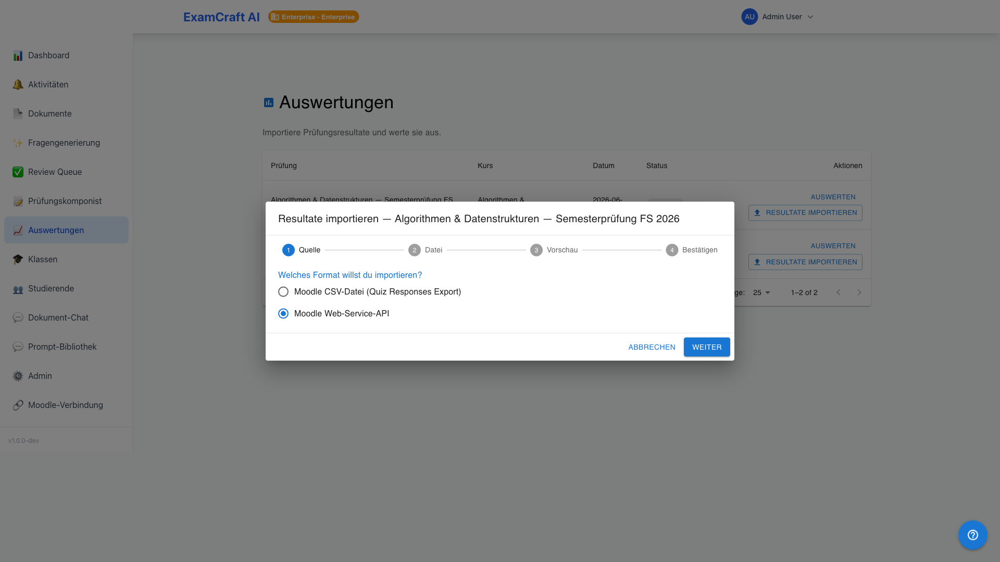
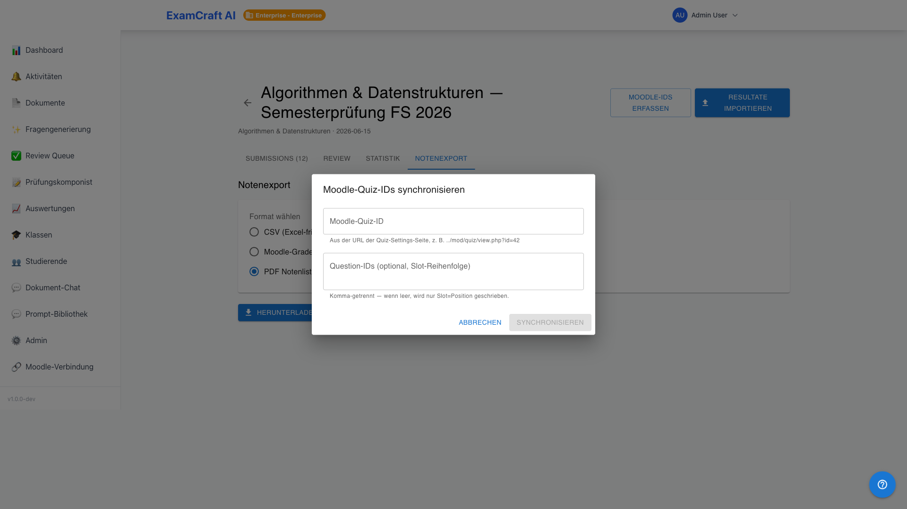

# Moodle-Integration

!!! note "Voraussetzung für API-Import"
    Für den API-Import muss ein Administrator zuerst eine Moodle-Connection unter `/admin/integrations/moodle` einrichten. Der CSV-Import funktioniert ohne diese Voraussetzung auf allen Tiers. Details: [Moodle einrichten (Admin-Guide)](../admin-guide/moodle.md).

Prüfungsresultate lassen sich auf zwei Wegen importieren: als CSV-Datei (alle Tiers) oder direkt via Moodle-Web-Service-API (Professional und Enterprise). Der API-Import holt die Daten per Klick — ohne manuellen Export aus Moodle.

## CSV-Import vs. API-Import

| Eigenschaft | CSV-Import | API-Import |
|-------------|-----------|-----------|
| Verfügbarkeit | Alle Tiers | Professional / Enterprise |
| Einrichtung | Keine | Admin richtet Connection einmalig ein |
| Aktualität | Snapshot beim Export | Aktueller Stand aus Moodle |
| Fragen-Zuordnung | Manuelles Spalten-Mapping | Automatisch via Moodle-Fragen-IDs |

## API-Import durchführen

1. Öffnen Sie **Resultate importieren** für die gewünschte Prüfung
2. Wählen Sie **Moodle API** als Quelle
3. Wählen Sie den Moodle-Kurs und das Quiz aus der Liste
4. Klicken Sie auf **Resultate holen**

Die Zuordnung zwischen Moodle-Fragen und ExamCraft-Fragen erfolgt automatisch via hinterlegter Moodle-Fragen-IDs. Sind keine IDs hinterlegt, öffnet sich das manuelle Spalten-Mapping-Fenster.

## Moodle-Fragen-IDs hinterlegen (Question-ID-Round-Trip)

Um die automatische Zuordnung beim API-Import zu aktivieren, müssen die Moodle-Fragen-IDs einmalig in ExamCraft erfasst werden:

1. Öffnen Sie die Prüfung im [Prüfungskomponisten](exam-composer.md)
2. Klicken Sie auf **Moodle-IDs synchronisieren**
3. Der Dialog zeigt Ihre ExamCraft-Fragen neben den Moodle-Entsprechungen
4. Bestätigen Sie die Zuordnung — die IDs werden dauerhaft gespeichert

Nach diesem Schritt läuft der API-Import vollautomatisch ohne manuelles Mapping — auch nach erneuten Exporten aus Moodle.

## Quota-Limits

| Tier | Import-Methode | Prüfungen/Monat | Max. Submissions |
|------|---------------|----------------|-----------------|
| Free | Nur CSV | 3 | 30 |
| Starter | Nur CSV | Unbegrenzt | 50 |
| Professional | CSV + API | Unbegrenzt | Unbegrenzt |
| Enterprise | CSV + API + Bulk | Unbegrenzt | Unbegrenzt |

## Nächste Schritte

- [:octicons-arrow-right-24: Admin: Moodle-Connection einrichten](../admin-guide/moodle.md)
- [:octicons-arrow-right-24: Auswertungen](auswertungen.md)
- [:octicons-arrow-right-24: Klassen und Studierende](klassen.md)
- [:octicons-arrow-right-24: Subscription-Quotas](subscription.md)
