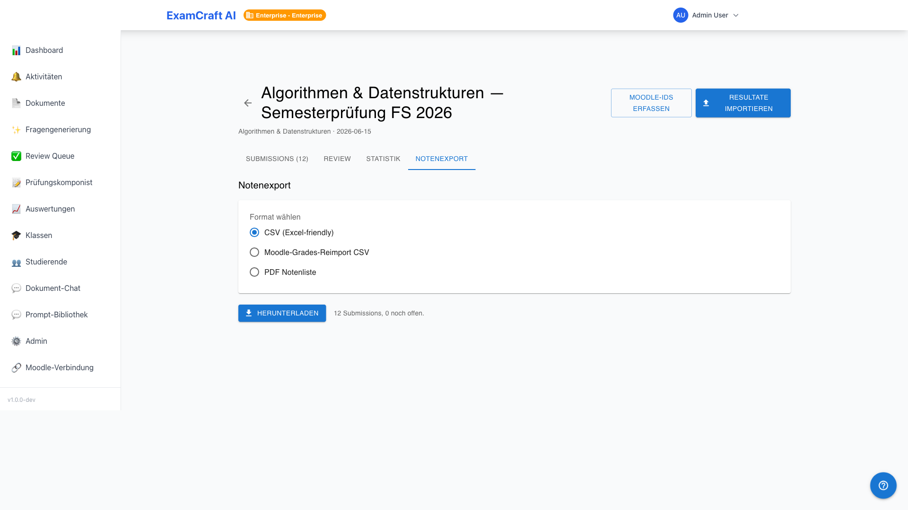
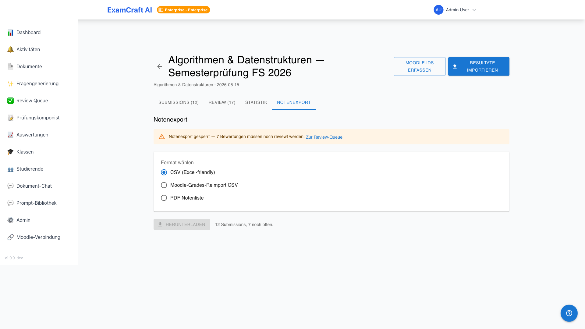
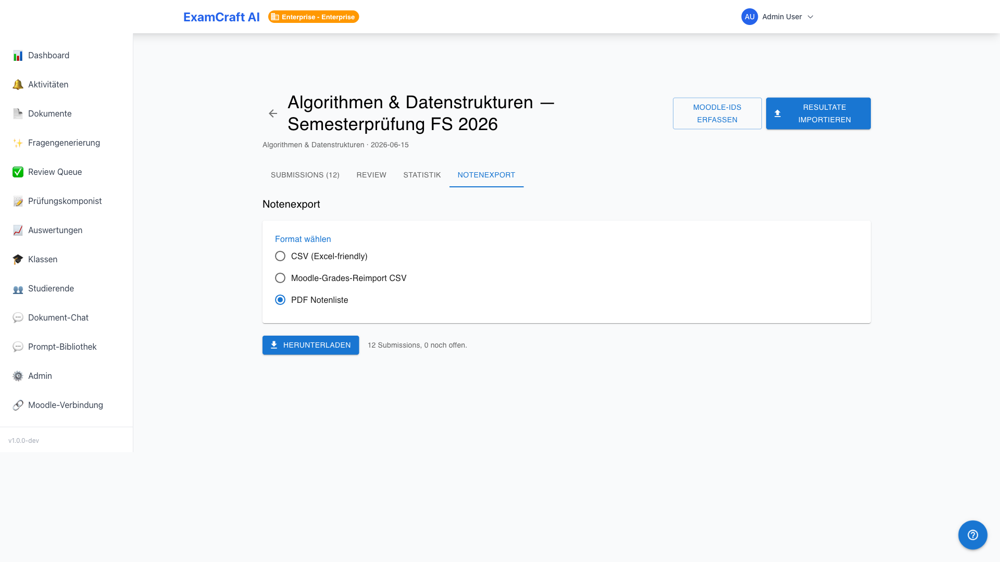

# Export des notes

!!! warning "Toutes les révisions doivent être terminées"
    L'export des notes est bloqué tant que des soumissions avec le statut `pending_review` ou `partially_reviewed` sont présentes. Terminez d'abord toutes les révisions dans l'[onglet Révision](review-grading.md).

L'export des notes crée une liste de notes finalisée en trois formats : en CSV pour Excel, en CSV de réimport Moodle ou en PDF prêt à imprimer. Route : onglet **Export des notes** dans `/auswertungen/:examId/submissions`.

## Modèle de notation

### Schémas prédéfinis

ExamCraft AI contient huit schémas de notation prédéfinis :

| Schéma | Plage | Remarque |
|--------|-------|----------|
| Swiss 1.0–6.0 | 1.0 (insuffisant) – 6.0 (très bien) | Échelle de notation suisse standard |
| German 1.0–5.0 | 1.0 (très bien) – 5.0 (insuffisant) | Échelle inversée |
| Austrian 1–5 | 1 (très bien) – 5 (non satisfaisant) | Nombres entiers |
| French 0–20 | 0–20 points | Système français |
| Dutch 1–10 | 1–10 | Système néerlandais |
| ECTS A–F | A–F + FX | Système européen de transfert |
| Pourcentage | 0–100 % | Affichage direct en pourcentage |
| Réussi/Échoué | Réussi / Échoué | Binaire |

### Schémas personnalisés

Les institutions avec le niveau Enterprise peuvent définir leurs propres schémas sous `/admin/grading-schemes` et les enregistrer comme standard institutionnel. Plus de détails : [Schémas de notation (Guide Admin)](../admin-guide/grading-schemes.md).

## Choisir le format d'export

| Format | Utilisation |
|--------|-------------|
| **CSV (Excel)** | UTF-8 avec BOM, séparé par point-virgule — à ouvrir directement dans Excel (DE) |
| **CSV de réimport Moodle** | Format compatible Moodle pour réimporter les notes |
| **PDF** | Liste de notes prête à imprimer avec en-tête de l'école, tableau et pied de page de signature |

## Effectuer l'export des notes

1. Sélectionnez le **schéma de notation** dans le menu déroulant (par défaut : standard institutionnel)
2. Sélectionnez le **format d'export**
3. Les 5 premières lignes apparaissent en **aperçu** — vérifiez les noms et les notes
4. Cliquez sur **Exporter** — le téléchargement démarre immédiatement

## Blocage en cas de révisions en attente

Tant que des révisions sont en attente, une bannière d'avertissement jaune apparaît avec le nombre de cas ouverts et un lien direct vers la [file de révision](review-grading.md). Le bouton d'export est désactivé jusqu'à ce que toutes les soumissions aient atteint le statut `fully_reviewed`.

## Contenu du PDF

Le PDF contient :
- **En-tête** : Nom de l'institution, titre de l'examen, date
- **Tableau de notes** : Tous les étudiants avec les points, le pourcentage et la note
- **Pied de page de signature** : Espace réservé pour l'enseignant et la direction de l'examen

## Prochaines étapes

- [:octicons-arrow-right-24: Gérer les classes](klassen.md)
- [:octicons-arrow-right-24: Intégration Moodle](moodle-integration.md)
- [:octicons-arrow-right-24: Quotas d'abonnement](subscription.md)
