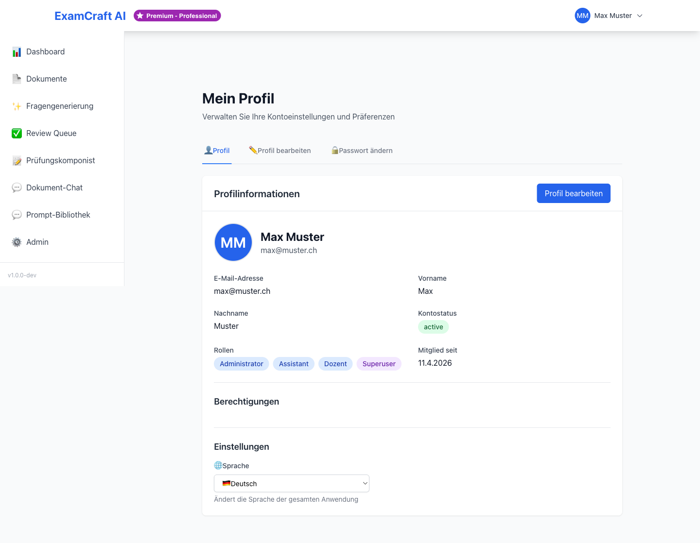

# Profil und Kontoeinstellungen

Auf der Profilseite können Sie Ihre persönlichen Daten anpassen und Ihr Passwort ändern. Alle Änderungen werden sofort gespeichert und sind in der gesamten Anwendung sichtbar.

## Profil öffnen

Klicken Sie oben rechts auf Ihren Namen oder Ihr Avatar und wählen Sie **Profil** aus dem Dropdown-Menü. Alternativ navigieren Sie direkt zu `/profile`.

Die Profilseite ist in mehrere Abschnitte unterteilt: Persönliche Daten, Sicherheit und Kontoübersicht.

## Persönliche Daten ändern

Der Abschnitt **Persönliche Daten** enthält alle grundlegenden Informationen Ihres Kontos.

### Name anpassen

1. Klicken Sie im Abschnitt **Persönliche Daten** auf das Bearbeiten-Symbol neben Ihrem Namen
2. Geben Sie den neuen Namen ein
3. Klicken Sie auf **Speichern**

Die Änderung ist sofort wirksam und wird in der Navigation und in allen generierten Dokumenten angezeigt. Ihr Name wird auch anderen Administratoren sichtbar, wenn Sie in Ihrem Workspace mit ihnen zusammenarbeiten.

### E-Mail-Adresse ändern

1. Klicken Sie auf das Bearbeiten-Symbol neben Ihrer E-Mail-Adresse
2. Geben Sie die neue E-Mail-Adresse ein
3. Klicken Sie auf **Speichern**
4. Sie erhalten sofort eine Bestätigungsmail an die neue Adresse
5. Bestätigen Sie den Link in der E-Mail, um die Änderung zu aktivieren

Solange Sie den Bestätigungslink nicht anklicken, wird die neue E-Mail-Adresse nicht vollständig aktiviert. Ihre alte E-Mail-Adresse bleibt gültig, bis Sie die neue bestätigt haben.

!!! warning "E-Mail bei Google OAuth"
    Wenn Sie sich über Google OAuth anmelden, wird Ihre E-Mail-Adresse von Google verwaltet.
    Sie können sie direkt in ExamCraft AI nicht ändern. Ändern Sie sie stattdessen in
    Ihrem Google-Konto unter [https://myaccount.google.com](https://myaccount.google.com).

!!! warning "E-Mail bei Microsoft OAuth"
    Ähnlich wie bei Google werden E-Mail-Adressen bei Microsoft OAuth-Anmeldungen
    von Microsoft verwaltet. Änderungen müssen in Ihrem Microsoft-Konto vorgenommen werden.

## Passwort ändern

Im Abschnitt **Sicherheit** können Sie Ihr Passwort jederzeit ändern. Dies ist empfohlen, wenn Sie den Verdacht haben, dass Ihr Passwort kompromittiert wurde.

### Passwort aktualisieren

1. Klicken Sie im Abschnitt **Sicherheit** auf **Passwort ändern**
2. Geben Sie Ihr aktuelles Passwort ein
3. Geben Sie das neue Passwort ein
4. Das neue Passwort muss folgende Anforderungen erfüllen:
    - Mindestens 8 Zeichen lang
    - Mindestens ein Grossbuchstabe (A-Z)
    - Mindestens ein Kleinbuchstabe (a-z)
    - Mindestens eine Zahl (0-9)
5. Wiederholen Sie das neue Passwort zur Bestätigung
6. Klicken Sie auf **Passwort speichern**

Nach der Änderung müssen Sie sich beim nächsten Login mit dem neuen Passwort anmelden. Alle aktiven Sitzungen in anderen Browsern oder Geräten werden automatisch beendet.

!!! note "Passwort bei Google OAuth"
    Bei der Anmeldung über Google OAuth gibt es keine Passwort-Option in ExamCraft AI.
    Ihr Passwort wird vollständig über Ihr Google-Konto verwaltet. Sie können es
    in den [Google Account-Einstellungen](https://myaccount.google.com) ändern.

!!! note "Passwort bei Microsoft OAuth"
    Ähnlich wie bei Google wird das Passwort bei Microsoft OAuth-Anmeldungen
    über Ihr Microsoft-Konto verwaltet.

## Konto-Übersicht

Im Abschnitt **Konto** sehen Sie eine Zusammenfassung Ihrer Kontodetails:

| Information | Beschreibung |
|-------------|-------------|
| Rolle | Ihre Benutzerrolle (ADMIN oder DOZENT) – bestimmt Ihre Berechtigungen |
| Institution | Die Institution, der Sie zugewiesen sind |
| Abonnement | Ihr aktueller Abonnementplan und Limits |
| Mitglied seit | Datum und Uhrzeit der Kontoerstellung |

Diese Informationen sind schreibgeschützt und können nur von einem Administrator für Ihr Konto geändert werden. Falls Sie Ihre Rolle, Institution oder Ihren Abonnementplan ändern müssen, kontaktieren Sie Ihren Administrator.

### Rolle verstehen

Die Rolle bestimmt, welche Funktionen Sie nutzen können:

- **ADMIN** – Vollständiger Zugriff auf alle Features, Benutzerverwaltung, Institutional-Einstellungen
- **DOZENT** – Zugriff auf Fragengenerierung, Prompt-Verwaltung, RAG-Prüfungen

### Institution

Ihre Institution wird von Ihrem Administrator zugewiesen. Alle Ihre Dokumente und Prüfungen sind dieser Institution zugeordnet.

## Sicherheits-Best-Practices

Um Ihr Konto sicher zu halten, beachten Sie diese Empfehlungen:

1. **Starkes Passwort verwenden** – Nutzen Sie mindestens 8 Zeichen mit Gross- und Kleinbuchstaben, Zahlen und Sonderzeichen
2. **Passwort regelmässig ändern** – Ändern Sie Ihr Passwort mindestens alle 90 Tage
3. **Sichere Verbindung** – Nutzen Sie ExamCraft AI nur über sichere HTTPS-Verbindungen
4. **Logout nach Verwendung** – Melden Sie sich ab, wenn Sie eine fremde Computer verwenden
5. **Zwei-Faktor-Authentifizierung** – Falls verfügbar, aktivieren Sie zusätzliche Sicherheitsmassnahmen

## Nächste Schritte

- [:octicons-arrow-right-24: Abonnement verwalten](subscription.md)
- [:octicons-arrow-right-24: Zum Dashboard](dashboard.md)
- [:octicons-arrow-right-24: Fragen generieren](exam-create.md)
