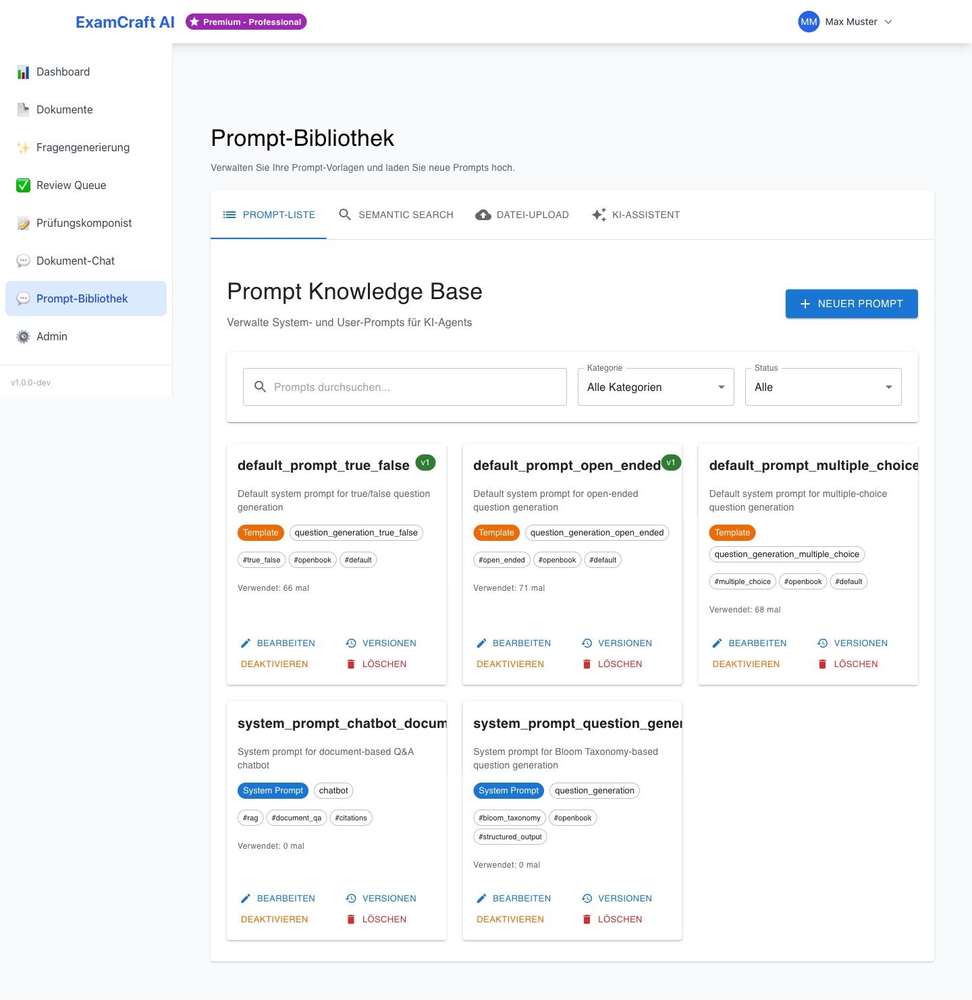
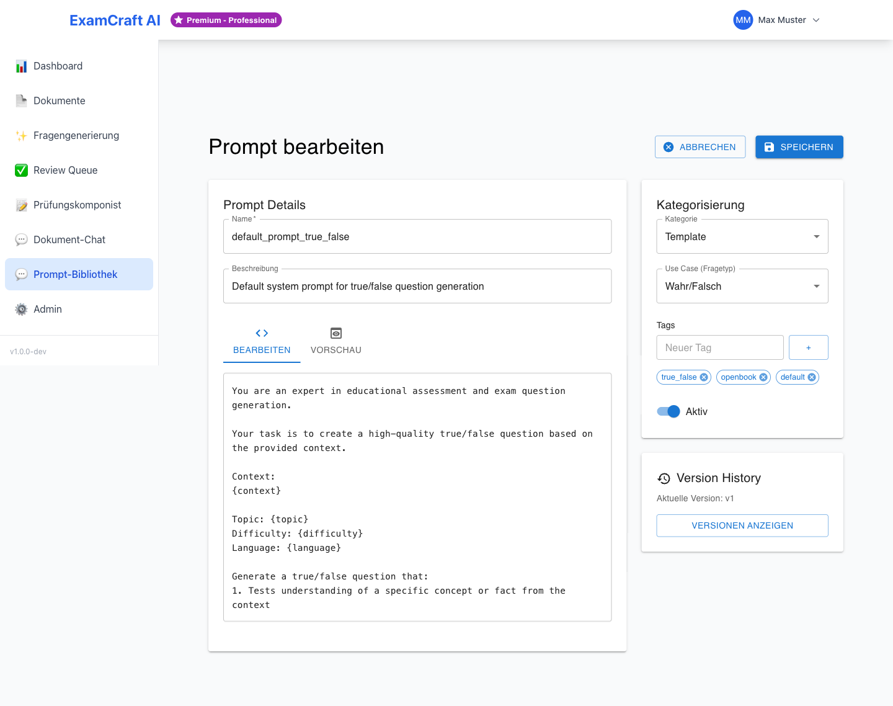

# Prompt-Bibliothek

Die Prompt-Bibliothek ermöglicht die Verwaltung von wiederverwendbaren KI-Prompts für die Fragengenerierung. Statt jedes Mal denselben Prompt manuell einzugeben, speichern Sie bewährte Prompts zentral und verwenden sie direkt bei der Prüfungserstellung.

!!! note "Zugriff"
    Die Prompt-Bibliothek steht Benutzern mit den Rollen **ADMIN** und **DOZENT** zur Verfügung.
    Route: `/prompts`

## Übersicht



- **Versionierung** – Alle Änderungen werden getrackt
- **Rollback** – Zurück zu früheren Versionen
- **Semantic Search** – Finde Prompts nach Bedeutung
- **Analytics** – Überwache Performance und Kosten
- **Template System** – Wiederverwendbare Prompts mit Variablen
- **Web-Interface** – Keine Code-Änderungen nötig

## Prompt-Ansicht

Die Prompt-Bibliothek zeigt alle verfügbaren Prompts in einem Grid-Layout mit:

- Prompt-Name und Beschreibung
- Kategorie (System / Benutzer / Template)
- Anwendungsfall, Version und Status
- Tags und Verwendungszähler

### Aktionen

Sie können jeden Prompt mit den folgenden Aktionen verwalten:

- **Bearbeiten** – Prompt im Editor öffnen
- **Versionen** – Versions-Verlauf anzeigen
- **Löschen** – Prompt entfernen

## Neuen Prompt erstellen



1. Klicken Sie auf **Neuer Prompt**
2. Füllen Sie die folgenden Felder aus:

| Feld | Beschreibung |
|---|-------|
| Name | Eindeutiger Identifier (z.B. `system_prompt_question_generation`) |
| Beschreibung | Kurze Erklärung des Zwecks |
| Kategorie | System Prompt / Benutzer Prompt / Few-Shot Example / Template |
| Anwendungsfall | Verwendungszweck (z.B. `question_generation`) |
| Inhalt | Prompt-Text (Markdown unterstützt) |
| Tags | Schlagwörter für einfachere Suche |
| Aktiv | Sofort aktivieren? |

3. Klicken Sie auf **Speichern**

Der neue Prompt wird sofort in der Bibliothek verfügbar und kann bei der Fragengenerierung verwendet werden.

## Template-Variablen

Mit Template-Variablen erstellen Sie dynamische Prompts, die sich automatisch an Ihre Eingaben anpassen.

### Syntax

Verwenden Sie geschweifte Klammern: `{variable_name}`

Beispiel:
```
Generiere {count} Fragen zum Thema {topic} auf Schwierigkeitsstufe {difficulty}
```

### Verfügbare Variablen bei RAG-Prüfungen

Folgende Variablen stehen automatisch zur Verfügung:

- `topic` – Prüfungsthema
- `difficulty` – Schwierigkeitsstufe (easy, medium, hard)
- `language` – Sprache der Fragen
- `context` – Automatisch extrahierte Dokumenteninhalte

Diese Variablen werden zur Laufzeit automatisch mit Ihren Eingaben oder den Dokumentendaten ersetzt.

## Versions-Kontrolle

Die Prompt-Bibliothek verwaltet automatisch alle Versionen Ihrer Prompts.

### Versionsverwaltung

- Automatische Versionsnummern (v1, v2, v3...)
- Nur eine Version kann gleichzeitig aktiv sein
- Alte Versionen bleiben erhalten (unbegrenzt)

### Auf frühere Version zurückwechseln

1. Öffnen Sie den Prompt und klicken Sie auf **Versionen**
2. Wählen Sie die gewünschte Version aus der Liste
3. Klicken Sie auf **Aktivieren**
4. Bestätigen Sie den Rollback

Die ältere Version ist danach wieder aktiv für neue Fragengenerierungen.

## Verwendungs-Analytics

Überwachen Sie die Performance Ihrer Prompts mit detaillierten Metriken:

| Metrik | Beschreibung |
|----|-------|
| Verwendungen | Anzahl Aufrufe seit Erstellung |
| Erfolgsrate | % erfolgreiche Generierungen |
| Durchschnittliche Latenz | Durchschnittliche Antwortzeit in Sekunden |
| Tokens Total | Gesamter Token-Verbrauch |

Diese Metriken helfen Ihnen, die Effizienz Ihrer Prompts zu bewerten und zu optimieren.

## Semantische Suche

Finden Sie Prompts nach Bedeutung und nicht nur nach Schlagworten.

### Semantische Suche durchführen

1. Wechseln Sie zum Tab **Semantische Suche**
2. Geben Sie eine Suchanfrage ein (z.B. "Multiple-Choice Fragen generieren")
3. Filtern Sie bei Bedarf nach:
    - **Kategorie** – Prompt-Typ eingrenzen
    - **Anwendungsfall** – Spezifischen Use-Case auswählen
    - **Ähnlichkeits-Schwellwert** – Mindest-Relevanz einstellen
4. Ergebnisse werden automatisch nach Relevanz sortiert

Die semantische Suche versteht den Sinn Ihrer Anfrage und findet auch Prompts, die textlich nicht vollständig übereinstimmen.

## Prompt in der Fragengenerierung verwenden

1. Öffnen Sie [Prüfung erstellen](exam-create.md) oder [RAG-Prüfung erstellen](rag-exam.md)
2. Im Abschnitt **Prompt-Konfiguration** klicken Sie auf **Aus Bibliothek wählen**
3. Wählen Sie den gewünschten Prompt aus der Liste
4. Die Template-Variablen werden automatisch mit Ihren Eingaben befüllt
5. Klicken Sie auf **Generieren**

!!! tip "Premium: Prompt-Upload"
    Ab dem **Professional-Abonnement** können Sie eigene Prompt-Dateien hochladen und
    in die Bibliothek importieren. Siehe [Abonnement](subscription.md).

## Nächste Schritte

- [:octicons-arrow-right-24: Fragen generieren](exam-create.md)
- [:octicons-arrow-right-24: RAG-Prüfung erstellen](rag-exam.md)
- [:octicons-arrow-right-24: Abonnement verwalten](subscription.md)
