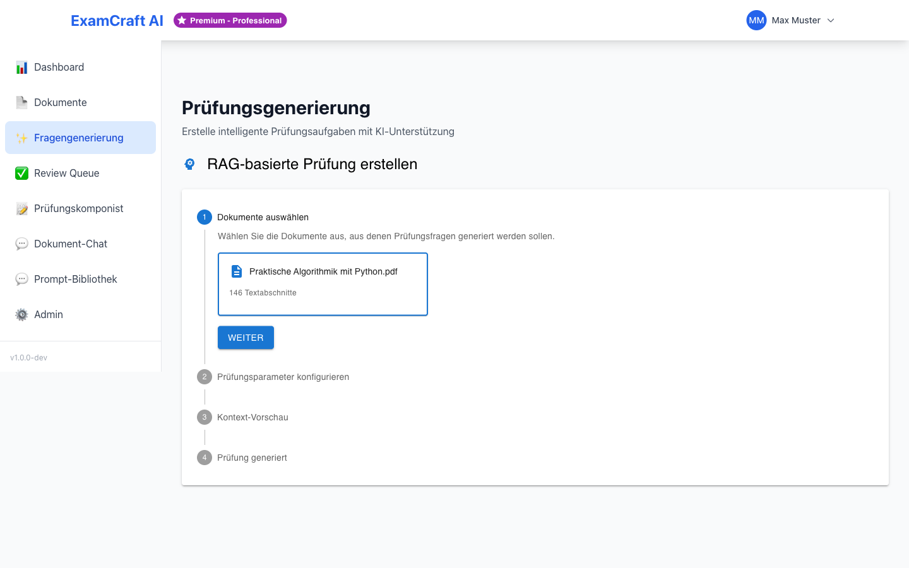
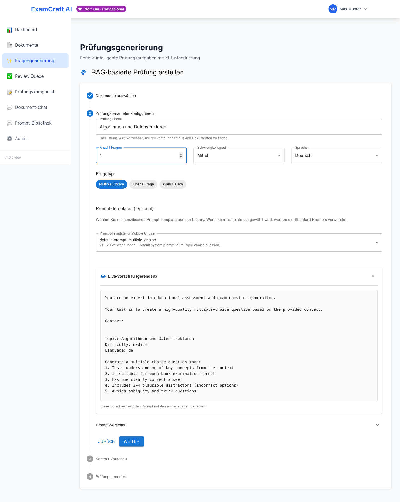
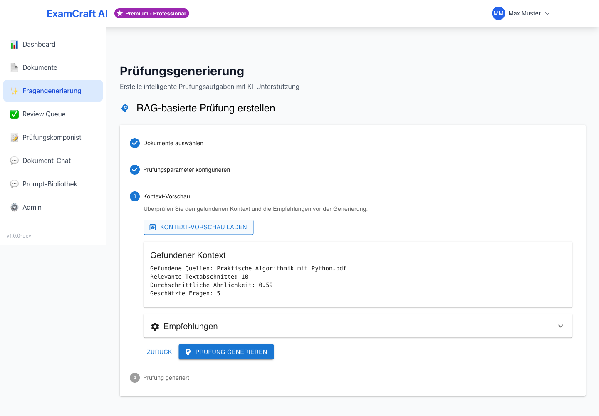
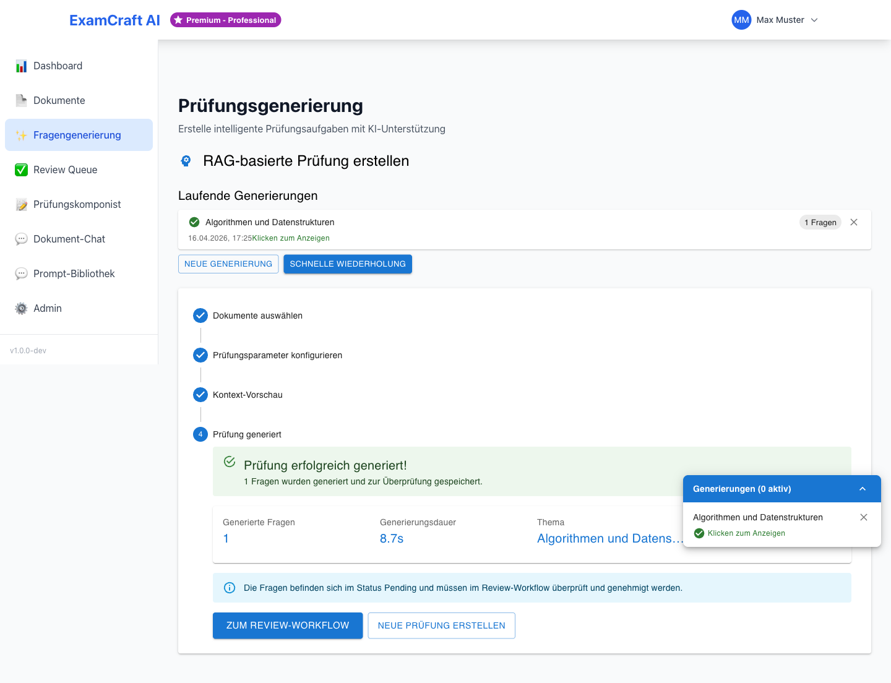

# RAG-basierte Prüfungen

!!! note "Voraussetzung"
    Für RAG-Prüfungen müssen zuerst Dokumente hochgeladen und verarbeitet worden sein.
    Siehe [Dokumente verwalten](documents.md).

## Was ist RAG?

**RAG** (Retrieval-Augmented Generation) kombiniert:

- **Retrieval**: Semantische Suche in Ihren Dokumenten
- **Generation**: KI-basierte Fragenerstellung

Der Vorteil: Fragen sind direkt aus Ihren Kursmaterialien abgeleitet und enthalten Quellenangaben.

## Voraussetzungen

- Mindestens 1 Dokument hochgeladen und verarbeitet
- Dokument in der Bibliothek ausgewählt

## Schritt-für-Schritt

### 1. Dokumente auswählen



In der Dokumentenbibliothek:

1. Wählen Sie 1–10 Dokumente aus
2. Klicken Sie **Prüfung aus Auswahl erstellen**

!!! tip "Optimale Dokumentenanzahl"
    3–5 Dokumente liefern die beste Qualität. Zu viele Dokumente können die Ergebnisse verwässern.

### 2. RAG-Konfiguration



- **Thema/Fokus**: Spezifischer Fokus (z.B. "Sortieralgorithmen Komplexität"). Leer lassen für allgemeine Fragen.
- **Anzahl Fragen**: 1–20, empfohlen 5–10
- **Fragetypen**: Multiple Choice, Offene Fragen, True/False
- **Schwierigkeitsgrad**: Einfach / Mittel / Schwer
- **Prompt-Vorlage**: Wählen Sie ein Prompt-Template mit Live-Vorschau

### 3. Generierung starten



Klicken Sie **RAG-Prüfung generieren**. Wartezeit: 20–60 Sekunden.

### 4. Ergebnis prüfen



Jede Frage enthält:

- Fragentext und Antwortoptionen
- Korrekte Antwort mit Erklärung
- **Quelldokumente** (mit Seitenzahl)
- **Confidence Score** (0–1)

## Qualitätsindikatoren

| Confidence Score | Bewertung |
|---------|------|
| 0.9–1.0 | Sehr hohe Qualität |
| 0.7–0.9 | Gute Qualität |
| 0.5–0.7 | Akzeptabel – Überprüfen |
| < 0.5 | Überarbeitung empfohlen |

## Nach der Generierung

Die erzeugten Fragen erscheinen automatisch in der **[Review Queue](review-queue.md)**.
Prüfen und genehmigen Sie dort jede Frage, bevor Sie sie im
**[Prüfungskomponisten](exam-composer.md)** zu einer Prüfung zusammenstellen.

!!! tip "Qualität der RAG-Fragen"
    Die Qualität der generierten Fragen hängt stark von der Qualität der Quelldokumente ab.
    Gut strukturierte Dokumente mit klaren Überschriften liefern bessere Ergebnisse.
    Siehe [Best Practices](best-practices.md).

## Häufige Fragen zu RAG-Prüfungen

**Was ist der Unterschied zwischen Confidence Score und Qualität?**

Der Confidence Score (0–1) zeigt, wie sicher sich die KI ist, dass die Frage und Antwort korrekt aus den Dokumenten abgeleitet sind. Ein hoher Score (0.9+) bedeutet hohe Relevanz und Genauigkeit. Fragen mit niedrigem Score (< 0.5) sollten in der Review Queue überarbeitet oder abgelehnt werden.

**Welche Dokumenttypen funktionieren am besten?**

Am besten funktionieren PDF-Dateien und Markdown-Dateien mit klarer Struktur:
- PDFs mit searchbarem Text (keine Scans)
- Dokumente mit Überschriften und Unterüberschriften
- Strukturierte Textinhalte statt unformatiertes Fleisstext
- Vermeiden Sie sehr lange Absätze ohne Gliederung

**Kann die KI Inhalte erfinden, die nicht in den Dokumenten stehen?**

Das ist selten, aber möglich. Eine generierte Frage könnte logisch sein, aber nicht genau in den Quelldokumenten vorkommen. Das ist der Hauptgrund, warum das Review und die Quellenverifikation wichtig sind. Überprüfen Sie bei jedem Review die angegebenen Quelldokumente und Seitenzahlen.

**Wie viele Dokumente sollte ich auswählen?**

**Optimal: 3–5 Dokumente.** Zu wenige Dokumente (1–2) ergeben möglicherweise unzureichende Kontextinformation. Zu viele Dokumente (10+) können zu verwässerten oder ungenaueren Fragen führen. Experimentieren Sie und beobachten Sie die Confidence Scores.

**Kann ich RAG mit Bildern in Dokumenten verwenden?**

Derzeit ist RAG hauptsächlich für Textinhalte optimiert. Bilder werden nicht als Quelle genutzt. Wenn Ihre Dokumente hauptsächlich Diagramme oder Bilder enthalten, verwenden Sie stattdessen KI-Prüfungen (ohne RAG) und beschreiben Sie das Thema in der Eingabe.

**Wie aktualisiere ich Dokumente für bessere RAG-Ergebnisse?**

1. Laden Sie eine neue Version des Dokuments hoch
2. Wählen Sie die neue Version in der Dokumentenbibliothek aus
3. Die nächste RAG-Generierung verwendet automatisch die neue Version
4. Frühere Versionen können gelöscht werden (siehe [Dokumente verwalten](documents.md))

## Optimale Dokumentenstruktur für RAG

Für beste Ergebnisse beim RAG sollten Dokumente folgende Struktur haben:

```
# Hauptthema

## Abschnitt 1
Erklärtext mit klaren Konzepten und Definitionen.

### Unterabschnitt 1.1
Weitere Details zum Thema.

## Abschnitt 2
Weitere verwandte Inhalte.

- Bullet Points für Zusammenfassungen
- Nummerierte Listen für Prozesse
```

Vermeiden Sie unstrukturierte Textwälder. Eine gute Dokumentation mit klaren Überschriften verbessert die RAG-Qualität erheblich.
