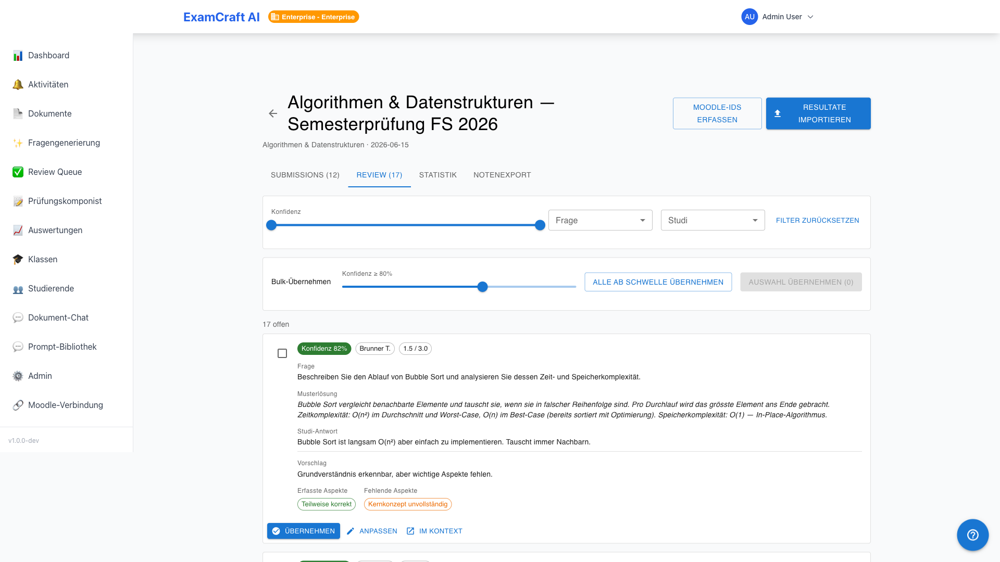
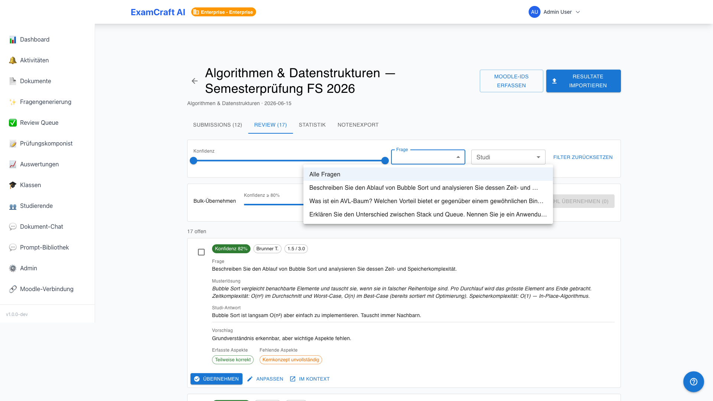
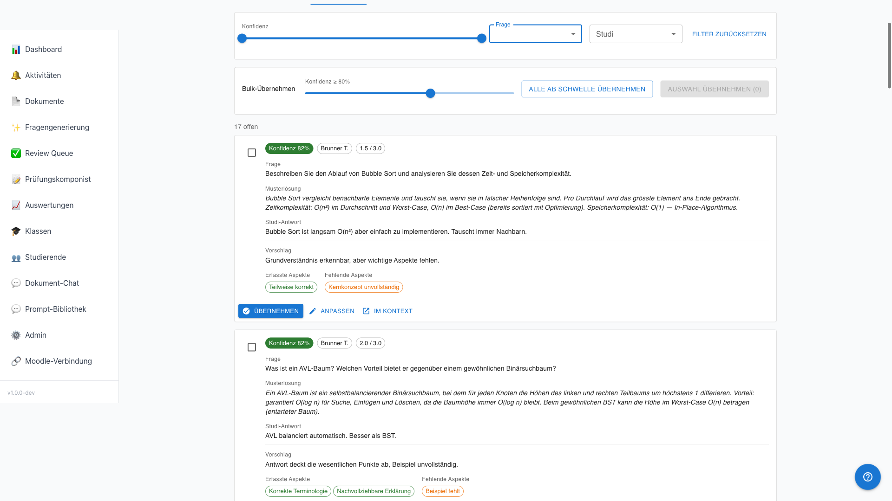
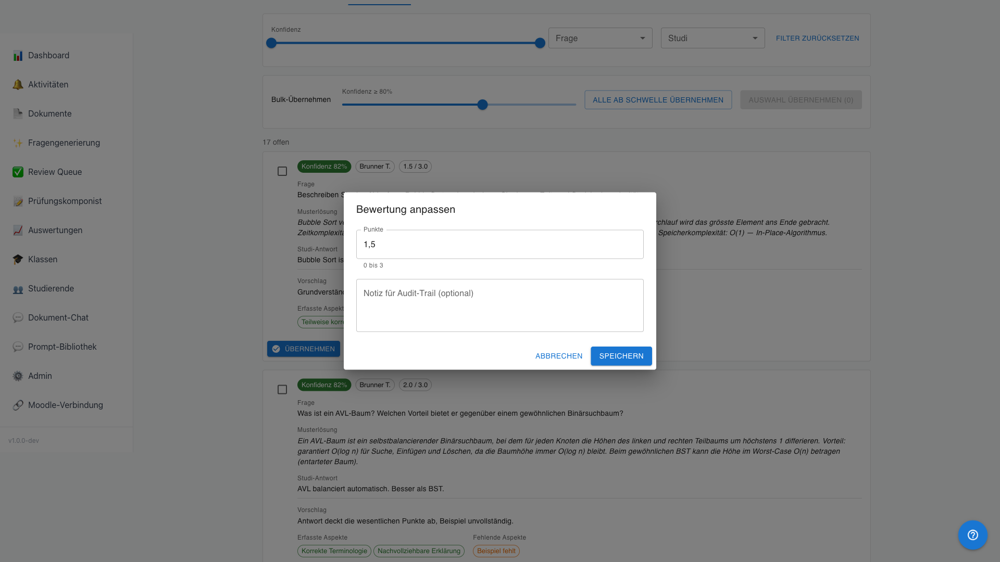
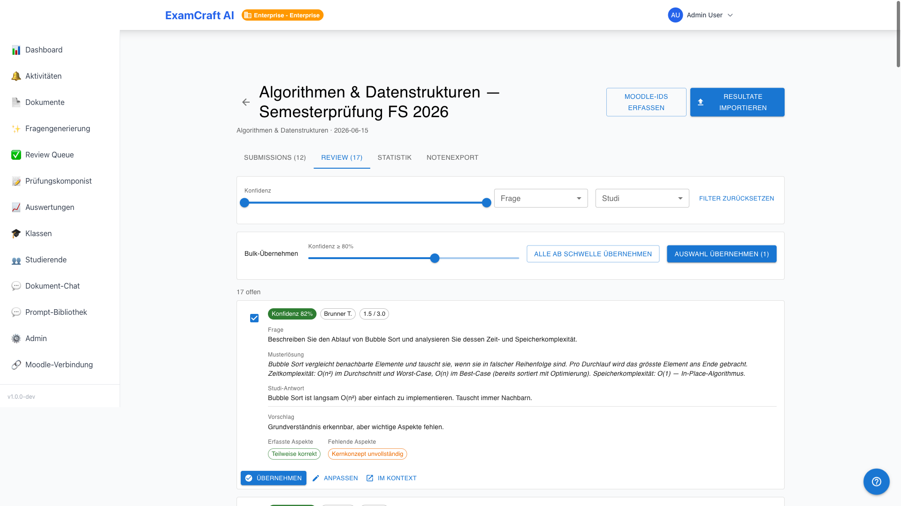

# Review und Bewertung

!!! note "Nur für offene Fragen"
    Multiple-Choice- und Wahr/Falsch-Fragen werden deterministisch bewertet — kein Review nötig. Dieser Bereich betrifft ausschliesslich offene Fragen mit KI-Vorschlägen.

Die Review-Queue zeigt alle KI-Bewertungsvorschläge für offene Fragen, sortiert nach Konfidenz aufsteigend — die unsichersten Fälle zuerst. Route: Tab **Review** in `/auswertungen/:examId/submissions`.

## Wie die KI-Bewertung funktioniert

Für jede offene Frage analysiert die KI die Antwort im Vergleich zur Musterlösung und vergibt Punkte (0 bis Maximum), eine Konfidenz (0–100 %) sowie eine Liste von erfüllten und fehlenden Aspekten. Eine Konfidenz von 0 % zeigt an, dass die KI-Bewertung fehlgeschlagen ist — der Fall muss manuell bewertet werden.

## Filter

| Filter | Optionen |
|--------|---------|
| Frage | Nur Submissions für eine bestimmte Frage |
| Studierende | Nur Einreichungen einer bestimmten Person |
| Konfidenz | Bereich von–bis, z.B. 0–50 % für unsichere Fälle |

## Bewertungskarte

Jede Karte zeigt:

| Element | Beschreibung |
|---------|-------------|
| Frage | Fragetext |
| Musterlösung | Erwartete Antwort |
| Eingereichte Antwort | Was der Prüfling geantwortet hat |
| KI-Vorschlag | Punkte + Konfidenz-Badge (grün ≥ 80 %, gelb 50–79 %, rot < 50 %) |
| Matched aspects | Erfüllte Aspekte der Musterlösung (grüne Chips) |
| Missing aspects | Fehlende Aspekte (rote Chips) |

### Aktionen pro Karte

| Aktion | Verhalten |
|--------|-----------|
| **Übernehmen** | KI-Vorschlag wird als finale Bewertung gespeichert |
| **Anpassen** | Inline-Editor öffnet sich — Punkte und optionale Notiz eingeben |
| **Im Kontext öffnen** | Vollständige Submission im Drawer öffnen |

## Bulk-Approval

Klicken Sie auf **Alle übernehmen** oder wählen Sie mehrere Karten per Checkbox und nutzen Sie **Auswahl übernehmen**. Im Dialog lässt sich ein Konfidenz-Schwellenwert setzen — nur Vorschläge ab diesem Wert werden übernommen, unsichere Fälle bleiben zur manuellen Prüfung.

## Manueller Override für MC und Wahr/Falsch

Auch automatisch bewertete Multiple-Choice- und Wahr/Falsch-Antworten können überstimmt werden. Öffnen Sie den Detail-Drawer der Submission und klicken Sie bei der gewünschten Frage auf **Override**. Tragen Sie die neue Punktzahl und eine optionale Begründung ein.

## Audit-Trail

Jede Bewertungsänderung — Übernehmen, Anpassen, Override — wird mit Zeitstempel und Benutzer protokolliert. Die Protokolle sind für Admins in den Backend-Logs einsehbar.

## Nächste Schritte

- [:octicons-arrow-right-24: Zurück zur Submissions-Liste](auswertungen.md)
- [:octicons-arrow-right-24: Statistik anzeigen](statistik.md)
- [:octicons-arrow-right-24: Noten exportieren](notenexport.md)
