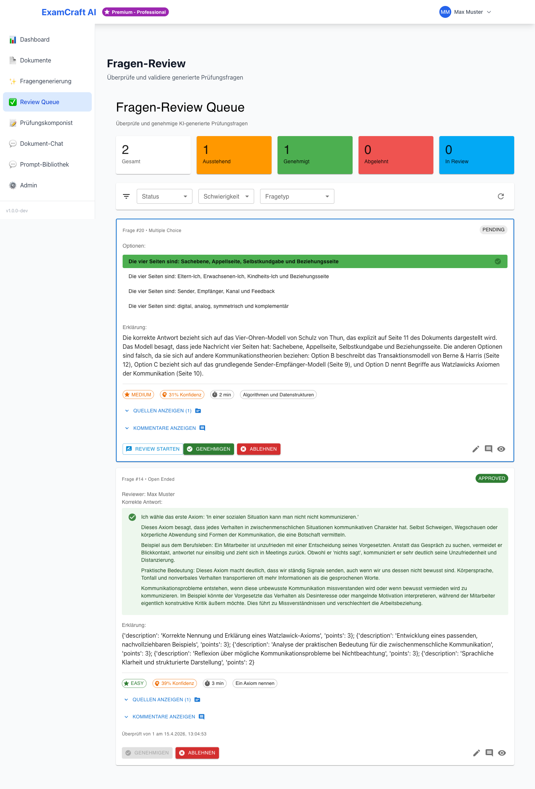
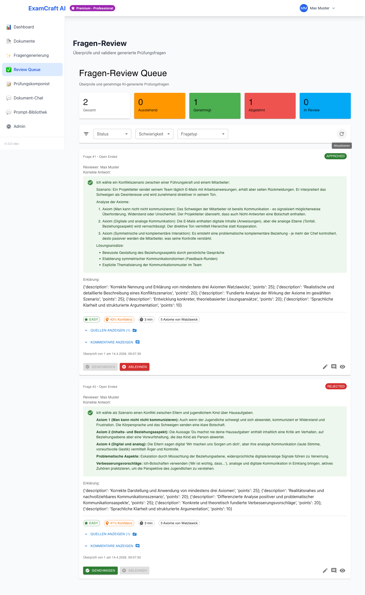

# Review Queue

Die Review Queue ist die zentrale Stelle zur manuellen Prüfung und Freigabe von
KI-generierten Fragen. Erst nach der Genehmigung in der Review Queue stehen Fragen
im [Prüfungskomponisten](exam-composer.md) zur Verfügung.

!!! note "Warum eine Review Queue?"
    KI-generierte Fragen sind ein Ausgangspunkt, kein Endprodukt. Die Review Queue
    gibt Ihnen die Kontrolle über die Qualität Ihrer Prüfungen — Sie entscheiden,
    welche Fragen gut genug sind.

## Statusübersicht

Jede Frage hat einen von vier möglichen Status:

| Status | Farbe | Bedeutung |
|--------|-------|-----------|
| Ausstehend | Orange | Neu generiert, noch nicht geprüft |
| In Review | Blau | Wird gerade geprüft |
| Genehmigt | Grün | Freigegeben für den Prüfungskomponisten |
| Abgelehnt | Rot | Nicht verwendbar, archiviert |

## Fragen filtern und suchen

Nutzen Sie die Filteroptionen um die Queue übersichtlich zu halten:

- **Status**: Ausstehend / In Review / Genehmigt / Abgelehnt
- **Schwierigkeit**: Einfach / Mittel / Schwer
- **Fragetyp**: Multiple Choice / Offene Frage
- **Zeitraum**: Nach Generierungsdatum filtern

## Frage prüfen — Schritt für Schritt

### Schritt 1: Frage öffnen

Klicken Sie in der Listenansicht auf eine Frage mit dem Status „Ausstehend".
Die Frage wechselt automatisch in den Status „In Review".

### Schritt 2: Inhalt prüfen

In der Detailansicht sehen Sie:

| Feld | Beschreibung |
|------|-------------|
| Fragetext | Die eigentliche Prüfungsfrage |
| Fragetyp | Multiple Choice oder offene Frage |
| Schwierigkeit | Einfach / Mittel / Schwer |
| Antwortoptionen | Bei Multiple Choice: alle Optionen inkl. korrekter Antwort |
| Erklärung | Begründung für die korrekte Antwort |
| Quellenangabe | Textabschnitt aus dem Quelldokument |
| Zuverlässigkeitswert | Einschätzung der KI-Konfidenz (0–1) |

Prüfen Sie besonders:
- Ist der Fragetext klar und eindeutig formuliert?
- Ist die korrekte Antwort tatsächlich korrekt?
- Ist die Erklärung verständlich und lehrreich?
- Stimmt die angegebene Quelle mit dem Frageinhalt überein?

### Schritt 3: Entscheiden

**Frage genehmigen**: Klicken Sie auf **Genehmigen**. Die Frage wechselt zu „Genehmigt"
und steht sofort im Prüfungskomponisten zur Verfügung.

**Frage ablehnen**: Klicken Sie auf **Ablehnen**. Die Frage wird archiviert und kann
nicht mehr verwendet werden. Optional können Sie einen Ablehnungsgrund eingeben.

!!! tip "Wann ablehnen?"
    Lehnen Sie Fragen ab, wenn: der Fragetext unklar oder mehrdeutig ist, die korrekte
    Antwort falsch ist, die Frage nicht zum Thema passt, oder mehrere Antwortoptionen
    korrekt sein könnten.

## Detailansicht einzelner Fragen

Jede Frage hat eine eigene URL: `/questions/review/:id`

Sie können diese URL teilen, um Kollegen auf eine spezifische Frage hinzuweisen.

## Nächste Schritte

Genehmigte Fragen stehen sofort im [Prüfungskomponisten](exam-composer.md) zur Verfügung.
Von dort aus können Sie eine vollständige Prüfung zusammenstellen und exportieren.

- [:octicons-arrow-right-24: Prüfung zusammenstellen](exam-composer.md)
- [:octicons-arrow-right-24: Mehr Fragen generieren](exam-create.md)
- [:octicons-arrow-right-24: Best Practices](best-practices.md)
