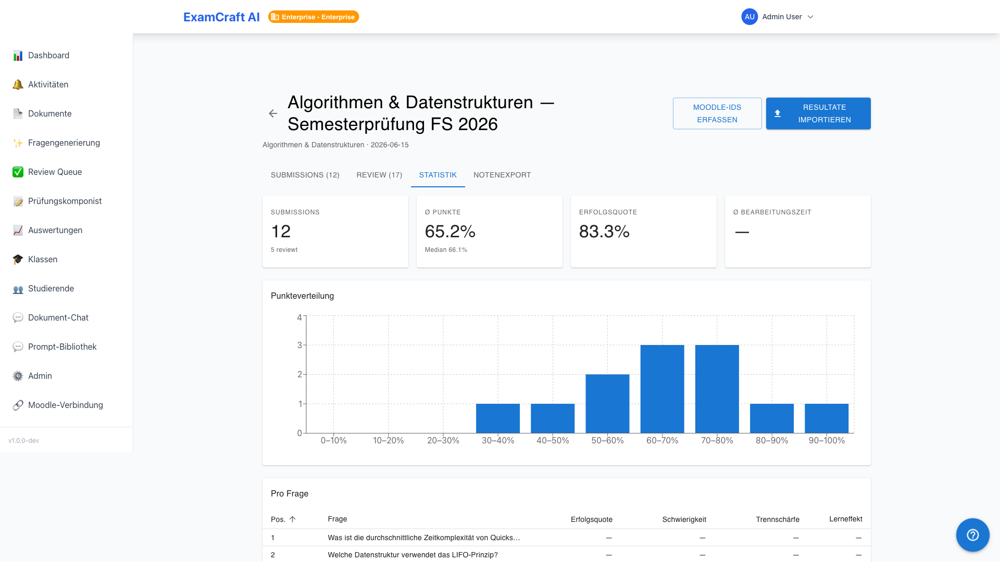
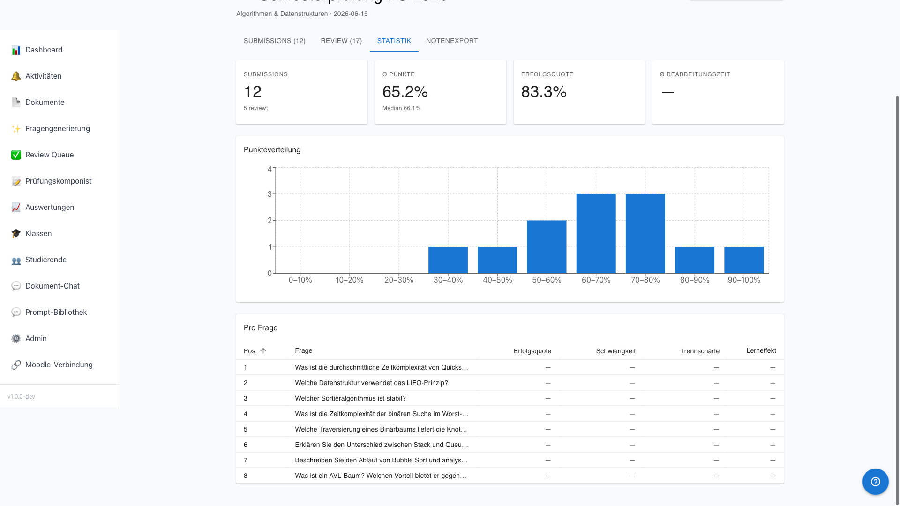
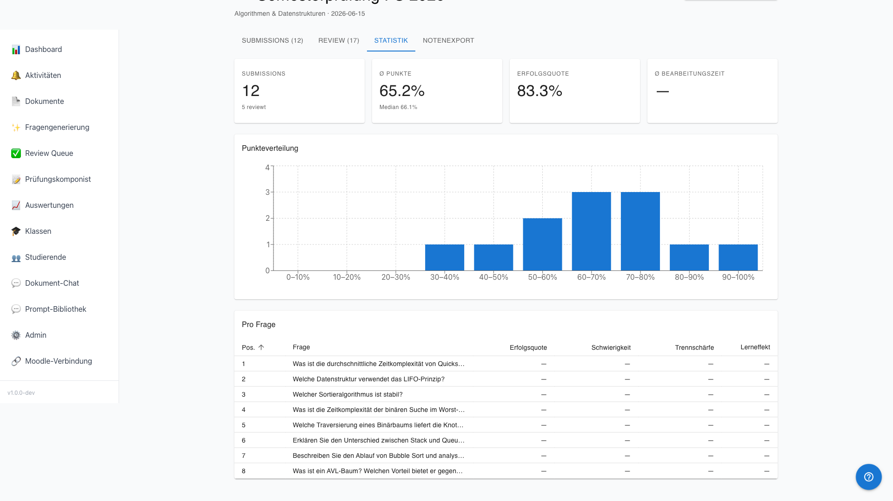

# Statistiques

!!! note "Note sur les niveaux"
    Les cartes KPI et l'histogramme sont disponibles pour tous les niveaux. L'analyse par question (pouvoir discriminant) et la statistique d'évolution des classes sont des fonctionnalités Professional et Enterprise.

L'onglet Statistiques offre une vue d'ensemble complète des performances de votre cohorte d'examen — de la distribution globale à l'analyse des questions individuelles. Route : onglet **Statistiques** dans `/auswertungen/:examId/submissions`.

## Cartes KPI

| Indicateur | Signification |
|------------|---------------|
| Moyenne | Score moyen de toutes les soumissions |
| Taux de réussite | Part des soumissions ayant atteint le seuil de passage |
| Soumissions | Nombre total de soumissions |
| Révisées | Nombre de soumissions avec le statut `fully_reviewed` |

## Distribution des points

L'histogramme regroupe toutes les soumissions en tranches de 10 % (0–10 %, 10–20 %, …). Un maximum prononcé au centre indique un examen bien calibré. Une forte asymétrie vers la gauche peut indiquer des questions trop difficiles.

## Analyse par question

| Colonne | Description |
|---------|-------------|
| Question | Texte abrégé de la question |
| Taux de réussite | Part des candidats ayant obtenu le score maximal |
| Difficulté | Inverse du taux de réussite — 100 % signifie que tous ont échoué |
| Pouvoir discriminant | Dans quelle mesure cette question distingue-t-elle les candidats forts des faibles ? |

### Comprendre le pouvoir discriminant

L'index de discrimination mesure si une question différencie les résultats des candidats forts et faibles :

| Valeur | Interprétation |
|--------|----------------|
| ≥ 0.40 | Excellent pouvoir discriminant |
| 0.30–0.39 | Bon pouvoir discriminant |
| 0.20–0.29 | Satisfaisant — révision recommandée |
| < 0.20 | Faible pouvoir discriminant — la question devrait être révisée ou supprimée |

Un pouvoir discriminant négatif est un signal d'alarme : les candidats plus faibles ont répondu correctement à la question plus souvent que les candidats plus forts.

## Effet d'apprentissage lors de tentatives multiples

Lorsque des étudiants passent le même examen plusieurs fois (p. ex. lors d'examens de rattrapage), cette section montre l'évolution des moyennes au fil des tentatives. Une tendance à la hausse confirme un effet d'apprentissage mesurable.

## Prochaines étapes

- [:octicons-arrow-right-24: Exporter les notes](notenexport.md)
- [:octicons-arrow-right-24: Statistiques d'évolution des classes](klassen.md)
- [:octicons-arrow-right-24: Quotas d'abonnement](subscription.md)
