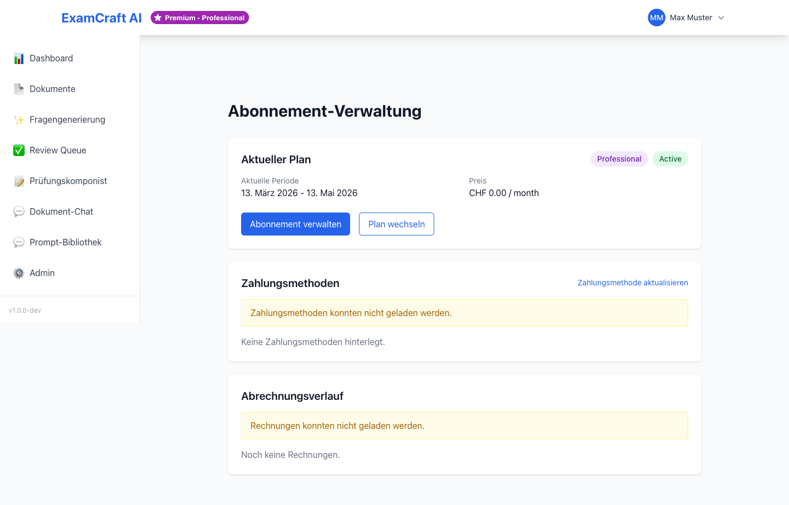
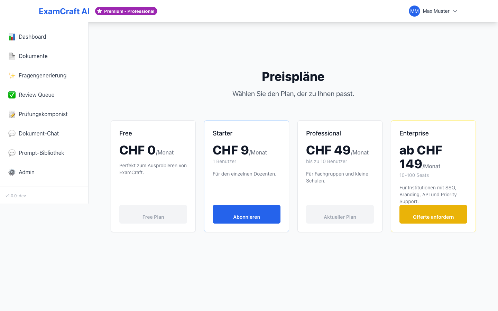

# Abonnement

Auf der Abonnement-Seite sehen Sie Ihren aktuellen Plan, Ihre Nutzung und können Ihr Abonnement verwalten. ExamCraft AI bietet vier flexibel skalierbare Abonnementpläne für unterschiedliche Anforderungen.

## Verfügbare Pläne

ExamCraft AI bietet vier Abonnementpläne mit zunehmenden Features und höheren Limits:

| Feature | Free | Starter | Professional | Enterprise |
|---------|:----:|:-------:|:------------:|:----------:|
| Dokumente | 5 | 50 | Unbegrenzt | Unbegrenzt |
| Fragen pro Monat | 20 | 200 | Unbegrenzt | Unbegrenzt |
| Fragetypen | MC + Offen | MC + Offen | MC + Offen + Matching | MC + Offen + Matching |
| Dokument-Chat | — | ✓ | ✓ | ✓ |
| Prompt-Upload | — | — | ✓ | ✓ |
| RAG-Prüfungen | — | ✓ | ✓ | ✓ |
| Prüfungsexport | PDF | PDF + Word | PDF + Word + Excel | PDF + Word + Excel + LMS |
| Support | Community | E-Mail | Priorität | Dediziert |
| SLA | — | — | 99,5% | 99,9% |

### Plan-Details

**Free** – Kostenlos, für Evaluation und kleine Projekte. Optimale Basis zum Kennenlernen der Plattform.

**Starter** – EUR 49/Monat, für Dozenten mit regelmässiger Nutzung. Inklusive RAG-Prüfungen und Dokument-Chat.

**Professional** – EUR 149/Monat, für Institutionen mit hohem Volumen. Unbegrenzte Ressourcen und Prompt-Verwaltung.

**Enterprise** – Auf Anfrage, für grosse Organisationen. Dedizierter Support und Custom SLA.

## Aktuelles Abonnement einsehen

Navigieren Sie zu `/subscription` oder klicken Sie im Hauptmenü auf **Abonnement**. Dort sehen Sie:

- **Ihren aktuellen Plan** mit vollständiger Feature-Übersicht
- **Ihre Nutzung** (z.B. verwendete Dokumente, generierte Fragen)
- **Das nächste Abrechnungsdatum** und Abonnement-Status
- **Den Abonnement-Badge** – auch oben links im Dashboard sichtbar

Die Nutzungsmetriken werden in Echtzeit aktualisiert und zeigen:

| Metrik | Beschreibung |
|--------|-------------|
| Hochgeladene Dokumente | Anzahl aktive Dokumente vs. Limit |
| Fragen diesen Monat | Generierte Fragen vs. Monats-Limit |
| Speicher verwendet | Dokumentengrösse vs. verfügbar |
| RAG-Anfragen | Durchführte Suchen in dieser Abrechnung |

## Plan upgraden

Sie können jederzeit zu einem höheren Plan wechseln. Der neue Plan wird sofort aktiviert.

### Abonnement-Upgrade durchführen

1. Navigieren Sie zu `/subscription`
2. Klicken Sie auf **Upgrade** oder wählen Sie den gewünschten Plan
3. Sie werden zum Stripe Checkout weitergeleitet
4. Geben Sie Ihre Zahlungsinformationen ein:
    - Kreditkarte (VISA, Mastercard, American Express)
    - SEPA-Lastschrift
5. Nach erfolgreicher Zahlung wird Ihr Plan sofort aktiviert

Die Abrechnung erfolgt am gleichen Tag im nächsten Monat. Bei monatlichen Plänen zahlen Sie pro 30 Tage, bei Jahresplänen rabattiert.

!!! tip "Jahresabonnement"
    Mit einem Jahresabonnement sparen Sie bis zu 20% gegenüber der monatlichen
    Abrechnung. Die genaue Ersparnis wird beim Checkout angezeigt. Jahresabonnements
    werden einmalig abgerechnet.

!!! note "Upgrade-Gebühren"
    Bei einem Upgrade von einem monatlichen Plan wird Ihnen die neue Plan-Gebühr
    anteilig für die verbleibenden Tage berechnet. Sie zahlen nicht doppelt.

## Rechnungen und Zahlungsdetails

Verwalten Sie Ihre Zahlungsmethode und laden Sie Rechnungen herunter.

### Zahlungsportal öffnen

1. Klicken Sie auf **Stripe-Portal öffnen** oder **Rechnungen verwalten**
2. Sie werden zu einem sicheren Kundendashboard weitergeleitet
3. Dort können Sie:
    - **Vergangene Rechnungen herunterladen** – PDF-Dateien für Ihre Buchhaltung
    - **Zahlungsmethode ändern** – Kreditkarte oder SEPA hinzufügen/aktualisieren
    - **Abrechnungsadresse bearbeiten** – Für korrekte Rechnungen
    - **Abonnement kündigen** – Falls gewünscht

Die Rechnungen enthalten alle für Ihre Buchhaltung notwendigen Informationen und Ihre Steuernummer, falls hinterlegt.

### Zahlungsmethode aktualisieren

1. Öffnen Sie das Zahlungsportal
2. Klicken Sie auf **Zahlungsmethode**
3. Wählen Sie **Neue Karte hinzufügen** oder **Bestehende bearbeiten**
4. Geben Sie die Daten ein oder wählen Sie eine gespeicherte Methode
5. Speichern Sie die Änderungen

Ihre Zahlungsdaten werden verschlüsselt über Stripe verwaltet und sicher gespeichert.

## Plan wechseln oder downgraden

Sie können jederzeit zu einem niedrigeren Plan wechseln oder Ihr Abonnement kündigen.

### Was passiert bei Downgrade?

Wenn Sie von einem höheren zu einem niedrigeren Plan wechseln, wird Ihr Konto sofort auf den neuen Plan limitiert:

- **Ihre Daten bleiben erhalten** – Alle Dokumente, Fragen und Prüfungen sind noch zugreifbar
- **Neue Features sind deaktiviert** – Premium-Features der alten Stufe funktionieren nicht mehr
- **Limits greifen sofort** – Falls Sie das Dokument-Limit überschritten haben, können Sie keine neuen Dokumente hochladen, bis Sie einige löschen

### Was passiert bei Ablauf?

Wenn Sie kündigen oder Ihr Abonnement abläuft:

- **Ihr Konto wird auf Free downgestuft** – Automatisch nach dem letzten Bezahltag
- **Ihre Daten bleiben 90 Tage erhalten** – Sie können sie noch einsehen und exportieren
- **Nach 90 Tagen werden Daten gelöscht** – Falls Sie nicht wieder upgraden
- **Sie können jederzeit upgraden** – Ihre Daten werden wiederhergestellt, wenn Sie innerhalb von 90 Tagen zurückkehren

!!! note "Daten bleiben erhalten"
    Beim Wechsel auf einen niedrigeren Plan werden Ihre Daten nicht gelöscht.
    Sie können sie nach einem erneuten Upgrade wieder vollständig nutzen.
    Falls Sie ein Backup brauchen, exportieren Sie vorher alle Prüfungen.

## Kontingente und Limits verstehen

Jeder Plan hat spezifische Limits für Speicher, Anfragen und Funktionen.

### Limits pro Plan

**Free-Plan:**
- 5 hochladbare Dokumente
- 20 Fragen pro Monat
- Kein Dokument-Chat
- Keine RAG-Prüfungen

**Starter-Plan:**
- 50 hochladbare Dokumente
- 200 Fragen pro Monat
- Unlimitierte RAG-Anfragen
- Dokument-Chat mit bis zu 100 Nachrichtenpaaren pro Monat

**Professional + Enterprise:**
- Unbegrenzte Dokumente und Fragen
- Volles Spektrum aller Features

### Was passiert bei Limit-Überschreitung?

Wenn Sie Ihre Limits erreichen:

1. **Dokumenten-Limit** – Sie können keine neuen Dokumente mehr hochladen
2. **Frage-Limit** – Fragengenerierung ist bis zum nächsten Abrechnung deaktiviert
3. **RAG-Limit** – Semantic Search funktioniert nicht mehr

Sie können sofort upgraden, um die Limits zu erhöhen.

## Nächste Schritte

- [:octicons-arrow-right-24: Zurück zum Dashboard](dashboard.md)
- [:octicons-arrow-right-24: Profil und Konto](profile.md)
- [:octicons-arrow-right-24: Dokumente hochladen](documents.md)
