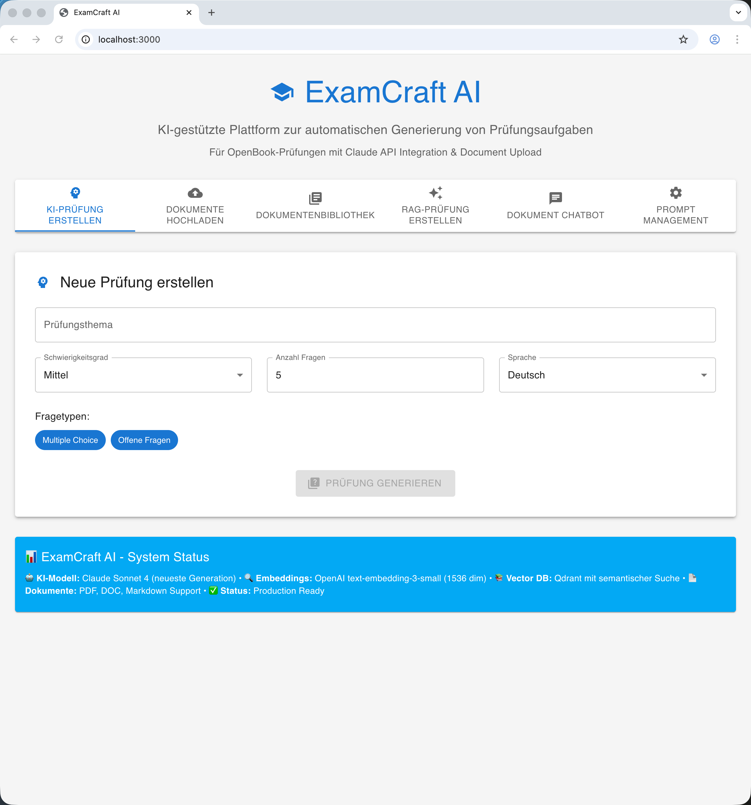

# 📸 ExamCraft AI - Screenshots & Visuals

> **Visuelle Übersicht der ExamCraft AI Benutzeroberfläche**

**Version**: 1.0.0
**Stand**: Oktober 2025

---

## 📖 Inhaltsverzeichnis

1. [Hauptnavigation](#hauptnavigation)
2. [KI-Prüfung erstellen](#ki-prüfung-erstellen)
3. [Dokumente hochladen](#dokumente-hochladen)
4. [Dokumentenbibliothek](#dokumentenbibliothek)
5. [RAG-Prüfung erstellen](#rag-prüfung-erstellen)
6. [Dokument ChatBot](#dokument-chatbot)
7. [Prompt Management](#prompt-management)
8. [Screenshots erstellen](#screenshots-erstellen)

---

## 🎯 Hauptnavigation

### Dashboard-Übersicht

**Beschreibung**: Die Hauptnavigation zeigt alle verfügbaren Funktionen in Tab-Form.

**Elemente:**

- Header mit ExamCraft AI Logo
- 6 Haupttabs:
  - 🤖 KI-Prüfung erstellen
  - 📤 Dokumente hochladen
  - 📚 Dokumentenbibliothek
  - 🔍 RAG-Prüfung erstellen
  - 💬 Dokument ChatBot
  - ⚙️ Prompt Management
- System Status Footer

**Screenshot-Datei**: `screenshots/01_main_navigation.png`

**Wie erstellen:**

1. Öffne `http://localhost:3000`
2. Warte bis Seite vollständig geladen
3. Screenshot des gesamten Fensters
4. Speichere als `01_main_navigation.png`

---

## 🤖 KI-Prüfung erstellen

### Konfigurationsformular

**Beschreibung**: Formular zur Konfiguration der themenbasierten Fragenerstellung.

**Elemente:**

- Thema-Eingabefeld
- Schwierigkeitsgrad-Dropdown (Einfach/Mittel/Schwer)
- Anzahl Fragen Slider (1-20)
- Fragetypen Checkboxen (Multiple Choice, Offene Fragen)
- Sprache-Auswahl (Deutsch/English)
- "Prüfung generieren" Button

**Screenshot-Datei**: `screenshots/02_ai_exam_config.png`

**Wie erstellen:**

1. Klicke auf Tab "KI-Prüfung erstellen"
2. Fülle Formular mit Beispieldaten:
   - Thema: "Python Programmierung - Listen und Dictionaries"
   - Schwierigkeitsgrad: Mittel
   - Anzahl: 5 Fragen
   - Typen: Beide aktiviert
   - Sprache: Deutsch
3. Screenshot vor dem Klick auf "Generieren"
4. Speichere als `02_ai_exam_config.png`

### Generierte Prüfung

**Beschreibung**: Anzeige der generierten Fragen mit Details.

**Elemente:**

- Prüfungsübersicht (Thema, Anzahl, Schwierigkeit)
- Liste der Fragen mit:
  - Fragenummer
  - Fragetext
  - Antwortoptionen (bei Multiple Choice)
  - Korrekte Antwort (grün markiert)
  - Erklärung
  - Bloom-Level Badge
  - Schwierigkeitsgrad (1-5 Sterne)
- "Neue Prüfung erstellen" Button

**Screenshot-Datei**: `screenshots/03_ai_exam_result.png`

**Wie erstellen:**

1. Generiere Prüfung mit obiger Konfiguration
2. Warte bis Generierung abgeschlossen
3. Scrolle zu erster Frage
4. Screenshot der ersten 2-3 Fragen
5. Speichere als `03_ai_exam_result.png`

---

## 📤 Dokumente hochladen

### Upload-Bereich

**Beschreibung**: Drag & Drop Upload-Interface für Dokumente.

**Elemente:**

- Upload-Box mit Drag & Drop Zone
- "Dateien auswählen" Button
- Unterstützte Formate Hinweis
- Max. Dateigröße Hinweis

**Screenshot-Datei**: `screenshots/04_document_upload_empty.png`

**Wie erstellen:**

1. Klicke auf Tab "Dokumente hochladen"
2. Screenshot des leeren Upload-Bereichs
3. Speichere als `04_document_upload_empty.png`

### Upload in Progress

**Beschreibung**: Anzeige während des Upload-Vorgangs.

**Elemente:**

- Dateiname und Größe
- Fortschrittsbalken (0-100%)
- Status: "Wird verarbeitet..."
- Spinner-Animation

**Screenshot-Datei**: `screenshots/05_document_upload_progress.png`

**Wie erstellen:**

1. Starte Upload einer PDF-Datei
2. Screenshot während Verarbeitung (ca. 50%)
3. Speichere als `05_document_upload_progress.png`

### Upload abgeschlossen

**Beschreibung**: Erfolgreiche Upload-Bestätigung.

**Elemente:**

- Grünes Häkchen
- "Verarbeitet" Status
- Anzahl extrahierte Seiten
- "Weiteres Dokument hochladen" Button

**Screenshot-Datei**: `screenshots/06_document_upload_success.png`

**Wie erstellen:**

1. Warte bis Upload abgeschlossen
2. Screenshot der Erfolgsanzeige
3. Speichere als `06_document_upload_success.png`

---

## 📚 Dokumentenbibliothek

### Bibliotheksübersicht

**Beschreibung**: Liste aller hochgeladenen Dokumente.

**Elemente:**

- Suchfeld
- Format-Filter Dropdown
- Dokumentenliste mit:
  - Dateiname
  - Upload-Datum
  - Dateigröße
  - Anzahl Seiten
  - Checkbox für Auswahl
  - Löschen-Button
- "Prüfung aus Auswahl erstellen" Button

**Screenshot-Datei**: `screenshots/07_document_library.png`

**Wie erstellen:**

1. Klicke auf Tab "Dokumentenbibliothek"
2. Stelle sicher, dass 3-5 Dokumente vorhanden sind
3. Screenshot der gesamten Bibliothek
4. Speichere als `07_document_library.png`

### Dokumentenauswahl

**Beschreibung**: Mehrere Dokumente für RAG-Prüfung ausgewählt.

**Elemente:**

- 2-3 aktivierte Checkboxen
- Hervorgehobene Zeilen
- Aktiver "Prüfung erstellen" Button

**Screenshot-Datei**: `screenshots/08_document_selection.png`

**Wie erstellen:**

1. Wähle 2-3 Dokumente aus
2. Screenshot mit aktivierten Checkboxen
3. Speichere als `08_document_selection.png`

---

## 🔍 RAG-Prüfung erstellen

### RAG-Konfiguration

**Beschreibung**: Formular für RAG-basierte Fragenerstellung.

**Elemente:**

- Ausgewählte Dokumente Anzeige
- Thema/Fokus Eingabefeld
- Anzahl Fragen Slider
- Fragetypen Checkboxen
- Schwierigkeitsgrad Dropdown
- "RAG-Prüfung generieren" Button

**Screenshot-Datei**: `screenshots/09_rag_exam_config.png`

**Wie erstellen:**

1. Klicke auf Tab "RAG-Prüfung erstellen"
2. Fülle Formular mit Beispieldaten:
   - Fokus: "Sortieralgorithmen Komplexität"
   - Anzahl: 5 Fragen
   - Typen: Multiple Choice
   - Schwierigkeit: Mittel
3. Screenshot vor Generierung
4. Speichere als `09_rag_exam_config.png`

### RAG-Ergebnis mit Quellen

**Beschreibung**: Generierte Fragen mit Quellenangaben.

**Elemente:**

- Frage mit Antwortoptionen
- Korrekte Antwort (grün)
- Erklärung
- **Quelldokumente** mit Seitenzahl
- **Confidence Score** (0-1)
- Bloom-Level Badge

**Screenshot-Datei**: `screenshots/10_rag_exam_result.png`

**Wie erstellen:**

1. Generiere RAG-Prüfung
2. Warte bis abgeschlossen
3. Screenshot einer Frage mit Quellenangaben
4. Speichere als `10_rag_exam_result.png`

---

## 💬 Dokument ChatBot

### ChatBot-Übersicht

**Beschreibung**: Interaktive Chat-Oberfläche mit Dokumentenauswahl.

**Elemente:**

- Dokument-Auswahl Dropdown
- Chat-Historie Bereich
- Eingabefeld für Fragen
- "Senden" Button
- "Chat exportieren" Button

**Screenshot-Datei**: `screenshots/11_chatbot_overview.png`

**Wie erstellen:**

1. Klicke auf Tab "Dokument ChatBot"
2. Wähle ein Dokument aus
3. Screenshot der leeren Chat-Oberfläche
4. Speichere als `11_chatbot_overview.png`

### ChatBot-Konversation

**Beschreibung**: Beispiel-Konversation mit Antworten.

**Elemente:**

- User-Nachricht (rechts, blau)
- Bot-Antwort (links, grau)
- Quellenangaben unter Antwort
- Confidence Score
- Timestamp

**Screenshot-Datei**: `screenshots/12_chatbot_conversation.png`

**Wie erstellen:**

1. Stelle Frage: "Erkläre mir den Heapsort Algorithmus"
2. Warte auf Antwort
3. Screenshot der Konversation
4. Speichere als `12_chatbot_conversation.png`

### Chat-Export

**Beschreibung**: Export-Dialog für Chat-Historie.

**Elemente:**

- Export-Format Auswahl (Markdown/PDF)
- Dateiname Eingabe
- "Exportieren" Button
- Vorschau der exportierten Datei

**Screenshot-Datei**: `screenshots/13_chatbot_export.png`

**Wie erstellen:**

1. Klicke "Chat exportieren"
2. Screenshot des Export-Dialogs
3. Speichere als `13_chatbot_export.png`

---

## 🎛️ Prompt Management

### Prompt Library

**Beschreibung**: Grid-Übersicht aller AI-Prompts.

**Elemente:**

- Suchfeld
- Kategorie-Filter Dropdown
- Grid mit Prompt-Karten:
  - Name
  - Beschreibung
  - Kategorie-Badge (farbcodiert)
  - Tags
  - Verwendungen
  - Aktiv/Inaktiv Status
  - Aktionen (Bearbeiten, Versionen, Löschen)

**Screenshot-Datei**: `screenshots/14_prompt_library.png`

**Wie erstellen:**

1. Klicke auf Tab "Prompt Management"
2. Stelle sicher, dass 4-6 Prompts vorhanden sind
3. Screenshot des Grid-Layouts
4. Speichere als `14_prompt_library.png`

### Prompt Editor

**Beschreibung**: Editor für Prompt-Erstellung/-Bearbeitung.

**Elemente:**

- Name Eingabefeld
- Beschreibung Textarea
- Kategorie Dropdown
- Use Case Eingabe
- Tags Eingabe mit Chips
- Content Editor (Markdown)
- Tabs: Bearbeiten / Vorschau
- Aktiv Toggle
- "Speichern" Button

**Screenshot-Datei**: `screenshots/15_prompt_editor.png`

**Wie erstellen:**

1. Klicke "Neuer Prompt" oder "Bearbeiten"
2. Fülle Formular mit Beispieldaten
3. Screenshot des Editors (Bearbeiten-Tab)
4. Speichere als `15_prompt_editor.png`

### Prompt Vorschau

**Beschreibung**: Markdown-Vorschau des Prompt-Contents.

**Elemente:**

- Gerenderte Markdown-Ansicht
- Formatierung (Überschriften, Listen, Code)
- Template-Variablen hervorgehoben

**Screenshot-Datei**: `screenshots/16_prompt_preview.png`

**Wie erstellen:**

1. Im Editor: Wechsle zu "Vorschau" Tab
2. Screenshot der gerenderten Ansicht
3. Speichere als `16_prompt_preview.png`

### Version History

**Beschreibung**: Tabelle mit allen Prompt-Versionen.

**Elemente:**

- Tabelle mit Spalten:
  - Version
  - Status (Aktiv/Inaktiv)
  - Beschreibung
  - Erstellt am
  - Aktionen (Vorschau, Aktivieren)
- Sortierung nach Version (neueste zuerst)

**Screenshot-Datei**: `screenshots/17_version_history.png`

**Wie erstellen:**

1. Klicke "Versionen" bei einem Prompt
2. Screenshot der Version History Tabelle
3. Speichere als `17_version_history.png`

### Usage Analytics

**Beschreibung**: Dashboard mit Nutzungsstatistiken.

**Elemente:**

- 4 Metrik-Karten:
  - Verwendungen (Zahl)
  - Erfolgsrate (% mit Farbindikator)
  - Ø Latenz (ms)
  - Tokens Total (Zahl)
- Verwendungsverlauf Tabelle:
  - Timestamp
  - Use Case
  - Tokens
  - Latenz
  - Erfolg/Fehler

**Screenshot-Datei**: `screenshots/18_usage_analytics.png`

**Wie erstellen:**

1. Klicke "Analytics" bei einem Prompt
2. Screenshot des Analytics-Dashboards
3. Speichere als `18_usage_analytics.png`

### Semantic Search

**Beschreibung**: Suchinterface für semantische Prompt-Suche.

**Elemente:**

- Suchanfrage Eingabefeld
- Filter:
  - Kategorie Dropdown
  - Use Case Eingabe
- Advanced Settings:
  - Limit Slider (1-20)
  - Score Threshold Slider (0-1)
- "Suchen" Button
- Ergebnisliste mit:
  - Prompt-Name
  - Similarity Score (farbcodiert)
  - Beschreibung
  - Tags

**Screenshot-Datei**: `screenshots/19_semantic_search.png`

**Wie erstellen:**

1. Wechsle zu "Semantic Search" Tab
2. Gib Suchanfrage ein: "Generiere Multiple Choice Fragen"
3. Screenshot mit Suchergebnissen
4. Speichere als `19_semantic_search.png`

---

## 📸 Screenshots erstellen

### Vorbereitung

**Browser-Einstellungen:**

- Verwende Chrome oder Firefox
- Auflösung: 1920x1080 (Desktop)
- Zoom: 100%
- Deaktiviere Browser-Erweiterungen
- Verwende Inkognito-Modus für saubere UI

**Daten vorbereiten:**

1. Starte Development Stack: `./start-dev.sh`
2. Lade Seed-Daten: `docker-compose exec backend python scripts/seed_prompts.py`
3. Lade 3-5 Beispiel-PDFs hoch
4. Generiere 1-2 Beispiel-Prüfungen
5. Erstelle 1-2 ChatBot-Konversationen

### Screenshot-Tools

**macOS:**

- Ganzer Bildschirm: `Cmd + Shift + 3`
- Ausgewählter Bereich: `Cmd + Shift + 4`
- Fenster: `Cmd + Shift + 4` dann `Space`

**Windows:**

- Ganzer Bildschirm: `Win + Print`
- Ausgewählter Bereich: `Win + Shift + S`
- Snipping Tool: `Win + S`

**Linux:**

- GNOME: `Print` oder `Shift + Print`
- KDE: `Spectacle`

### Nachbearbeitung

**Empfohlene Tools:**

- **macOS**: Preview, Pixelmator
- **Windows**: Paint, Paint.NET
- **Linux**: GIMP, Krita
- **Cross-Platform**: Figma, Photopea

**Bearbeitungsschritte:**

1. Zuschneiden auf relevanten Bereich
2. Größe anpassen (max. 1920px Breite)
3. Komprimieren (PNG oder JPG, <500 KB)
4. Annotationen hinzufügen (optional):
   - Pfeile für wichtige Elemente
   - Nummern für Schritt-für-Schritt
   - Hervorhebungen für Features

### Dateiorganisation

**Verzeichnisstruktur:**

```
docs/screenshots/
├── 01_main_navigation.png
├── 02_ai_exam_config.png
├── 03_ai_exam_result.png
├── 04_document_upload_empty.png
├── 05_document_upload_progress.png
├── 06_document_upload_success.png
├── 07_document_library.png
├── 08_document_selection.png
├── 09_rag_exam_config.png
├── 10_rag_exam_result.png
├── 11_chatbot_overview.png
├── 12_chatbot_conversation.png
├── 13_chatbot_export.png
├── 14_prompt_library.png
├── 15_prompt_editor.png
├── 16_prompt_preview.png
├── 17_version_history.png
├── 18_usage_analytics.png
└── 19_semantic_search.png
```

**Namenskonvention:**

- Format: `{nummer}_{beschreibung}.png`
- Kleinbuchstaben
- Unterstriche statt Leerzeichen
- Fortlaufende Nummerierung

### Integration in Dokumentation

**Markdown-Syntax:**

```markdown

```

**Mit Bildunterschrift:**

```markdown

*Abbildung 1: ExamCraft AI Hauptnavigation mit 6 Funktionsbereichen*
```

**Mit Link:**

```markdown
[](screenshots/01_main_navigation.png)
```

---

## 📋 Checkliste

Verwende diese Checkliste, um sicherzustellen, dass alle Screenshots erstellt wurden:

- [ ] 01 - Hauptnavigation
- [ ] 02 - KI-Prüfung Konfiguration
- [ ] 03 - KI-Prüfung Ergebnis
- [ ] 04 - Dokument Upload (leer)
- [ ] 05 - Dokument Upload (in Progress)
- [ ] 06 - Dokument Upload (Erfolg)
- [ ] 07 - Dokumentenbibliothek
- [ ] 08 - Dokumentenauswahl
- [ ] 09 - RAG-Prüfung Konfiguration
- [ ] 10 - RAG-Prüfung Ergebnis
- [ ] 11 - ChatBot Übersicht
- [ ] 12 - ChatBot Konversation
- [ ] 13 - Chat Export
- [ ] 14 - Prompt Library
- [ ] 15 - Prompt Editor
- [ ] 16 - Prompt Vorschau
- [ ] 17 - Version History
- [ ] 18 - Usage Analytics
- [ ] 19 - Semantic Search

---

**Letzte Aktualisierung**: Oktober 2025
**Version**: 1.0.0
**Autor**: ExamCraft AI Team
