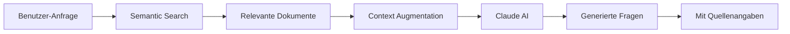

## Benutzeroberfläche

Die ExamCraft AI Benutzeroberfläche ist in mehrere Hauptbereiche unterteilt, die Sie über die Tab-Navigation erreichen:

<CardGroup cols={2}>
  <Card title="KI-Prüfung erstellen" icon="wand-magic-sparkles">
    Generieren Sie Fragen zu einem beliebigen Thema ohne Dokumente
  </Card>
  <Card title="Dokumente hochladen" icon="cloud-arrow-up">
    Laden Sie Ihre Kursmaterialien (PDF, Word, Markdown) hoch
  </Card>
  <Card title="Dokumentenbibliothek" icon="book">
    Verwalten und durchsuchen Sie alle hochgeladenen Dokumente
  </Card>
  <Card title="RAG-Prüfung erstellen" icon="brain">
    Erstellen Sie Fragen direkt aus Ihren Dokumenten
  </Card>
  <Card title="Dokument ChatBot" icon="comments">
    Führen Sie Gespräche mit Ihren Dokumenten (NotebookLM-Style)
  </Card>
  <Card title="Prompt Management" icon="sliders">
    Verwalten Sie AI-Prompts (nur für Administratoren)
  </Card>
</CardGroup>

## Hauptkonzepte

### 1. Dokumente

Dokumente sind die Grundlage für RAG-basierte Fragenerstellung. ExamCraft AI unterstützt:

<Tabs>
  <Tab title="PDF">
    - ✅ Bis zu 50 MB
    - ✅ Tabellen und Formeln
    - ✅ Bilder und Diagramme
    - ⚠️ OCR für gescannte PDFs empfohlen
  </Tab>
  <Tab title="Word (.doc/.docx)">
    - ✅ Bis zu 25 MB
    - ✅ Formatierung bleibt erhalten
    - ✅ Tabellen und Listen
    - ✅ Eingebettete Bilder
  </Tab>
  <Tab title="Markdown (.md)">
    - ✅ Bis zu 10 MB
    - ✅ Code-Blöcke mit Syntax Highlighting
    - ✅ LaTeX-Formeln
    - ✅ Tabellen und Listen
  </Tab>
  <Tab title="Text (.txt)">
    - ✅ Bis zu 5 MB
    - ✅ Plain Text
    - ✅ UTF-8 Encoding
  </Tab>
</Tabs>

**Verarbeitung:**
1. Upload → Text-Extraktion → Semantische Segmentierung → Vektorisierung → Indexierung

**Verarbeitungszeit:**
- PDF (10 Seiten): ~30 Sekunden
- Word (20 Seiten): ~45 Sekunden
- Markdown: ~15 Sekunden

### 2. Fragenerstellung

ExamCraft AI bietet zwei Ansätze zur Fragenerstellung:

<Tabs>
  <Tab title="Themenbasiert">
    **KI-Prüfung erstellen** (ohne Dokumente)

    - Geben Sie ein Thema ein
    - Wählen Sie Schwierigkeitsgrad
    - Legen Sie Anzahl und Typ der Fragen fest
    - Claude AI generiert passende Fragen

    **Vorteile:**
    - Schnell und einfach
    - Keine Dokumente erforderlich
    - Breites Themenspektrum

    **Nachteile:**
    - Keine Quellenangaben
    - Nicht kursspezifisch
  </Tab>
  <Tab title="RAG-basiert">
    **RAG-Prüfung erstellen** (aus Dokumenten)

    - Wählen Sie relevante Dokumente
    - Geben Sie optional einen Fokus an
    - Konfigurieren Sie Fragen
    - RAG System sucht + generiert

    **Vorteile:**
    - Quellenangaben vorhanden
    - Kursspezifisch
    - Höhere Relevanz

    **Nachteile:**
    - Erfordert hochgeladene Dokumente
    - Etwas längere Generierungszeit
  </Tab>
</Tabs>

### 3. Fragetypen

<AccordionGroup>
  <Accordion title="Multiple Choice" icon="list-check">
    **Format:**
    - 1 Frage
    - 4 Antwortoptionen
    - 1 korrekte Antwort
    - 3 Distraktoren (Ablenkungen)

    **Merkmale:**
    - Automatische Auswertung
    - Klar definierte richtige Antwort
    - Bloom's Taxonomy Levels 1-4

    **Beispiel:**
    ```
    Was ist die Zeitkomplexität von Heapsort im Worst Case?

    A) O(n)
    B) O(n log n) ✓
    C) O(n²)
    D) O(log n)
    ```
  </Accordion>

  <Accordion title="Offene Fragen" icon="message">
    **Format:**
    - 1 Frage
    - Freitext-Antwort erwartet
    - Musterlösung vorhanden

    **Merkmale:**
    - Manuelle Bewertung erforderlich
    - Tiefes Verständnis prüfbar
    - Bloom's Taxonomy Levels 3-6

    **Beispiel:**
    ```
    Erklären Sie den Unterschied zwischen Heapsort und Quicksort
    in Bezug auf Stabilität und Speicherkomplexität.

    Musterlösung: [Wird von AI generiert]
    ```
  </Accordion>

  <Accordion title="Code-Fragen" icon="code">
    **Format:**
    - Code-Aufgabe
    - Erwartete Lösung in Code
    - Syntaxhervorhebung

    **Merkmale:**
    - Programmiersprachen-Support
    - Automatische Formatierung
    - Bloom's Taxonomy Levels 3-6

    **Beispiel:**
    ```python
    Implementieren Sie eine Funktion, die einen Heap
    aus einem Array erstellt.

    def build_heap(arr):
        # Ihre Lösung hier
        pass
    ```
  </Accordion>
</AccordionGroup>

### 4. Bloom's Taxonomy

ExamCraft AI ordnet jede Frage automatisch einem Bloom's Taxonomy Level zu:

| Level | Beschreibung | Beispiel-Verben |
|-------|-------------|-----------------|
| **1. Remember** | Wissen abrufen | Nennen, Auflisten, Identifizieren |
| **2. Understand** | Verstehen | Erklären, Beschreiben, Zusammenfassen |
| **3. Apply** | Anwenden | Verwenden, Implementieren, Ausführen |
| **4. Analyze** | Analysieren | Vergleichen, Unterscheiden, Organisieren |
| **5. Evaluate** | Bewerten | Beurteilen, Kritisieren, Rechtfertigen |
| **6. Create** | Kreieren | Entwerfen, Konstruieren, Entwickeln |

<Info>
  Je höher das Bloom-Level, desto anspruchsvoller die kognitive Leistung.
</Info>

### 5. Schwierigkeitsgrade

ExamCraft AI verwendet ein 5-stufiges Schwierigkeitssystem:

<Steps>
  <Step title="Sehr Einfach (1)">
    Grundlegende Fakten und Definitionen
    - Bloom Level: 1 (Remember)
    - Zielgruppe: Einsteiger
  </Step>
  <Step title="Einfach (2)">
    Verständnisfragen
    - Bloom Level: 1-2 (Remember, Understand)
    - Zielgruppe: Anfänger
  </Step>
  <Step title="Mittel (3)">
    Anwendung und Analyse
    - Bloom Level: 3-4 (Apply, Analyze)
    - Zielgruppe: Fortgeschrittene
  </Step>
  <Step title="Schwer (4)">
    Evaluation und Synthese
    - Bloom Level: 5 (Evaluate)
    - Zielgruppe: Experten
  </Step>
  <Step title="Sehr Schwer (5)">
    Kreation und Innovation
    - Bloom Level: 6 (Create)
    - Zielgruppe: Meister
  </Step>
</Steps>

### 6. RAG-Technologie

**RAG** (Retrieval-Augmented Generation) kombiniert Suche und KI-Generation:



**Ablauf:**
1. **Retrieval**: Semantische Suche in Vektordatenbank
2. **Ranking**: Relevanzbasierte Sortierung
3. **Augmentation**: Context an Claude AI senden
4. **Generation**: KI generiert Fragen aus Context
5. **Attribution**: Quellenangaben hinzufügen

**Vorteile:**
- ✅ Fakten-basiert (keine Halluzinationen)
- ✅ Quellenangaben vorhanden
- ✅ Kursspezifisch und relevant

### 7. Prompt-System

Prompts steuern, wie Claude AI Fragen generiert:

<Tabs>
  <Tab title="System Prompts">
    Definieren grundlegendes Verhalten der AI
    - Tonalität
    - Formatierung
    - Qualitätsstandards
  </Tab>
  <Tab title="User Prompts">
    Spezifische Anweisungen pro Fragetyp
    - Multiple Choice Format
    - Offene Fragen Format
    - Code-Fragen Format
  </Tab>
  <Tab title="Template Variables">
    Dynamische Platzhalter
    - `{topic}` - Thema
    - `{difficulty}` - Schwierigkeitsgrad
    - `{context}` - RAG Context
    - `{bloom_level}` - Bloom Level
  </Tab>
</Tabs>

**Administratoren** können Prompts über das Prompt Management verwalten.

## Workflow-Übersicht

<Steps>
  <Step title="Dokumente hochladen (optional)">
    Laden Sie Ihre Kursmaterialien hoch, wenn Sie RAG verwenden möchten
  </Step>
  <Step title="Fragenerstellung konfigurieren">
    Wählen Sie Thema, Schwierigkeitsgrad, Anzahl und Typ der Fragen
  </Step>
  <Step title="Fragen generieren">
    Claude AI generiert die Fragen (10-60 Sekunden)
  </Step>
  <Step title="Review & Edit">
    Überprüfen und bearbeiten Sie die generierten Fragen
  </Step>
  <Step title="Export (geplant)">
    Exportieren Sie als PDF, Moodle XML, oder Canvas JSON
  </Step>
</Steps>

## Browser-Unterstützung

ExamCraft AI ist optimiert für moderne Browser:

| Browser | Mindestversion | Empfohlen |
|---------|---------------|-----------|
| Chrome | 90+ | ✅ Beste Performance |
| Firefox | 88+ | ✅ Vollständig unterstützt |
| Safari | 14+ | ✅ macOS/iOS |
| Edge | 90+ | ✅ Windows empfohlen |

<Warning>
  Internet Explorer wird nicht unterstützt.
</Warning>

## Nächste Schritte

<CardGroup cols={2}>
  <Card
    title="Subscription Tiers verstehen"
    icon="layer-group"
    href="/essentials/subscription-tiers"
  >
    Welche Features sind in welchem Tier verfügbar?
  </Card>
  <Card
    title="RBAC System"
    icon="shield-halved"
    href="/essentials/rbac"
  >
    Rollen und Berechtigungen verstehen
  </Card>
  <Card
    title="Erste Prüfung erstellen"
    icon="graduation-cap"
    href="/guides/first-exam"
  >
    Schritt-für-Schritt Anleitung
  </Card>
  <Card
    title="Features erkunden"
    icon="compass"
    href="/features/document-upload"
  >
    Detaillierte Feature-Dokumentation
  </Card>
</CardGroup>
