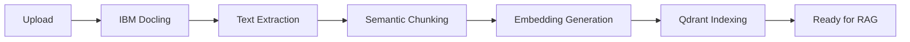

## Übersicht

Der Dokumenten-Upload ist der erste Schritt zur RAG-basierten Fragenerstellung. ExamCraft AI unterstützt verschiedene Formate und verwendet IBM Docling für fortgeschrittene Dokumentenverarbeitung.

<CardGroup cols={2}>
  <Card title="Multi-Format Support" icon="file">
    PDF, Word, Markdown, Text
  </Card>
  <Card title="IBM Docling" icon="brain">
    Advanced Layout-Erkennung und OCR
  </Card>
  <Card title="Semantic Chunking" icon="puzzle-piece">
    Intelligente Dokumentsegmentierung
  </Card>
  <Card title="Vector Indexing" icon="database">
    Automatische Qdrant-Indexierung
  </Card>
</CardGroup>

## Unterstützte Formate

<Tabs>
  <Tab title="PDF">
    ### PDF-Dateien (.pdf)

    **Max. Größe:** 50 MB

    **Features:**
    - ✅ Automatische Layout-Erkennung
    - ✅ Tabellen-Extraktion mit Strukturerhaltung
    - ✅ Formeln und mathematische Notation
    - ✅ Bilder und Diagramme
    - ✅ OCR für gescannte Dokumente

    **Best Practices:**
    - Verwenden Sie hochwertige PDFs (nicht gescannt, wenn möglich)
    - Strukturierte Dokumente mit klaren Überschriften
    - Vermeiden Sie Wasserzeichen und Hintergrundbilder
    - Bei gescannten PDFs: mindestens 300 DPI

    **Verarbeitungszeit:**
    - 10 Seiten: ~30 Sekunden
    - 50 Seiten: ~2 Minuten
    - 100+ Seiten: ~5 Minuten

    <Warning>
      Passwortgeschützte PDFs werden nicht unterstützt. Entfernen Sie den Passwortschutz vor dem Upload.
    </Warning>
  </Tab>

  <Tab title="Word">
    ### Word-Dokumente (.doc, .docx)

    **Max. Größe:** 25 MB

    **Features:**
    - ✅ Formatierung bleibt erhalten
    - ✅ Tabellen und Listen
    - ✅ Eingebettete Bilder
    - ✅ Kommentare werden extrahiert
    - ✅ Metadaten (Autor, Titel, Datum)

    **Best Practices:**
    - Verwenden Sie .docx (modernes Format)
    - Strukturieren Sie mit Überschriften (H1, H2, H3)
    - Vermeiden Sie komplexe Formatierungen
    - Nutzen Sie Standard-Fonts

    **Verarbeitungszeit:**
    - 20 Seiten: ~45 Sekunden
    - 50 Seiten: ~1.5 Minuten

    <Info>
      .doc (altes Format) wird unterstützt, aber .docx wird empfohlen für bessere Ergebnisse.
    </Info>
  </Tab>

  <Tab title="Markdown">
    ### Markdown-Dateien (.md)

    **Max. Größe:** 10 MB

    **Features:**
    - ✅ Code-Blöcke mit Syntax Highlighting
    - ✅ LaTeX-Formeln (`$...$` und `$$...$$`)
    - ✅ Tabellen und Listen
    - ✅ Links und Bilder
    - ✅ Frontmatter (YAML)

    **Best Practices:**
    - Verwenden Sie klare Überschriften-Hierarchie
    - Nutzen Sie Code-Blöcke für Programmierbeispiele
    - LaTeX für mathematische Formeln
    - UTF-8 Encoding

    **Verarbeitungszeit:**
    - 5 Seiten: ~15 Sekunden
    - 20 Seiten: ~45 Sekunden

    **Beispiel:**
    ```markdown
    # Sorting Algorithms

    ## Heapsort

    Time complexity: $O(n \log n)$

    ```python
    def heapsort(arr):
        # Implementation here
        pass
    ```
    ```
  </Tab>

  <Tab title="Text">
    ### Text-Dateien (.txt)

    **Max. Größe:** 5 MB

    **Features:**
    - ✅ Plain Text
    - ✅ UTF-8 Encoding
    - ✅ Zeilenumbrüche erhalten
    - ✅ Minimale Verarbeitung

    **Best Practices:**
    - UTF-8 Encoding verwenden
    - Klare Absätze mit Leerzeilen
    - Vermeiden Sie spezielle Formatierung

    **Verarbeitungszeit:**
    - 5 Seiten: ~10 Sekunden

    <Note>
      Für strukturierte Dokumente empfehlen wir Markdown statt Plain Text.
    </Note>
  </Tab>
</Tabs>

## Upload-Methoden

### Web-Interface

<Steps>
  <Step title="Tab öffnen">
    Navigieren Sie zu **"Dokumente hochladen"** in der Hauptnavigation
  </Step>

  <Step title="Dateien auswählen">
    Zwei Möglichkeiten:

    **Drag & Drop:**
    - Ziehen Sie Dateien in den Upload-Bereich
    - Multiple Dateien gleichzeitig möglich

    **Datei-Browser:**
    - Klicken Sie auf "Dateien auswählen"
    - Wählen Sie eine oder mehrere Dateien aus
  </Step>

  <Step title="Upload überwachen">
    Sie sehen für jede Datei:
    - Dateiname und Größe
    - Fortschrittsbalken (0-100%)
    - Status: "Uploading..." → "Processing..." → "Complete"
  </Step>

  <Step title="Verarbeitung abwarten">
    Nach dem Upload:
    - Text wird extrahiert (IBM Docling)
    - Dokument wird segmentiert (Semantic Chunking)
    - Embeddings werden erstellt
    - Indexierung in Qdrant Vector Database
  </Step>
</Steps>

### API Upload

<CodeGroup>

```python Python
import requests

# Upload single document
with open("textbook.pdf", "rb") as f:
    response = requests.post(
        "https://api.examcraft.ai/api/v1/documents",
        headers={"Authorization": f"Bearer {token}"},
        files={"file": f},
        data={
            "tags": "algorithms,data-structures",
            "language": "de"
        }
    )

document_id = response.json()["id"]
print(f"Document uploaded: {document_id}")

# Check processing status
status = requests.get(
    f"https://api.examcraft.ai/api/v1/documents/{document_id}",
    headers={"Authorization": f"Bearer {token}"}
)

print(f"Status: {status.json()['processing_status']}")
```

```javascript JavaScript
// Upload with progress tracking
const formData = new FormData();
formData.append('file', fileInput.files[0]);
formData.append('tags', 'algorithms,data-structures');
formData.append('language', 'de');

const response = await fetch(
  'https://api.examcraft.ai/api/v1/documents',
  {
    method: 'POST',
    headers: {
      'Authorization': `Bearer ${token}`
    },
    body: formData,
    // Track upload progress
    onUploadProgress: (progressEvent) => {
      const percentCompleted = Math.round(
        (progressEvent.loaded * 100) / progressEvent.total
      );
      console.log(`Upload: ${percentCompleted}%`);
    }
  }
);

const { id } = await response.json();
console.log(`Document uploaded: ${id}`);
```

```bash cURL
curl -X POST https://api.examcraft.ai/api/v1/documents \
  -H "Authorization: Bearer YOUR_TOKEN" \
  -F "file=@textbook.pdf" \
  -F "tags=algorithms,data-structures" \
  -F "language=de"
```

</CodeGroup>

## Verarbeitungs-Pipeline

Die Dokumentenverarbeitung läuft in mehreren Schritten:



### 1. IBM Docling Processing

**Was macht Docling?**
- Layout-Analyse (Überschriften, Absätze, Tabellen)
- Tabellen-Extraktion mit Strukturerhaltung
- OCR für gescannte Dokumente
- Metadaten-Extraktion (Sektionen, Bilder, Formeln)

<Tabs>
  <Tab title="Layout-Erkennung">
    Docling erkennt automatisch:
    - Überschriften (H1-H6)
    - Absätze und Textblöcke
    - Tabellen und Listen
    - Code-Blöcke
    - Formeln (LaTeX)
    - Bilder und Diagramme
  </Tab>

  <Tab title="Tabellen-Extraktion">
    **Strukturerhaltung:**
    - Zeilen und Spalten
    - Header-Rows
    - Merged Cells
    - Formatierung

    **Output-Format:**
    - Markdown-Tabellen
    - CSV-Export möglich
    - JSON-Struktur verfügbar
  </Tab>

  <Tab title="OCR für Scans">
    Wenn Docling gescannte PDFs erkennt:
    - Automatische OCR-Aktivierung
    - Multi-Language Support
    - Confidence Scores pro Wort
    - Fehlerkorrektur
  </Tab>
</Tabs>

### 2. Semantic Chunking

**Intelligente Segmentierung:**

<AccordionGroup>
  <Accordion title="Chunk-Strategie" icon="puzzle-piece">
    - **Section-Based:** Chunks basierend auf Überschriften
    - **Size-Based:** Max. 500 Tokens pro Chunk
    - **Overlap:** 50 Token Überlappung zwischen Chunks
    - **Context Preservation:** Überschriften-Kontext bleibt erhalten
  </Accordion>

  <Accordion title="Chunk-Metadaten" icon="tag">
    Jeder Chunk enthält:
    - Section Title (Überschrift)
    - Page Number (Seitenzahl)
    - Chunk Index (Position im Dokument)
    - Parent Section (Hierarchie)
    - Content Type (Text, Code, Tabelle, Formel)
  </Accordion>

  <Accordion title="Chunk-Qualität" icon="star">
    **Quality Indicators:**
    - Completeness Score (0-1)
    - Coherence Score (0-1)
    - Information Density
    - Readability Score

    Chunks mit niedrigen Scores werden gefiltert oder neu-chunked.
  </Accordion>
</AccordionGroup>

### 3. Vector Indexing

**Qdrant Integration:**

<Steps>
  <Step title="Embedding Generation">
    Verwendung von Sentence-Transformers:
    - Model: `all-MiniLM-L6-v2` (384 dimensions)
    - Multi-Language Support
    - ~5ms pro Chunk
  </Step>

  <Step title="Qdrant Indexing">
    - Collection per Institution
    - Payload: Full chunk text + metadata
    - HNSW Index für schnelle Suche
    - Cosine Similarity Metric
  </Step>

  <Step title="Search Ready">
    Dokument ist nun bereit für:
    - RAG-basierte Fragenerstellung
    - Semantic Search
    - ChatBot Konversationen
  </Step>
</Steps>

## Verarbeitungsstatus

### Status-Übersicht

| Status | Beschreibung | Dauer | Aktionen |
|--------|-------------|--------|----------|
| `uploading` | Datei wird hochgeladen | Abhängig von Dateigröße | Warten |
| `processing` | Docling verarbeitet | 30s - 5min | Warten |
| `chunking` | Semantic Chunking | 10s - 1min | Warten |
| `embedding` | Embeddings erstellen | 5s - 30s | Warten |
| `indexing` | Qdrant Indexierung | 5s - 20s | Warten |
| `ready` | Bereit für RAG | - | Verwenden |
| `failed` | Fehler aufgetreten | - | Erneut versuchen |

### Status abfragen

<CodeGroup>

```python Python
import requests
import time

def wait_for_processing(document_id, token):
    while True:
        response = requests.get(
            f"https://api.examcraft.ai/api/v1/documents/{document_id}",
            headers={"Authorization": f"Bearer {token}"}
        )

        status = response.json()["processing_status"]
        print(f"Status: {status}")

        if status == "ready":
            print("✅ Document ready for RAG!")
            break
        elif status == "failed":
            print("❌ Processing failed")
            break

        time.sleep(5)  # Check every 5 seconds
```

```javascript JavaScript
async function waitForProcessing(documentId, token) {
  while (true) {
    const response = await fetch(
      `https://api.examcraft.ai/api/v1/documents/${documentId}`,
      {
        headers: { 'Authorization': `Bearer ${token}` }
      }
    );

    const { processing_status } = await response.json();
    console.log(`Status: ${processing_status}`);

    if (processing_status === 'ready') {
      console.log('✅ Document ready for RAG!');
      break;
    } else if (processing_status === 'failed') {
      console.log('❌ Processing failed');
      break;
    }

    await new Promise(resolve => setTimeout(resolve, 5000));
  }
}
```

</CodeGroup>

## Quota-Management

### Dokumente-Quota

<Tabs>
  <Tab title="Free Tier">
    **5 Dokumente**

    - Gelöschte Dokumente zählen nicht zur Quota
    - Quota gilt pro Institution
    - Bei Erreichen: Upload blockiert
  </Tab>

  <Tab title="Starter">
    **50 Dokumente**

    - 10x mehr als Free
    - Ideal für kleine Lehrteams
    - Batch-Upload möglich
  </Tab>

  <Tab title="Professional">
    **Unbegrenzte Dokumente** ⭐

    - Keine Limits
    - Große Dokumentenbibliothek
    - Enterprise-Grade Storage
  </Tab>

  <Tab title="Enterprise">
    **Unbegrenzte Dokumente** ⭐

    - Keine Limits
    - On-Premise Option
    - Dedizierter Storage
  </Tab>
</Tabs>

### Aktuelle Quota prüfen

<CodeGroup>

```python Python
response = requests.get(
    "https://api.examcraft.ai/api/v1/institution/quota",
    headers={"Authorization": f"Bearer {token}"}
)

quota = response.json()
print(f"Documents: {quota['documents_used']} / {quota['documents_limit']}")
```

```javascript JavaScript
const response = await fetch(
  'https://api.examcraft.ai/api/v1/institution/quota',
  {
    headers: { 'Authorization': `Bearer ${token}` }
  }
);

const quota = await response.json();
console.log(`Documents: ${quota.documents_used} / ${quota.documents_limit}`);
```

</CodeGroup>

## Troubleshooting

<AccordionGroup>
  <Accordion title="Upload schlägt fehl" icon="triangle-exclamation">
    **Mögliche Ursachen:**
    - Dateigröße überschreitet Limit
    - Unsupported Format
    - Quota erreicht
    - Netzwerk-Timeout

    **Lösungen:**
    1. Prüfen Sie Dateigröße und Format
    2. Überprüfen Sie Quota Status
    3. Versuchen Sie kleinere Dateien
    4. Kontaktieren Sie Support bei wiederholten Fehlern
  </Accordion>

  <Accordion title="Verarbeitung dauert sehr lange" icon="clock">
    **Normal bei:**
    - Großen PDFs (>50 Seiten)
    - Gescannten Dokumenten (OCR benötigt Zeit)
    - Vielen Tabellen und Bildern

    **Wenn es zu lange dauert (>10 Minuten):**
    1. Prüfen Sie Processing Status
    2. Warten Sie noch 5 Minuten
    3. Kontaktieren Sie Support mit Document ID
  </Accordion>

  <Accordion title="Dokument ist 'ready' aber RAG funktioniert nicht" icon="question">
    **Prüfen Sie:**
    1. Ist das Dokument in Qdrant indexiert?
       ```python
       response = requests.get(
           f"https://api.examcraft.ai/api/v1/documents/{doc_id}/chunks",
           headers={"Authorization": f"Bearer {token}"}
       )
       print(f"Chunks: {len(response.json()['chunks'])}")
       ```
    2. Hat das Dokument genug Content?
       - Minimum: 100 Wörter
       - Empfohlen: 1000+ Wörter
    3. Ist die Sprache korrekt erkannt?
  </Accordion>

  <Accordion title="OCR-Qualität ist schlecht" icon="eye">
    **Tipps für bessere OCR:**
    - Verwenden Sie hochauflösende Scans (min. 300 DPI)
    - Vermeiden Sie schräge Scans
    - Gute Beleuchtung bei Fotos
    - Klare, lesbare Schrift

    **Alternative:**
    - Konvertieren Sie gescannte PDFs mit Adobe Acrobat
    - Verwenden Sie OCR-Software vor dem Upload
  </Accordion>
</AccordionGroup>

## Best Practices

<CardGroup cols={2}>
  <Card title="Batch-Upload" icon="layer-group">
    **Zusammengehörige Dokumente gemeinsam hochladen**

    - Alle Kapitel eines Lehrbuchs
    - Vorlesungsfolien einer Reihe
    - Related Papers

    → Bessere RAG-Ergebnisse durch mehr Kontext
  </Card>

  <Card title="Strukturierung" icon="sitemap">
    **Dokumente mit klarer Struktur**

    - Überschriften verwenden (H1, H2, H3)
    - Konsistente Formatierung
    - Logische Gliederung

    → Besseres Chunking und Semantic Search
  </Card>

  <Card title="Metadaten" icon="tags">
    **Metadaten hinzufügen**

    - Tags für Kategorisierung
    - Kursbezug angeben
    - Sprache spezifizieren

    → Einfacheres Wiederfinden und Filtern
  </Card>

  <Card title="Qualitätskontrolle" icon="check">
    **Dokumente vor Upload prüfen**

    - Ist der Inhalt relevant?
    - Ist die Qualität ausreichend?
    - Sind Tabellen/Formeln lesbar?

    → Bessere RAG-Qualität
  </Card>
</CardGroup>

## Nächste Schritte

<CardGroup cols={2}>
  <Card
    title="RAG-Prüfung erstellen"
    icon="brain"
    href="/features/rag-generation"
  >
    Nutzen Sie Ihre hochgeladenen Dokumente für RAG-basierte Fragenerstellung
  </Card>
  <Card
    title="ChatBot nutzen"
    icon="comments"
    href="/features/chatbot"
  >
    Führen Sie Gespräche mit Ihren Dokumenten
  </Card>
  <Card
    title="Dokumentenbibliothek"
    icon="book"
    href="/guides/document-library"
  >
    Verwalten und durchsuchen Sie Ihre Dokumente
  </Card>
  <Card
    title="API Upload"
    icon="code"
    href="/api-reference/endpoints/documents"
  >
    Integrieren Sie Document Upload in Ihre Anwendung
  </Card>
</CardGroup>
