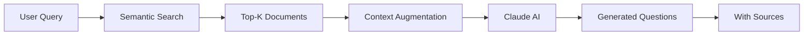

## Übersicht

RAG (Retrieval-Augmented Generation) kombiniert semantische Suche mit KI-Generation, um Fragen direkt aus Ihren Kursmaterialien zu erstellen. Jede Frage enthält Quellenangaben und basiert auf echtem Content.

<CardGroup cols={2}>
  <Card title="Semantic Search" icon="magnifying-glass">
    Qdrant Vector Database für präzise Suche
  </Card>
  <Card title="Context Retrieval" icon="book">
    Relevante Textabschnitte aus Dokumenten
  </Card>
  <Card title="Claude Generation" icon="brain">
    KI generiert Fragen aus Context
  </Card>
  <Card title="Source Attribution" icon="link">
    Jede Frage mit Quellenangabe
  </Card>
</CardGroup>

## Wie funktioniert RAG?



<Steps>
  <Step title="Semantic Search">
    Ihre Anfrage wird in einen Vector umgewandelt und gegen die Qdrant Database gesucht
  </Step>
  <Step title="Context Retrieval">
    Top-K relevante Chunks werden aus den ausgewählten Dokumenten geholt
  </Step>
  <Step title="Augmentation">
    Der Context wird an Claude AI gesendet zusammen mit Ihrer Konfiguration
  </Step>
  <Step title="Generation">
    Claude AI generiert Fragen basierend auf dem echten Content
  </Step>
  <Step title="Attribution">
    Quellenangaben (Dokument + Seitenzahl) werden automatisch hinzugefügt
  </Step>
</Steps>

## RAG vs. Themenbasiert

| Aspekt | Themenbasiert | RAG-basiert |
|--------|--------------|-------------|
| **Dokumente** | Nicht erforderlich | Mindestens 1 Dokument |
| **Quellenangaben** | ❌ Nein | ✅ Ja (mit Seitenzahl) |
| **Kursspezifisch** | ❌ Allgemein | ✅ Sehr spezifisch |
| **Halluzinationen** | Möglich | Sehr selten (faktenbasiert) |
| **Generierungszeit** | 10-30s | 20-60s |
| **Confidence Score** | Nicht verfügbar | ✅ 0-1 Score |
| **Subscription Tier** | Free | Starter+ |

## Konfiguration

### Dokumente auswählen

<Tabs>
  <Tab title="Single Document">
    **1 Dokument:**
    - Fokussierte Fragen
    - Höchste Relevanz
    - Schnellste Generierung

    **Use Case:**
    - Kapitel-spezifische Prüfung
    - Einzelnes Paper
    - Vorlesungsfolien
  </Tab>

  <Tab title="Multiple Documents">
    **3-5 Dokumente:**
    - Breiter Context
    - Cross-Reference möglich
    - Längere Generierung

    **Use Case:**
    - Themen-übergreifend
    - Vergleichsfragen
    - Synthesis-Aufgaben
  </Tab>

  <Tab title="Too Many">
    **>10 Dokumente:**
    - ⚠️ Nicht empfohlen
    - Niedrigere Relevanz
    - Längere Zeit
    - Niedrigere Confidence

    **Alternative:**
    - Mehrere kleinere Batches
    - Spezifischerer Fokus
  </Tab>
</Tabs>

### Fokus/Topic (Optional)

**Ohne Fokus:**
- Allgemeine Fragen aus gesamtem Content
- Breite Abdeckung

**Mit Fokus:**
```
"Sortieralgorithmen Komplexität"
```
- Gezielte Fragen zu spezifischem Thema
- Höhere Relevanz
- Bessere Confidence Scores

### Prompt-Template Auswahl

<Info>
  **NEU:** Wählen Sie custom Prompts für jeden Fragetyp!
</Info>

<Steps>
  <Step title="Prompt wählen">
    Dropdown zeigt alle verfügbaren Prompts für den Fragetyp
  </Step>
  <Step title="Live-Vorschau">
    Sehen Sie den gerenderten Prompt mit Ihren Werten
  </Step>
  <Step title="Variablen anpassen">
    Template-Variablen werden automatisch befüllt:
    - `{topic}` - aus Fokus-Feld
    - `{difficulty}` - aus Dropdown
    - `{context}` - aus ausgewählten Dokumenten
  </Step>
</Steps>

## Qualitätsindikatoren

### Confidence Score

<Tabs>
  <Tab title="0.9-1.0 ✅">
    **Sehr hohe Qualität**
    - Direktes Match mit Source
    - Klar formuliert
    - Eindeutige Antwort

    **Action:** Kann ohne Review verwendet werden
  </Tab>

  <Tab title="0.7-0.9 ✅">
    **Gute Qualität**
    - Solider Context-Match
    - Verständlich formuliert
    - Quellenangaben korrekt

    **Action:** Kurze Review empfohlen
  </Tab>

  <Tab title="0.5-0.7 ⚠️">
    **Akzeptabel**
    - Mäßiger Context-Match
    - Möglicherweise unklar
    - Überprüfung nötig

    **Action:** Detaillierte Review erforderlich
  </Tab>

  <Tab title="< 0.5 ❌">
    **Niedrige Qualität**
    - Schwacher Context-Match
    - Unklar oder irrelevant
    - Möglicherweise Halluzination

    **Action:** Regenerieren oder verwerfen
  </Tab>
</Tabs>

### Quellenangaben

Jede RAG-Frage enthält:

```json
{
  "question": "Was ist die Zeitkomplexität von Heapsort?",
  "sources": [
    {
      "document_id": 123,
      "document_name": "algorithms_chapter3.pdf",
      "page_number": 42,
      "chunk_text": "Heapsort has a time complexity of O(n log n)...",
      "relevance_score": 0.95
    }
  ],
  "confidence": 0.92
}
```

**Vorteile:**
- ✅ Überprüfbarkeit
- ✅ Nachvollziehbarkeit
- ✅ Keine Halluzinationen

## Best Practices

<AccordionGroup>
  <Accordion title="Dokumentenauswahl" icon="book">
    **Do:**
    - ✅ 3-5 zusammenhängende Dokumente
    - ✅ Gleiche Sprache
    - ✅ Gleiche Thematik
    - ✅ Hochwertige Quellen

    **Don't:**
    - ❌ Zu viele Dokumente (>10)
    - ❌ Gemischte Sprachen
    - ❌ Nicht verwandte Themen
    - ❌ Niedrige Qualität
  </Accordion>

  <Accordion title="Fokus setzen" icon="bullseye">
    **Spezifisch:**
    - ✅ "Heapsort Algorithmus - Zeitkomplexität"
    - ✅ "Binary Search Trees - Einfügen und Löschen"

    **Zu allgemein:**
    - ❌ "Algorithmen"
    - ❌ "Datenstrukturen"
  </Accordion>

  <Accordion title="Prompt-Optimierung" icon="sliders">
    - Testen Sie verschiedene Prompts
    - Nutzen Sie Live-Vorschau
    - Passen Sie Variablen an
    - Speichern Sie erfolgreiche Prompts
  </Accordion>
</AccordionGroup>

## Troubleshooting

<AccordionGroup>
  <Accordion title="Niedrige Confidence Scores" icon="triangle-exclamation">
    **Mögliche Ursachen:**
    - Dokumente nicht relevant für Topic
    - Zu allgemeiner Fokus
    - Schlechte Dokumentenqualität

    **Lösungen:**
    1. Spezifischeren Fokus setzen
    2. Relevantere Dokumente wählen
    3. Prompt anpassen
  </Accordion>

  <Accordion title="Keine Quellenangaben" icon="link-slash">
    **Check:**
    - Sind Dokumente korrekt indexiert?
    - Ist Qdrant erreichbar?
    - Subscription Tier = Starter+?

    **Fix:**
    ```bash
    # Status prüfen
    curl http://localhost:6333/collections
    ```
  </Accordion>

  <Accordion title="Fragen zu allgemein" icon="circle-question">
    **Problem:** Fragen passen nicht zum Content

    **Lösung:**
    - Spezifischeren Fokus angeben
    - Weniger Dokumente wählen
    - Custom Prompt verwenden
  </Accordion>
</AccordionGroup>

## API Example

<CodeGroup>

```python Python
import requests

# RAG-basierte Fragenerstellung
response = requests.post(
    "https://api.examcraft.ai/api/v1/questions/generate-rag",
    headers={"Authorization": f"Bearer {token}"},
    json={
        "document_ids": [123, 124, 125],
        "topic": "Sorting Algorithms Complexity",
        "difficulty": "medium",
        "num_questions": 5,
        "question_types": ["multiple_choice", "open_ended"],
        "language": "de"
    }
)

questions = response.json()["questions"]

for q in questions:
    print(f"Q: {q['question']}")
    print(f"Confidence: {q['confidence']}")
    print(f"Sources: {len(q['sources'])} documents")
```

```javascript JavaScript
const response = await fetch(
  'https://api.examcraft.ai/api/v1/questions/generate-rag',
  {
    method: 'POST',
    headers: {
      'Authorization': `Bearer ${token}`,
      'Content-Type': 'application/json'
    },
    body: JSON.stringify({
      document_ids: [123, 124, 125],
      topic: 'Sorting Algorithms Complexity',
      difficulty: 'medium',
      num_questions: 5,
      question_types: ['multiple_choice', 'open_ended'],
      language: 'de'
    })
  }
);

const { questions } = await response.json();
```

</CodeGroup>

## Nächste Schritte

<CardGroup cols={2}>
  <Card
    title="RAG Workflow Guide"
    icon="route"
    href="/guides/rag-workflow"
  >
    Detaillierter Workflow-Guide
  </Card>
  <Card
    title="ChatBot"
    icon="comments"
    href="/features/chatbot"
  >
    Gespräche mit Dokumenten führen
  </Card>
  <Card
    title="Prompt Management"
    icon="sliders"
    href="/features/prompt-management"
  >
    Custom Prompts erstellen
  </Card>
  <Card
    title="Best Practices"
    icon="star"
    href="/guides/best-practices"
  >
    Tipps für optimale RAG-Ergebnisse
  </Card>
</CardGroup>
